<p align="center">
  <picture>
    <source media="(prefers-color-scheme: dark)"
            srcset="docs/logo-dark.svg">
    
  </picture>
</p>

<p align="center">
Turns a BibTeX bibliography into grounded survey papers, thesis chapters,
undergraduate textbook chapters and hands-on tutorials, with every citation
traceable back to a paper the bibliography actually holds.
</p>

<p align="center">
Named for the Hindu god who keeps the ledger of every deed and audits souls
against it -- which is what this does to citations.
<!-- Absolute on purpose. This is a raw HTML anchor inside a centred block,
     and MkDocs only rewrites Markdown links, so a relative `docs/NAME.md`
     here resolves on GitHub and 404s on the docs site. Making it a Markdown
     link is not the fix: CommonMark treats the inside of an HTML block as
     raw text, so GitHub would stop rendering it. -->
<a href="https://github.com/prasadtalasila/chitragupta/blob/main/docs/NAME.md">See more</a>.
</p>

---

## The one rule

Fabricated placeholder references have made it into real papers before.
This pipeline is built to make that impossible rather than unlikely:

> **A citekey may only be used if it appears in your own `.bib` export
> *and* was picked up into the ledger by a real parse of a real PDF.**

- [How it works](#how-it-works)
- [Quickstart](#quickstart)
- [The enrichment layer](#the-enrichment-layer)
- [Hardware requirements](#hardware-requirements)
- [Documentation](#documentation)
- [Acknowledgements](#acknowledgements)

## How it works

Five phases. You own phase 0, the **corpus layer** owns phase 1, the
**drafting layer** owns 2 through 4, and nothing reaches phase 4 without
passing phase 3.

<p align="center">
  
</p>

Two properties of that picture do all the work:

- **Phase 0 is the only entrance.** Citekeys come from your reference
  manager's BibTeX export. The pipeline never fetches a paper, never
  invents a citekey, and never renames one.
- **Phase 3 is the only exit.** `src.citation_gate` sits on the single
  path between a draft and a rendered document. There is no arrow around
  it, and a `FAIL` is treated like a failing test rather than a lint
  warning.

The loop back from a failed gate goes to *drafting*, not to you: the skill
discards the unsupported claim and writes again. You only get involved in
the rarer case where the paper genuinely isn't in the corpus yet -- the
dotted arrow back to phase 0.

Seven skills sit behind phase 2, all obeying the same grounding rules:
five that write a new draft -- survey, thesis chapter, undergraduate
textbook chapter, tutorial, and a heavier multi-perspective deep-research
mode -- and two that change one that already exists, because a draft is
never revised by re-running the skill that produced it
([docs/GENRE.md](docs/GENRE.md)). A third layer, **enrichment**, sits
outside these phases: it deepens the same corpus with layout-aware
parsing, semantic search and topic clustering, and nothing above needs it.

[docs/DIAGRAMS.md](docs/DIAGRAMS.md) draws this workflow eleven ways --
by depth, by genre, and in time order -- and is where the figure above
comes from.

### One thing the corpus layer does not promise

The corpus layer is deterministic in the sense that matters most -- no
LLM, no judgement calls, same bibliography in, same citekeys out -- but it
is **not** bit-reproducible with every parser. With the default
`pdftotext` backend it is: parsed text comes back byte-identical, every
ledger column stable except the `last_synced` timestamp.

With the opt-in `docling` backend *and* a worker pool, it isn't -- and the
instability reaches the *quotable passage*, so the exact span quoted from
a source can change between runs. That is Docling's behaviour under load
rather than something this pipeline adds, and it cannot be switched off;
serial parsing (`[parser].workers = 1`, the default) has not been observed
to vary. The artifact-by-artifact contract, the measured rates and how
little they can pin down are in
[docs/ARCHITECTURE.md](docs/ARCHITECTURE.md#what-is-reproducible-and-what-is-not).

## Quickstart

```bash
# 1. Export Zotero's library: format BibTeX, tick "Export Files", and save
#    it as `bibliography` inside papers/. Zotero writes the .bib plus a
#    companion attachment folder beside it:
#      papers/bibliography.bib
#      papers/bibliography/files/<id>/<name>.pdf
#    Each entry's file field is a path relative to the .bib, so don't
#    rename or move that folder afterwards -- see docs/ZOTERO.md.
#      Ex: file = {Full Text PDF:bibliography/files/16/paper-name.pdf:application/pdf}
mkdir -p papers && cp -r /path/to/your/export/. papers/

cp config.toml.example config.toml

# 2. Install dependencies. scripts/install_full_pipeline.sh is the only
#    install path -- one script for a bare host and for the Docker image,
#    taking stage names as positional arguments:
#      python-deps  creates .venv-full/ and runs `poetry install --with
#                   enrich` into it. The default when no stage is given.
#      os-deps      apt-gets pdftotext, Pandoc, TeX Live, git/curl/unzip.
#                   Needs root; auto-sudo's. Opt-in.
#      dev-deps     pytest + pytest-cov, to run the test suite.
#      all          os-deps + python-deps (NOT dev-deps).
#    Poetry has to exist first -- either install it yourself, as here, or
#    let the os-deps stage do it.
pipx install poetry
bash scripts/install_full_pipeline.sh all

# ...and, only if you want to run the test suite:
# bash scripts/install_full_pipeline.sh dev-deps
# .venv-full/bin/python -m pytest

# 3. Sync the corpus layer from papers/bibliography.bib. A citekey that
#    later drops out of the bib file (a paper removed from your reference
#    manager) is only *reported* by default; re-run with --remove-stale
#    to actually delete its ledger row once you've reviewed the reported
#    list -- not needed on a first run. docs/ZOTERO.md has the full
#    semantics and why the default is to report rather than delete.
source .venv-full/bin/activate
python -m src.sync

# ...and only once you've read the stale list it prints, and agree with it:
# python -m src.sync --remove-stale

# 4. Inspect what it found. Read-only, takes no lock (so it works while a
#    sync is running), and needs no venv.
python3 -m src.ledger

# 5. Optional, and only when you want it: the enrichment layer -- layout-aware
#    parsing, semantic search and topic clustering over the whole corpus.
#    Nothing else needs it and no skill builds it for you, so skip this on a
#    first run. What it costs and which stage is worth it: "The enrichment
#    layer" below, then docs/RETRIEVAL.md.

# 6. In Claude Code, ask for a draft, e.g.:
#    "write a survey section on digital twin composability"
#    "draft a thesis chapter on runtime verification for autonomous robots"
#    "write a textbook chapter introducing digital twin asset reuse"
#    "write a tutorial that builds a minimal digital twin asset from scratch"
# The matching skill in .claude/skills/ picks this up automatically,
# including its own citation_gate -> references -> render_output chain
```

Every command that chain runs, every way to re-run one by hand, and every
review aid for checking a finished draft against its sources are in
[docs/CLI.md](docs/CLI.md) -- see [The full first run, step by
step](docs/CLI.md#the-full-first-run-step-by-step), which walks the whole
sequence above and everything that follows it, in order.

## The enrichment layer

Everything above works without it. The enrichment layer is a second,
optional pass over the same corpus that buys three things: layout-aware
parsing that yields quotable passages, semantic search that finds a paper
arguing your point in different words, and topic clustering over the whole
corpus.

```bash
.venv-full/bin/python scripts/enrich.py --stages docling,embed
.venv-full/bin/python scripts/enrich.py --stages render --input draft.md
```

It costs real time and disk -- a first full-corpus parse is measured in
tens of minutes, and the enrich dependency group is several gigabytes -- so
you build it deliberately. **No genre skill builds it for you.** The
skills read what is already there and fall back to the lightweight default
when it isn't.

Which stage is worth that cost, and what each one actually answers, is in
[docs/RETRIEVAL.md](docs/RETRIEVAL.md). How the stages fit into the rest
of the system, including how to call them from your own script or skill,
is in [docs/ARCHITECTURE.md](docs/ARCHITECTURE.md#the-enrichment-layer).

No stage needs an LLM API key -- this repository intentionally has none.
Every stage probes its own prerequisites and reports `ok`, `skipped` or
`missing-binary` rather than assuming they are present.

## Hardware requirements

What the pipeline needs, not what it was developed on. The split below is
the one that matters: the **corpus layer** -- `sync`, the citation gate,
keyword retrieval -- is light enough for any laptop, and the optional
**enrichment layer** is what costs real disk and real time.

| Resource | Minimum (corpus layer only) | Recommended (enrichment layer in regular use) |
|---|---|---|
| Disk | ~1GB | **10-20GB+** -- the full venv alone is **6.0GB** (torch pulled in twice over via sentence-transformers/docling, plus docling's own layout/OCR models); TeX Live adds several GB more |
| RAM | ~1-2GB | **8GB minimum, 16GB+ better**. At ~3GB free, Docling on a 17-page PDF pushed the process to 3.6GB RSS and the host swapped 6.3GB -- it finished, just slowly |
| CPU | 1-2 cores | **4+ cores** -- without a GPU, Docling's layout inference and BERTopic's UMAP/HDBSCAN are CPU-bound, and more cores directly cut wall-clock time |
| GPU | none needed | **none required.** If one is present the installer detects it and torch is set up to use it automatically -- worth ~4.7x on the parse |
| Network | once, for `poetry install` | also for first-run model downloads (the embedding model, Docling's layout/OCR models) |

**For a sense of scale at the top end:** this project's own bibliography
-- 501 PDFs, 13,400 pages, 1.54GB -- parses in **about 4 minutes** on a
96-core machine with four A40s, against **1h 56m** serially on that same
host. On ordinary hardware a first full Docling parse is measured in tens
of minutes. A *second* run over an unchanged corpus costs close to
nothing either way, because every stage skips what hasn't changed -- which
is what makes it safe to put `sync` on a schedule.

Every measured figure in this project comes from one of two reference
machines: **the small machine** (4 cores, 9.7GB RAM, no GPU) and **the
multi-GPU machine** (96 cores, 251GB RAM, 4x NVIDIA A40 -- the one in the
paragraph above). **Treat each figure as that machine's, and expect yours
to differ.** [docs/PERFORMANCE.md](docs/PERFORMANCE.md) has their full
specifications, what each setting costs, and the two install-time traps
worth knowing before you start (a CPU-only host pulling several GB of
unused CUDA packages, and a GPU host where `torch.cuda.is_available()`
comes back `False`).

## 📖 Research Citation

When Chitragupta is used in academic work, the following reference may be used:

```bibtex
@software{talasila2026chitragupta,
author = {Prasad Talasila},
title = {Chitragupta: An automated research pipeline for literature review and thesis drafting},
year = {2026},
url = {https://github.com/prasadtalasila/chitragupta},
publisher = {GitHub}
}
```

## Documentation

This file is the overview: what the pipeline is, how to get it running,
and what it needs. Everything else lives in one document per question,
split by who is asking.

### Using it

**Getting started**

| Document | Answers |
|---|---|
| [SOUL.md](SOUL.md) | One page: why this exists, the one invariant, and what it refuses to become |
| [AGENTS.md](AGENTS.md) | The rules an agent *drafting with* this pipeline must follow -- above all, never fabricate a citekey |
| [docs/GENRE.md](docs/GENRE.md) | Which of the seven skills writes what? How to pick a genre, what each one refuses to do, and why changing an existing draft never goes back through the genre skill |
| [docs/ZOTERO.md](docs/ZOTERO.md) | How do I get my library and its PDFs into the shape this expects? Includes the attachment-path trap that silently leaves every entry without a PDF |
| [docs/CLI.md](docs/CLI.md) | What commands are there, what flags does each take, and which interpreter does it need? |
| [docs/CONFIG.md](docs/CONFIG.md) | What settings exist, what values does each accept, and what is the default? Starts with a minimal `config.toml`. Includes `[parser].backend`, which decides how faithfully your PDFs are read |

**Understanding the system**

| Document | Answers |
|---|---|
| [docs/ARCHITECTURE.md](docs/ARCHITECTURE.md) | What actually runs, what does each part write, which parts are optional, and why do some commands need the venv? |
| [docs/DIAGRAMS.md](docs/DIAGRAMS.md) | The workflow drawn eleven ways -- six by depth, three by genre, two in an appendix. Pick the one that matches what you already know |
| [docs/LADDERS.md](docs/LADDERS.md) | Where does the pipeline choose between two ways of doing one job? Every ladder it walks for you and every tier you pick yourself, and what the bottom rung costs |
| [docs/RETRIEVAL.md](docs/RETRIEVAL.md) | BM25, embeddings, topic models -- which one answers my question, and which is worth building? |
| [docs/REJECTION.md](docs/REJECTION.md) | Why is turning a source *down* the judgment this pipeline is most careful about? The reasoning behind a retrieval change that was built and then withdrawn, and what was kept from it |
| [docs/TOKENS.md](docs/TOKENS.md) | Where do a run's tokens actually go, which of them get billed once and which get billed every turn, and how do I measure that without paying for a full run? |
| [docs/DRAFT-ITERATION.md](docs/DRAFT-ITERATION.md) | What does a draft's dossier hold, and how do I change a draft weeks later without re-running the pipeline that produced it? |

**Choosing settings**

| Document | Answers |
|---|---|
| [docs/PERFORMANCE.md](docs/PERFORMANCE.md) | What does each setting *cost*? Every measured figure in one place, organised by setting |
| [docs/PDF-PARSER.md](docs/PDF-PARSER.md) | Which PDF backend should I use, why were two dropped, and why was each newer candidate not adopted? |

**Reading the output**

| Document | Answers |
|---|---|
| [docs/CITATION-PROVENANCE.md](docs/CITATION-PROVENANCE.md) | What does the provenance report say, and how do I read it? |
| [docs/PLAGIARISM.md](docs/PLAGIARISM.md) | How much of a draft's wording came from its sources? What the verbatim `overlap`/`scan` checks catch, and -- just as important -- what they cannot see, since these drafts are LLM-written and paraphrase is invisible to an exact match |
| [docs/WRITING-STANDARDS.md](docs/WRITING-STANDARDS.md) | What prose standards do the genre skills follow, and where in the technical-communication literature do they come from? |

### Working on it

| Document | Answers |
|---|---|
| [docs/DESIGN.md](docs/DESIGN.md) | Why does this refuse what it refuses? The hard constraints, the conflict policy when two runs collide, and the failure analysis behind both |
| [docs/PARALLELISM.md](docs/PARALLELISM.md) | How does the parallel parse actually work, what is each component for, and what is planned next? |
| [docs/GROBID-CITATION-GRAPH.md](docs/GROBID-CITATION-GRAPH.md) | **A proposal, not a plan.** What would it take to build a corpus-internal citation graph, and is it worth a JDK and a long-running service? |
| [DEVELOPER.md](DEVELOPER.md) | How do I run the tests, where does everything live, and what is unbuilt? |
| [DOCKER.md](DOCKER.md) | How do I run this in a container? |
| [DEVELOPER-AGENTS.md](DEVELOPER-AGENTS.md) | The rules an agent *changing this repo* must follow -- test policy, the local check suite, commit/PR/release conventions |

Every prose document ships in the release archive -- everything under
`docs/`, plus `SOUL.md`, `AGENTS.md`, `DEVELOPER-AGENTS.md` and
`DEVELOPER.md` -- as do `.claude/`'s genre skills. Only this repo's own
machinery stays behind: `tests/`, `bench/` (the measurement harness and its
raw timings), `.github/` and `.gitignore`.

## Acknowledgements

- **[hadufer/claude-storm](https://github.com/hadufer/claude-storm)** (MIT
  License) -- the `.claude/skills/deep-research/` skill and its
  `deep-research-interviewer`/`deep-research-writer` subagents adapt its
  7-phase pipeline (perspective discovery, parallel grounded interviews,
  contradiction mapping, outline, cited writing, synthesis, self peer-review).
  Retooled here for a closed, citekey-grounded local corpus instead of live
  web sources -- see `reference.md` in that skill's directory for exactly
  what changed and why.
- **[stanford-oval/storm](https://github.com/stanford-oval/storm)** -- the
  original STORM method claude-storm implements: "Assisting in Writing
  Wikipedia-like Articles From Scratch with Large Language Models" (Shao,
  Jiang, Kanell, Xu, Khattab, Lam; NAACL 2024; arXiv:2402.14207).
- Nav Toor's (@heynavtoor) 4-prompt adaptation, fused into claude-storm's
  pipeline and carried through into `deep-research`'s synthesis-briefing
  and single-reviewer (`quick` depth) peer-review phases.
- **[Imbad0202/academic-research-skills](https://github.com/Imbad0202/academic-research-skills)**
  -- the *idea* behind `deep-research`'s `standard`/`deep`-depth peer review
  (an independent multi-reviewer panel including a dedicated adversarial
  reviewer, reconciled against a concession threshold) is credited to that
  project's Stage-3 peer-review design. That project is licensed CC-BY-NC
  4.0; **no text from it was copied** -- `.claude/agents/peer-reviewer.md`
  and `.claude/skills/deep-research/reference.md` §7 are written from
  scratch, adapting only the concept of an independent panel plus a
  Devil's Advocate role, not its implementation.
