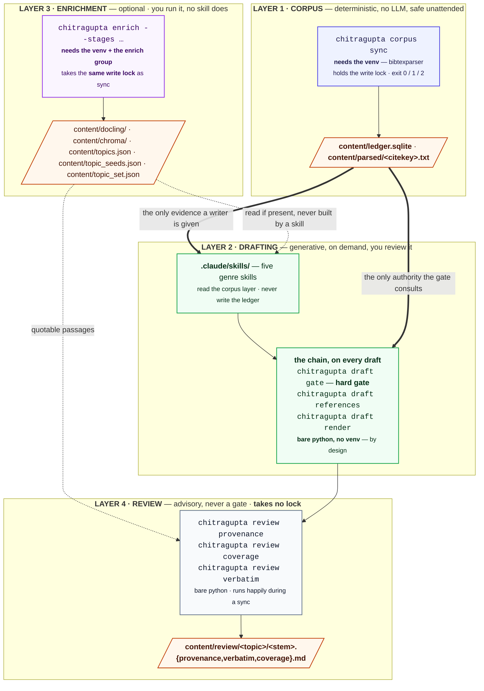

# 🏗 Architecture

Status: **reference.** Written 2026-08-06. Updated 2026-08-28.

What actually runs, what each part writes, and which parts are optional.

**Written for** someone who has the pipeline working and now wants to
change something. Pick a parser backend, decide whether the enrichment
layer is worth building, wire a new script into the chain, or work out
why a command needs a virtual environment when the one next to it does
not.

**Assumed** you have run [the Quickstart](../README.md#-quickstart) at least
once. **Not covered here:** every flag of every command
([CLI.md](CLI.md)), every setting ([CONFIG.md](CONFIG.md)), the internal
design rationale and failure analysis ([DESIGN.md](DESIGN.md)), and how to
work on the repository itself (`DEVELOPER.md`, git checkout only).

## 🧭 Table of contents

- [The four layers](#-the-four-layers)
- [Layer 1: the corpus layer](#-layer-1-the-corpus-layer)
- [Layer 2: the drafting layer](#-layer-2-the-drafting-layer)
- [Layer 3: the enrichment layer](#-layer-3-the-enrichment-layer)
- [Layer 4: the review layer](#-layer-4-the-review-layer)
- [Incremental by default, honest about failure](#-incremental-by-default-honest-about-failure)
- [What is reproducible, and what is not](#-what-is-reproducible-and-what-is-not)
- [What this architecture does not do](#-what-this-architecture-does-not-do)
- [What each capability requires](#-what-each-capability-requires)
- [Which interpreter, and why](#-which-interpreter-and-why)
- [Ladders and tiers](#-ladders-and-tiers)
- [One writer at a time](#-one-writer-at-a-time)

## 🧩 The four layers

Four layers: a deterministic **corpus layer**, a generative **drafting
layer**, an optional **enrichment layer** that deepens the corpus for
whoever wants it, and an advisory **review layer** you run by hand over a
finished draft. The diagram below adds the axis the workflow diagrams
leave out: **which interpreter each part needs, and who holds the write
lock.**

The numbers are the order these are introduced, and the order you meet
them: you need a corpus before a draft, and there is nothing to review
until a draft exists. They are **not a dependency rank.** The actual
dependency graph is acyclic and entirely artefact-mediated -- every edge
is one layer reading a file another wrote, and no layer calls into
another:

```text
corpus (sync) ──ledger, parsed/──▶ drafting (skills + gate chain) ──draft──▶ review
     │                                    ▲                                    │
     └──▶ enrichment (-m chitragupta.enrich) ─docling/, chroma/, passages──┘              │
                        └───────────────── passages ────────────────────────────┘
```

Until 4.0.0 that was not quite true in code: the enrichment layer hosted
a `provenance` and a `render` stage, each a three-line wrapper around a
tier-1 command, so the enrichment layer imported the review and drafting
layers. Both stages are gone -- run `python -m chitragupta.review provenance
<draft>` and `python -m chitragupta.draft render <draft> --format pdf`
directly, which need no venv and take no lock.



Every module, every file it writes, and the exact edges between them are in
[DIAGRAMS.md's full workflow](DIAGRAMS.md#-3-the-full-workflow) -- the same
system at source-reading detail, plus ten other views of it.

Two properties carry the safety argument, and both are visible above:

- **The bibliography is the only entrance.** Citekeys come from your own
  BibTeX export. The pipeline never fetches a paper, never invents a
  citekey, and never renames one.
- **The gate is the only exit.** `chitragupta.draft gate` consults
  `content/ledger.sqlite` and nothing else, so a citekey no `sync` ever put
  there cannot survive into a rendered draft.

## 📚 Layer 1: the corpus layer

One entry point, `python -m chitragupta.corpus`, with two verbs: `sync` does the
work and `ledger` reads back what it did. Until 5.2.0 this section said
"one command" and meant it — `chitragupta.ledger` sat outside as a second bare
command, which is the gap issue #143 closed.

`sync` reads `papers/bibliography.bib`, updates one ledger row per
citekey, resolves each PDF from the entry's `file` field, and extracts
text to `content/parsed/<citekey>.txt`.

Three checks ride along, and none of them is fatal: near-duplicate
citekeys, a parse-quality warning when a backend starts losing word
boundaries, and a stale-citekey report. Deletion of a stale row happens
only under `--remove-stale`.

It is idempotent and incremental -- a PDF whose bytes haven't changed is
not re-parsed -- which is what makes the second run nearly free. Exit
codes: `0` clean, `1` at least one parse failed, `2` another writer holds
the lock.

`ledger` is the other half, and deliberately unlike the first: read-only,
taking no lock, on the bare-`python` tier, so it answers "what does the
corpus hold?" *while* a sync is running. Exit codes: `0` on any
successful read, `1` for a citekey the ledger doesn't hold.

## ✍ Layer 2: the drafting layer

Nine Claude Code skills in `.claude/skills/`, one set of grounding rules
between them: five that write a new draft, three that revise one that
already exists, and `book-assembler` -- the only one that writes no
prose -- which composes an already-drafted book from its accepted units.

| Skill | Produces |
| --- | --- |
| `survey-writer` | a survey, related-work or background section, topic-clustered, with a comparison table and a gap analysis |
| `thesis-chapter-writer` | a research-question-driven chapter as a standalone LaTeX fragment you `\input` |
| `textbook-chapter-writer` | an undergraduate chapter -- worked examples and exercises, for a reader who is studying |
| `tutorial-writer` | a Diataxis lesson the reader follows at a keyboard to a working result, verified to run |
| `deep-research` | a multi-perspective, corpus-grounded report -- heavier and slower than the others by design |
| `draft-reviser` | a scoped edit to a draft that already exists, made from its dossier rather than the corpus -- including repairing citations after a sync moved the corpus |
| `corpus-reviser` | the same edit discipline over a full retrieval pass, when you ask for the whole corpus to be re-searched |
| `agenda-reviser` | a repaired draft after a review agenda found unattended findings, one item at a time |
| `book-assembler` | a composed book from already-accepted units -- front matter, `\part`, `\chapter`, back matter |

The two teaching genres are deliberately separate: a textbook chapter
explains, a tutorial is verified to run. `draft-reviser` and
`corpus-reviser` are separate for a different reason: `draft-reviser`
contains no instructions for a wide search, so the cheap path cannot
drift into the expensive one -- see
[GENRE.md](GENRE.md#-revising-widely-corpus-reviser). The prose standards
all eight prose-writing skills share -- every one but `book-assembler`,
which writes no prose of its own -- and where in the
technical-communication literature they come from, are in
[WRITING-STANDARDS.md](WRITING-STANDARDS.md).

Each skill retrieves from the corpus layer, drafts into
`content/drafts/`, then runs the same three commands on its own output:

1. `python -m chitragupta.draft gate <draft>` -- the hard gate. The skill
   loops here, fixing and re-running until it exits 0, and presents
   nothing before that.
2. `python -m chitragupta.draft references <draft>` -- an IEEE reference list
   built from
   exactly the citekeys the draft cites, numbered by first appearance.
   Skipped for thesis `.tex` fragments, where the surrounding LaTeX owns
   the bibliography.
3. `python -m chitragupta.draft render <draft> --format pdf` -- the
   rendered output. Citations render IEEE-style: numeric `[1]` markers,
   `[3]-[6]` for a consecutive run, over a numbered bibliography built
   from the citekeys actually cited.

**Grounding is enforced, not requested.** The gate runs twice on the same
draft, and neither run is the skill's own good intentions. A PostToolUse
hook runs it on every write under `content/drafts/`, so a draft cannot be
saved with an unverifiable citation even if a skill forgets to check. The
skill then runs it again before presenting anything.

A second hook checks at session start that the first one can still start
at all, since a hook that fails to launch cannot report that it failed.
[HOOKS.md](HOOKS.md) is where that layer's rules live.

**The skills never run the corpus layer for you.** They read it. They do
not write `content/ledger.sqlite`, and they do not run
`python -m chitragupta.corpus sync`. That command takes the write lock, and a
first full-corpus parse can run for tens of minutes, so starting one is
your decision rather than a side effect of asking for a draft.

On an empty ledger, the three citation-grounded genres --
`survey-writer`, `thesis-chapter-writer`, `deep-research` -- say so and
stop. The two teaching genres, where citations are optional, say so and
ask whether to continue uncited.

**No skill runs the enrichment layer.** They consume its output when a
human has already built it. `deep-research` checks for `content/chroma/`
before reaching for embedding search; `peer-reviewer` reads
`content/docling/<citekey>.md` if it exists. Both fall back to the
lightweight default when it is not there.

Building that stack is your decision, not a side effect of asking for a
draft. See [layer 3, the enrichment
layer](#-layer-3-the-enrichment-layer) below.

## 🧠 Layer 3: the enrichment layer

**It extends the corpus layer, not the drafting one.** That is worth
saying plainly, because a layer this expensive sitting next to the
generative one invites the opposite assumption. Nothing in it is
generative and no skill runs it;
every artefact it writes is a deeper reading of the same corpus, which is
also why it takes the *same write lock* as `sync`. The drafting layer only
ever reads what it produced.

`chitragupta/enrich/__main__.py` is the entry point, and it is the only one:

```bash
.venv-full/bin/python -m chitragupta.enrich --stages docling,embed
.venv-full/bin/python -m chitragupta.enrich --for-draft content/drafts/digital-twins.md
```

| Stage | What it produces | `--for-draft` |
| --- | --- | --- |
| `docling` | `content/docling/<doc>.md` plus a `<doc>.passages.json` sidecar of quotable, reading-ordered passages (and figure bitmaps under `[enrich].docling_images`) | scoped |
| `embed` | `content/chroma/` -- sentence-transformers vectors per 200-word chunk | refused |
| `bertopic` | `content/topics.json` -- one cluster assignment per document | refused |
| `seed-topics` | `content/topic_seeds.json` -- every citekey matching one of the author's own topic phrases, many-to-many | refused |
| `converge` | `content/topic_set.json` -- `bertopic`'s emergent clusters and `seed-topics`' author-named ones, joined into one topic set | refused |

**Five stages, and no more than five.** A review report and a draft
render are deliberately *not* among them, though both would be three-line
wrappers around `python -m chitragupta.review provenance` and
`python -m chitragupta.draft render`. They are conveniences rather than
enrichment work.

Hosting either here would cost two things. It would make the enrichment
layer *import* the review and drafting layers -- the one cycle the
four-layer picture otherwise has none of. And because the lock wraps
every stage, it would make a review aid and a draft render wait on a
running `sync`. Called directly they need no venv at all, so the direct
form is cheaper than the wrapper would be.

The default unit of work is the whole corpus. `--for-draft` narrows it to
the papers one draft cites, and reaches `docling` only. `embed` and
`bertopic` each write one whole-corpus artefact with no partial form, so
they are refused rather than scoped.
[LADDERS.md](LADDERS.md#-scoping-a-run-to-one-draft) has the reasoning,
and [CLI.md](CLI.md#-enriching-one-drafts-papers) the flags.

Each stage probes its own prerequisites and reports `ok`, `partial`,
`skipped`, `missing-binary` or `error`, so a missing dependency is a
correct answer rather than a crash. No stage needs an LLM API key -- this
repository intentionally has none. (An earlier revision had PaperQA2 and
STORM stages that required `ANTHROPIC_API_KEY` or `OPENAI_API_KEY`; they
were removed to keep it key-free. LLM-backed synthesis happens only in the
drafting layer, through a Claude Code session.)

What the three build stages are *for*, and which one to build first, is in
[RETRIEVAL.md](RETRIEVAL.md).

**`--stages` is the only way to run them.**
`chitragupta/enrich/docling_parse.py`, `embed_index.py` and `topic_model.py` have
no `__main__` block, so `python -m chitragupta.enrich.docling_parse` imports the
module, does nothing, and exits 0 -- a silent no-op, not an error.
`chitragupta/render_output/` is not among them at all: it has a CLI, needs no
package from the `enrich` group, and belongs to the drafting layer --
which is why it lives in `chitragupta/` rather than in the package.

**A skill must not run it.** A skill runs inline with the same Bash
access as the session that invoked it, so it *can* shell out to
`chitragupta/enrich/__main__.py`. It must not, which is what AGENTS.md and all
seven `SKILL.md` files say.

Two reasons. This layer takes the same write lock as `sync`, so a skill
invoking it can block or be blocked by the user's own run. And a first
full-corpus Docling parse is measured in tens of minutes, which is not a
cost a skill may incur on the user's behalf without being asked.

What a skill *does* do is **read** what this layer produced, and that is
the only edge between the two. It checks the stack exists before using it
-- `content/chroma/` for embeddings, `content/docling/` for passages --
and degrades to the lightweight default rather than erroring when it does
not. Reading an artefact is not calling a layer.

## 🔍 Layer 4: the review layer

Nine aids behind one command, run over a finished draft. **What each
one answers, what a report looks like, and how to read one is
[REVIEW.md](REVIEW.md)** -- this section is only the layer's boundary:
where it sits, and what it may not do.

Three boundary facts, and each is load-bearing:

- **Nothing invokes them as part of producing a draft**, with one
  amended exception: a genre skill runs `verbatim scan` on its own
  output before presenting. The rest are yours to run.
- **They take no lock.** Read-only over the corpus, so they keep working
  during a `sync`, like `chitragupta corpus ledger` and retrieval. That
  is also why no enrichment stage wraps one: a `--stages provenance`
  would run a review aid while holding sync's write lock, making an
  advisory read-only report wait on a corpus rebuild for no reason.
- **None of them gates anything, and none may be promoted to one.**

**Advisory, not a gate**, and named accordingly. *Review* rather than
*verification*, because `chitragupta.draft gate` is the verification: it
lives in the drafting layer and is that layer's only exit. A
"verification layer" that excluded the gate would split the concept
across two layers. The contrast is the point, not a competition.

Output lands in `content/review/`, mirroring the draft's path exactly as
`content/rendered/` and `content/dossiers/` do, with
`chitragupta/review/__init__.py` owning that contract. A draft under
`content/` but not under `content/drafts/` writes flat, matching
`render_output._output_dir`; a draft resolving outside `content/` is
refused, the same tier-1 rule the gate chain follows.

and can therefore be automatic and absolute. Seven of the nine answer
questions of judgement -- the original six, plus `support`, which scores
a claim against its cited source's passage but never calls the verdict
itself -- where a machine verdict would be either wrong often enough to
be ignored, or trusted more than it deserves. They give you the evidence
and leave the call to you.

**`quotation` is the seventh, and it is not one of those.** Its question
-- does this quoted span appear in the source it is attributed to? -- is
binary, deterministic, and about as close to ground truth as anything
outside the gate. It is the sharpest test this section has, so it is
worked through rather than excepted, immediately below.

**`agenda` is the eighth, and it asks no question of its own.** It
merges what the other eight already found into one ranked list, so each
item it surfaces carries whichever answer -- judgement or binary --
produced it, unchanged. Merging does not turn a judgement into a fact:
an `agenda` item inherited from `provenance` is still something to read
and decide, not something `agenda` has itself concluded.

**Which side a check falls on is decided by what it is measured against,
not by how decidable its answer is.** The two are easy to conflate, and
that conflation is the one that would erode the gate.

The gate compares a citekey to the ledger: ground truth, built from the
human's own `.bib` export and a real parse of a real PDF. No state of the
world makes a citekey absent from it legitimately present, so an absolute
verdict is available. A check compared against a *recorded preference* fails
differently, even when its answer is just as mechanical. The preference
is a line someone typed, so it can be wrong, stale, or deliberately
overridden by a quoted title or a proper noun. Blocking on it refuses a
correct draft on a bad target -- a failure the gate cannot have by
construction.

`quotation` is the case where the temptation is strongest, because
nothing about it is fuzzy. What it is measured against is the *parse* --
`passages.py`'s ladder, at whichever rung has been reached today. An
enrichment run that has not happened, a backend switched back to
`pdftotext`, a re-parse of an edited PDF: each changes the answer while
nothing changes about the paper. So "this span is absent" is a statement
about the parse as much as about the source, which is exactly why the
aid has a *third* outcome, `unverifiable`, for a source only
`pdftotext -layout` could read -- there, column splicing means a
perfectly correct quotation is not contiguous in the text, and calling
it absent would assert a fabrication that is not there. A check that
needs a third outcome is not a two-valued gate, however binary its
first two look. Deterministic did not make it gateable; what it is
measured against decided that, and would have decided it the same way
had the answer been fuzzy.

Such a check reports and never blocks, whichever layer it lives in. What
is enforced is *invocation* rather than conformance: a harness may
guarantee that it runs and that its findings are seen, never that they
were obeyed. Decidable is not the same as
gateable, which is why
`DEVELOPER-AGENTS.md` bars promoting any new
check into a gate beside `chitragupta/citation_gate.py` outright, rather than
leaving it to a judgement about how precise the check is.

`scan` is worth placing against the gate specifically, because the two
are complements and both are deterministic. The gate proves every citekey
is *real*; the scan reports what *wording* came along with them. Same
corpus, same determinism, opposite halves of one question.

The second is a review aid anyway, and not because it is fuzzy. "This
sentence resembles its source" has no single right answer the way ledger
membership does. Its findings are what a later severity policy would be
tuned against, not a verdict waiting to be switched on:
[SOUL.md](../SOUL.md) commits to verbatim checks *staying* review aids.
Note also what a clean run does not mean. `scan` runs three detection
tiers, but the third needs an optional stack a checkout may not have, so
a clean run can be incomplete rather than wrong. It names any tier that
did not run. See
[docs/PLAGIARISM.md](PLAGIARISM.md).

## ♻ Incremental by default, honest about failure

Two properties run through every stage, and both are load-bearing rather
than incidental.

**Nothing is recomputed without a reason.** `sync` skips a PDF whose
bytes have not changed. The embedding index skips a document whose text
hashes the same as what is already stored. The topic model re-encodes
only documents that moved, even though it must re-cluster all of them.
The Docling stage fingerprints each PDF by size and modification time.

A second run over an unchanged corpus therefore costs close to nothing,
which is what makes it safe to put `sync` on a schedule.

**A stage that cannot run says so.** Every stage probes for the binaries
and packages it needs and reports `missing-binary` or `skipped` rather
than crashing or silently succeeding. The parse path adds a quality guard
on top: it warns when a backend starts fusing words together, which is
invisible in a spot check but quietly wrecks keyword retrieval.

## 🔁 What is reproducible, and what is not

Run the pipeline twice over an unchanged bibliography and some artifacts
come back byte-identical, some come back equivalent-but-not-identical,
and one comes back genuinely different. This is the contract, artifact by
artifact, so that "is this stable?" is answered here rather than inferred
from four documents that each describe one corner of it.

The distinction matters most for **quotation**. A pipeline whose purpose
is grounded citation cannot treat "the same words, arranged differently"
as equivalent to "the same": a passage shown to a reviewer as evidence is
a specific span of a specific source.

| Artifact | Stable across a re-run on unchanged input? |
| --- | --- |
| `content/ledger.sqlite` rows | **Yes, except `last_synced`**, which is wall-clock and changes every run. `pdf_hash`, `status`, `parsed_path`, `failure_kind` and the bib columns are byte-stable |
| `pdf_size`, `pdf_mtime_ns` | Stable only while the file is untouched. A re-export producing byte-identical PDFs with fresh mtimes changes `pdf_mtime_ns` -- which is what the stat-before-hash skip reads, so those documents are re-hashed (not re-parsed: the hash still matches) |
| `content/parsed/<citekey>.txt`, `pdftotext` | **Yes** -- byte-identical, measured |
| `content/parsed/<citekey>.txt`, `docling` | **No.** ~1.4% of documents differ between differently-configured runs, ~0.9% between two runs of the *same* configuration on multiple GPUs |
| `content/parsed/<citekey>.passages.json` | **No**, and this is the one that matters -- see below |
| `content/rendered/*.md`, `*.tex` | **Yes** -- byte-identical, measured |
| `content/rendered/*.pdf`, `content/review/*.pdf` | **No.** pdflatex embeds a creation timestamp and a trailer `/ID`; two renders of identical input differ. `SOURCE_DATE_EPOCH`/`FORCE_SOURCE_DATE` does *not* make them identical |
| `content/review/*.md` -- the seven review reports, and a `.json` sibling beside each | **Yes on unchanged input**, deliberately: they carry no wall-clock line, because the reason to write one is that it diffs against the next revision's. The qualification is the same one the passage-sidecar row carries -- `citation_provenance` *quotes* passages, so a re-parse that moved a span moves the report with it |
| `content/topics.json` | **Yes** on unchanged input -- UMAP is seeded (`random_state=42`) and HDBSCAN is deterministic, verified as identical assignments over three runs on identical embeddings. But **a topic id is not a stable identifier**: clustering is whole-corpus, so adding or removing one document can renumber every other document's topic. Stable across a re-run, not across a corpus change -- two different questions |
| `content/retrieval_index.json` | A cache, not an output: term-frequency stats keyed by a per-item fingerprint, rebuilt for any document whose parsed text changed. Delete it and the next search rebuilds it |
| `content/overlap/` | A cache, not an output: `chitragupta/review/verbatim_check/`'s word n-gram fingerprints (per-document `docs/*.fpr` and the merged `index.bin`), keyed by `(pdf_hash, parsed-file stat)` per document. The `.fpr` files serve both modes; the merged `index.bin` is `scan`'s alone, built on the first `scan` and reloaded by every later one, so a re-scan over an unchanged corpus re-fingerprints nothing. Delete it and the next `overlap` or `scan` rebuilds whatever it needs |
| `content/chroma/` | The embedding store the `embed` stage writes -- persistent, not a cache, but incremental: a document whose text hashes the same is not re-embedded. Inherits whatever instability its input text has |

### 🗄 The passage sidecar, specifically

Docling groups dense reference blocks into elements slightly differently
under contention, and `chitragupta/passages.py` writes **one passage record per
element**. So the instability does not stop at byte offsets.

Measured over 286 across-configuration document comparisons, **4 (1.4%)**
differed in their passage records and **3 (1.0%)** in the passage *text*
itself. The gap between those two is label changes on byte-identical
text: real instability, but not a changed quotation.

Two text-level mechanisms were observed. A bibliography entry splits in
two, leaving a reference truncated before its publisher and pages; or two
entries merge into one. Same-configuration runs are not exempt either --
2 of 572 comparisons (0.3%) changed a passage's text.

Two consequences worth stating plainly:

- **A previously quoted span is not guaranteed to survive a re-parse.**
  Neither `--reparse` nor a fresh clone reproduces it reliably. If a
  quotation has been reviewed and matters, the reviewed text is the
  artifact -- not the offset it came from.
- **Serial parsing is the stable configuration.** Every observed
  difference required a worker pool, and the single-GPU arm was clean
  across all 286 comparisons. `[parser].workers = 1` (the default) has
  not been observed to vary.

This is Docling's behaviour under load, not something this repository's
parallelism introduced, and it cannot be switched off. Docling exposes no
determinism setting. The only lever below it, torch's
`use_deterministic_algorithms`, *raises* rather than degrades on an op
with no deterministic implementation -- which would turn a cosmetic
difference into a hard failure.

`bench/RESULTS.md`'s "2026-08-07: does the *quotable passage* survive a
re-parse?" has the measurement, the three mechanisms it separates, and
its own statement of how little 286 comparisons can pin down.

## 🚫 What this architecture does not do

- **It does not fetch papers.** There is no downloader, no metadata API
  client, no crawler. You curate the bibliography; the pipeline reads it.
- **It is not a citation manager.** Zotero (or whatever you export from)
  remains the source of truth for citekeys and metadata. This repository
  parses that export and never writes back to it.
- **It does not verify claims.** The gate guarantees a citekey is *real*,
  not that the sentence attached to it is *right*. That is what the review
  aids above are for, and they are aids -- reading the source remains your
  job.
- **It does not take an outline from you, except for a book.** The book
  track has one -- you write `spec.md`, sign it, and each unit is
  generated from its slice ([BOOKS.md](BOOKS.md)). At *single-draft*
  scale there is no equivalent: all five genre skills manufacture their
  own retrieval queries from a one-line topic, and there is nowhere to
  hand them a structure, a per-section brief, or the queries you want
  run. `deep-research` writes section-to-citekey rows into `sections.md`
  at its Phase 4 and dispatches writers through `dossier brief
  --section`, so the *mechanism* exists at this scale -- but the rows are
  written by the model, and the other four genres never use them.
- **It does not notice that you edited the draft by hand.** `scope.md`
  fingerprints the *corpus*; nothing fingerprints the draft. So after a
  manual edit, `sections.md`, `evidence.md` and `math.md` describe a
  document that no longer exists, and `draft-reviser` reads them as
  current. The book track does detect this for a unit
  (`unit status` reports `stale: draft changed since accepted`); the
  dossier has no counterpart.
- **It cannot tell your prose from the drafter's.** Nothing marks a span
  as human-authored, so text you write into a draft yourself is measured
  by every review aid as though a skill had produced it -- `verbatim
  scan` reports your wording against the corpus with no attribution path,
  `review synthesis` flags your paragraph for citing one source,
  `draft style` flags your spelling, and `draft-reviser`'s copy-edit mode
  will rewrite it. The citation gate is the one that should *not* change:
  a fabricated citekey is fabricated whoever typed it.

Those last three are the subject of
`plans/outline-driven-drafting-and-manual-edits.md`,
which is a proposal and not built.

## 🔧 What each capability requires

The pipeline probes for what it needs and reports what is missing, so a
machine with only some of these still works. It reports the rest as
unavailable rather than failing.

| Capability | What it needs |
| --- | --- |
| Parse bib file, track citekeys and PDF paths | `bibtexparser` (venv, main Poetry group) |
| Extract PDF text | `pdftotext` (poppler-utils, `os-deps` stage) by default -- `docling` is an opt-in alternative, see [CONFIG.md](CONFIG.md#-backend-pdftotext-or-docling) |
| Track parse status incrementally | stdlib `sqlite3` |
| BM25-ranked retrieval | stdlib only |
| Citation gate, References section, tex/pdf render | stdlib only, no venv (see [below](#-which-interpreter-and-why)) |
| Prose conformance report (`chitragupta.draft style`) | stdlib only, plus `vale` on PATH (`os-deps` stage); absent, it reports missing-binary |
| Docling layout-aware parsing, embeddings/Chroma, BERTopic | venv, `enrich` Poetry group |
| Compiling generated `.tex` to PDF | `pandoc`, `pdflatex`, `latexmk` (`os-deps` stage) |

## 🐍 Which interpreter, and why

Three tiers, on purpose. [CLI.md](CLI.md#-which-interpreter) lists which
tier each command is in; this is the reason there are tiers at all.

| Tier | Needs | Commands |
| --- | --- | --- |
| 1 | bare `python`, stdlib only | `chitragupta.draft` (all eleven commands -- `style` additionally probes for the optional `vale` binary), `chitragupta.corpus ledger`, `chitragupta.review` (all seven aids) |
| 2 | venv + `bibtexparser` | `chitragupta.corpus sync` |
| 3 | venv + the `enrich` group | `python -m chitragupta.enrich` |

**The gate chain is deliberately in tier 1.** `chitragupta.draft gate` ->
`chitragupta.draft references` -> `chitragupta.draft render` runs on the system
interpreter with no third-party import anywhere in it. The pipeline's one
safety guarantee therefore cannot be blocked by a virtual environment
that is broken, absent, or built for a different Python.

That matters more than it sounds. PEP 668 blocks `pip install` outside a
venv on most current distributions, so "the venv is broken" is not always
a five-second fix.

Tier 2 is one package. `chitragupta.corpus sync` needs `bibtexparser` because parsing
BibTeX correctly -- nested braces, LaTeX escapes, multi-line values -- is
not worth hand-rolling.

**Directory membership is not the same axis, and has twice disagreed with
it.** `render_output.py` once sat in the enrichment layer's own directory
while needing no package from that dependency group at all. It is the
drafting layer's publish step, and it now lives in `chitragupta/` beside the rest
of that layer.

The last residue of the same confusion was `verbatim_check.py`, a
review-layer command living in `scripts/` -- the directory that then held
the enrichment layer's entry point. It ran on bare `python` like the
other two aids and was in no way heavier; only its path suggested
otherwise. It is `chitragupta/review/verbatim_check/` now, and `scripts/` holds
no layer entry point at all, leaving only genuine dev tooling behind.

Both moves were corrections of a label, not of a cost.

What the aid needs is `pandoc` and `pdflatex`, which are operating-system
packages, probed at runtime and reported as `missing-binary` when absent.
That axis -- which binaries a command shells out to -- is independent of
which directory it lives in, and always was.

**One entry point per layer, one level deep.** The command surface is
`chitragupta <layer> <verb>` -- `chitragupta corpus sync`, `chitragupta
draft gate`, `chitragupta review verbatim`, `chitragupta enrich
--stages …` -- with the equivalent module form `python -m
chitragupta.<layer> <verb>` supported alongside it and used by the hooks
and the genre skills (docs/PACKAGING.md says why both survive). A layer's
package may nest as deep as its code wants; its *command surface* does
not. What the rule forbids is reaching *into* a layer's package from the
command line. A layer's submodules carry no `__main__` block, so
`python -m chitragupta.a.b` exits 0 with empty output, which for the gate
is a silent pass on a draft nothing checked. `chitragupta review verbatim
scan` is not that -- it is one layer, one aid, and one subcommand owned
by that aid's own parser. The submodules inside `chitragupta/enrich/` and
`chitragupta/review/` carry no `__main__` block, so
`python -m chitragupta.enrich.docling_parse` or
`python -m chitragupta.review.verbatim_check` imports a module and exits 0 having
done nothing. That is a trap, but a silent and harmless one, and it is
the price of there being exactly one `--help` per layer.

The drafting layer's eleven commands carry the same trap without moving
into a package. `citation_gate.py`, `dossier.py`, `references.py`,
`evidence_appendix.py`, `render_output.py`, `retrieval.py`,
`style_check.py`, `spec.py`, `unit.py`, `registry.py` and `tldr.py`
stayed flat in `chitragupta/` -- each a top-level module or package
there, never gathered into a shared drafting subpackage the way
`enrich/`'s stages are; `chitragupta/draft.py` beside them is what
dropped their `__main__` blocks and gave the layer its one front door.
So `python -m chitragupta.dossier`, or any of the other ten, is the same
silent no-op as the nested form above.

**One module refuses instead: `chitragupta/sync.py`.** Silence is the right price
everywhere above because nobody schedules those commands. A no-op is seen
by the person who typed it, in the second after they typed it.

Running `chitragupta/sync.py` as a module is the exception. It was the corpus
layer's entry point until 5.2.0, and it is the one spelling here that
plausibly sits in a crontab or a systemd unit, where "exited 0" is all
anyone ever reads. It ran that way for a release. Issue #151 found the
cost in this repository's own `bench/`, where two measurement harnesses
timed a sync that never happened and recorded the result -- wrong data,
not missing data.

So that module carries a `__main__` block that prints
`python -m chitragupta.corpus sync` and exits **64**. That is deliberately none
of the three codes [CLI.md](CLI.md#-running-sync-on-a-schedule) publishes
as `sync`'s API, since a scheduler reads `2` there as "expected, do
nothing". #153 removed the old spelling from the documentation.

It is not a second way in: it parses no arguments, offers no `--help`,
takes no lock and syncs nothing. There is still exactly one `--help` per
layer, which is what this invariant is about.

`tests/test_removed_command_scan.py` keeps the old spelling out of the
tree. It matches the *invocation*: the `-m` flag and the module together,
in prose and in the quoted argument-list form that got past #150's hand
sweep. It deliberately does not match the module path, which is
legitimate and common -- `chitragupta.sync` is also the pinned logger name in
every `logs/pipeline.log` line.

**Why those two layers are flat while the other two are packages** is a
question about code cohesion, independent of the rule above:
`python -m chitragupta.draft <verb>` and `python -m chitragupta.corpus <verb>` already
satisfy it.

What makes `chitragupta/enrich/` and `chitragupta/review/` packages is that their
submodules form clusters. `topic_model` imports `embed_index` imports
`corpus`, and all seven review aids share `chitragupta/review/__init__.py`'s
output contract. The five drafting modules share little beyond
`chitragupta/config.py`, so there is no cluster to name a package after.

The dependencies also run the wrong way for one. `chitragupta/review/` imports
four of the five, and `chitragupta/enrich/__main__.py` imports `citation_gate`.
An `chitragupta/draft/` package would therefore have the review and enrichment
layers importing the drafting layer by name -- the shape of the cycle
that keeping `provenance` and `render` out of the stage list prevents.

`chitragupta.retrieval` is additionally a documented *Python API* across the
skills. Such a move would rename it for no gain, to a command surface
that is already one level deep. Issue #147 has that argument in full.

The corpus layer is flat for the same reason: `chitragupta/corpus.py` beside
`sync.py` and `ledger.py`, rather than a `chitragupta/corpus/` package that would
have rewritten every `from chitragupta import ledger` across `chitragupta/`,
`tests/` and
`bench/`. Two things about it are its own.

It **imports the verb it was given and not the other one**. Everywhere
else the dispatcher can import its whole layer at module scope, because
every command in that layer sits on the same interpreter tier. Here they
do not: `sync` needs `bibtexparser` (tier 2) and `ledger` needs only
`sqlite3` (tier 1). A top-level `from chitragupta import sync` would have taken
`ledger` off the bare-`python` rung silently -- silently because it would
still work on any host that has the venv, which is every host CI runs
on. `tests/test_corpus_entrypoint.py` asserts on `sys.modules` rather
than on the import lines, for that reason.

And it is a shared **command surface, not a shared lock**. `sync` holds
the write lock for its whole run; `ledger` takes none, which is what
keeps it readable *during* a sync -- the same property the review layer
and retrieval rely on, described above. The front door itself takes
nothing.

One thing that does not settle: `chitragupta/ledger.py` is not corpus-layer
code that only `sync` touches. All four layers import it as a library --
`sync`, `citation_gate`, `references` and `retrieval`, `enrich/corpus`,
`review/citation_provenance` -- so it is closer to shared infrastructure
than to a command `sync` owns. What sits under `chitragupta.corpus` is its
*command*, which is a claim about where a reader should look for it, not
about who owns the module. Issue #143 has the full argument.

The two-level form was tried once, as `chitragupta.heavy.render_output`, and was
reverted with the directory that held it.
`tests/test_review_entrypoint.py`, `tests/test_draft_entrypoint.py` and
`tests/test_corpus_entrypoint.py` pin the rule in the code;
`tests/test_command_depth_scan.py` pins it across these docs and the
skills, so a nested invocation cannot reach a reader through prose
either. None of it is left to someone comparing files by eye.

## 🪜 Ladders and tiers

Both words appear across these docs, and they are not the same thing.
Summarised here; each one is treated in full, with what its bottom rung
costs you, in [docs/LADDERS.md](LADDERS.md) -- except the detection
tiers, whose full treatment is [docs/PLAGIARISM-DESIGN.md](PLAGIARISM-DESIGN.md).

A **ladder** is an ordered chain the code walks *automatically*: it tries
the first rung, and falls to the next when that one can't answer. A
**rung** is one option in such a chain.

| Ladder | Rungs, best first | Where |
| --- | --- | --- |
| Evidence passages | the enrichment layer's `.passages.json` -> the corpus layer's `.passages.json` -> parsed text split on page breaks -> a fresh `pdftotext` run | `chitragupta/passages.py` |
| Enrichment text source | `content/docling/<id>.md` -> the ledger's parsed `.txt` -> a fresh `pdftotext` run | `embed_index.get_text` |
| Accelerator | one CUDA device per worker -> that worker falls back to the CPU on an out-of-memory error | `chitragupta/pdf_text/` |

A **tier** is a menu you choose from, with no automatic descent. Naming
these apart matters because the failure modes differ: a ladder degrades
quietly and you may not notice, while a tier fails loudly and tells you
what is missing.

| Tier set | Options | What happens if the one you picked is unavailable |
| --- | --- | --- |
| Parser backend | `pdftotext`, `docling` | `sync` warns and skips parsing. It does **not** silently substitute the other backend |
| Interpreter | the three tiers above | `ModuleNotFoundError` |
| Render format | `md` (no binary), `tex`/`docx` (pandoc), `pdf` (pandoc + pdflatex) | reported as `missing-binary`. No format is silently downgraded to another |
| Detection | `exact` word-n-gram runs, a deterministic skip-gram tier, and an embedding tier (all three built; the second and third advisory-only) | the embedding tier needs the optional enrichment layer's `content/chroma/`, the Docling passage sidecars *and* the draft's own dossier; without any of them it is unavailable and says which, rather than falling back to the exact tier and reporting less |

One difference is worth stating, because it is the exception to the word
*tier* as used above: the detection tiers are **not mutually exclusive**.
The other three tier sets are a menu you pick exactly one option from.
`scan` instead runs every detection tier that can run, unions the
findings, and labels each with the tier that produced it. That is what a
finding's `tier` field is for, and it currently takes three values:
`exact`, `skip-gram` and `embedding`.

The practical consequence is the one every place that offers `scan`
repeats. A tier that could not run says so by name, so a clean run means
"nothing found by the tiers that ran", never "no borrowed wording".
[docs/PLAGIARISM-DESIGN.md](PLAGIARISM-DESIGN.md) has the three tiers
and the literature behind them.

## 🔒 One writer at a time

`sync` and the enrichment layer take the same lock over `content/`
(`content/pipeline.lock.db`), because the unsafe overlap is any writer
against any other writer, not just sync against sync. The second one to
start exits `2` rather than interleaving, and the lock releases itself if
its holder is killed.

Readers are never blocked: `python -m chitragupta.corpus ledger`, the citation gate,
retrieval and **the whole review layer** all run happily while a sync is
in progress. The review layer's exemption is deliberate and stated in its
own section -- reviewing a finished draft is exactly the kind of work
that should not have to wait for a corpus rebuild.
[DESIGN.md](DESIGN.md) has the reasoning and the failure analysis.
