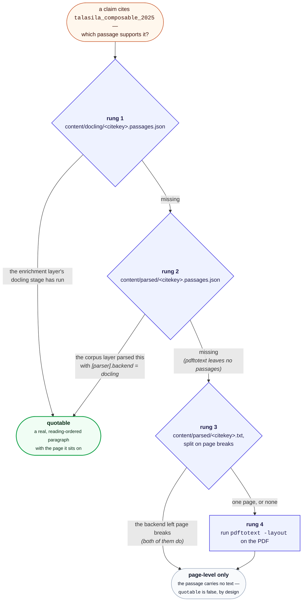

# 📖 Citation provenance

Status: **implemented.** Written 2026-08-01.

**Written for** anyone reading a provenance report and deciding what to
do about a low-scoring claim. **Assumed:** a drafted, gated document.
**Not covered here:** the scoring internals a change to them would need,
which are in the module's own docstrings.

## 💡 Background: what this repository does

Skip this section if you already know the codebase.

This project turns a personal reference library into cited prose. It runs
as two layers that never mix.

**The corpus layer is deterministic and has no AI in it.** You export a
`.bib` file
from your reference manager. `python -m chitragupta.corpus sync` reads it,
records every
entry in a small SQLite "ledger" (`content/ledger.sqlite`), and extracts
each attached PDF's text into `content/parsed/<citekey>.txt`. Nothing is
generated; the bib file is the source of truth.

**The drafting layer drafts documents**, on demand, using those extracted
sources.

A **citekey** is the identifier BibTeX assigns an entry -- for example
`larsen_engineering_2024`. In a draft it appears as `[@larsen_engineering_2024]`.
The project's one hard rule is that **a citekey may only be used if it
came from the bib file**, because fabricated references have made it into
real published papers before. `python -m chitragupta.draft gate` enforces this
mechanically: it extracts every citekey from a draft and fails if any is
absent from the ledger. That is a *gate* -- drafting is blocked until it
passes.

Some tools in the repo are gates. Others are **advisory**: they report
something for a human to judge, and never block. Those are a named layer
-- the **review layer**, layer 4 -- rather than a group defined by what
it is not, and [REVIEW.md](REVIEW.md) is the page for it. The
distinction from the gate matters a lot below.

Two other terms used here:

- **Parser backend** -- how a PDF becomes text. `pdftotext` (fast, the
  default) or `docling` (slow, layout-aware). Set in `config.toml`.
- **The enrichment layer** -- optional, opt-in stages under `chitragupta/enrich/`
  run by `python -m chitragupta.enrich`: layout-aware Docling parsing,
  embeddings, topic modelling, and rendering to PDF/LaTeX.

## ❗ The problem

You are reading a draft. A sentence carries a citation:

> Simulation has become a cornerstone of developing and validating these
> systems [@zampetti_continuous_2023].

You have a doubt. Not "is this citekey real?" -- `citation_gate` already
answers that, and answers it as a hard gate. The doubt is different and
harder:

**Does the cited paper actually say this?**

Right now, answering that means opening the PDF and reading until you
find the passage, or convincing yourself it isn't there. That is slow
enough that in practice it doesn't get done, which means the failure it
would catch -- a claim that drifted away from its source during drafting
-- ships.

### 💡 Why the existing tools don't cover it

The repository already had two of these commands, and neither answers
this question.

`chitragupta/review/citation_coverage.py` asks the inverse: *of the sources retrieval
surfaced for a query, which ones did the draft actually cite?* That
finds sources you missed. It says nothing about whether the ones you did
cite support what you wrote.

The `verbatim` aid is closer but needs you to already know the answer's
shape. Two of its three modes take the citekey as an argument, so they
answer a question you have to have asked first:

- `overlap <draft> <citekey>` -- longest verbatim word runs shared
  between the paragraphs citing that key and the source.
- `locate <citekey> "<phrase>"` -- which page a phrase appears on.

(The third, `scan`, takes no citekey: it slides the whole draft across
the whole corpus. That is a different question -- *did I reuse anyone's
wording anywhere* -- and docs/PLAGIARISM.md is where it belongs.)

So it verifies a suspicion you have already formed about a specific
citekey. It cannot tell you *which* of a draft's forty citations deserve
suspicion in the first place.

There is also a subtler gap. `cmd_overlap` matches **exact word n-grams
(default n=8)**. That is the right tool for its actual job -- catching
borrowed wording, i.e. accidental plagiarism -- but it is the wrong tool
here. A correctly paraphrased claim shares *no* 8-word run with its
source and scores zero, indistinguishable from a claim the source never
made. The failure mode we care about is precisely the paraphrased one.

## 🎯 What is being asked for

A **citation provenance document**: for a given draft, a report that
walks every citation and shows what in the source supports it, so a
human reading the draft can jump straight to the doubtful ones.

Explicitly a manual review step, run when you want it. Not a gate, not
part of any automatic chain.

## 🏗 The solution, as built

```bash
python -m chitragupta.review provenance content/drafts/<slug>.md
```

Writes `content/review/<slug>.provenance.md`, plus `.tex` and `.pdf`
renders of the same report beside it when `pandoc`/`pdflatex` are
available. It needs no venv.

The report mirrors the draft's own place under `content/drafts/`, the
same rule `content/rendered/` and `content/dossiers/` follow: a draft at
`content/drafts/<topic>/survey.md` reports to
`content/review/<topic>/survey.provenance.md`, alongside the same draft's
`survey.verbatim.md` and `survey.coverage.md`. A draft directly in
`content/drafts/`, or outside it altogether, has no path to mirror and
keeps the flat directory; a draft resolving outside `content/` is
refused. `chitragupta/review/__init__.py` owns that contract for all six review-layer
commands -- see [ARCHITECTURE.md](ARCHITECTURE.md#-layer-4-the-review-layer).

For each citing passage in the draft, emit:

| Field | Meaning |
| --- | --- |
| Draft location | Line number and the citing sentence -- or, where the citation sits in a table, a list or a heading (Markdown or LaTeX), that row, item or heading alone |
| Citekey | The key cited there |
| Best-matching source passage | The span of that paper's text closest to the claim |
| Page | Where that passage sits in the PDF |
| Score | How strong the lexical match is |
| Flag | Explicit **NO SUPPORT FOUND** when nothing clears a floor |

Sorted **worst match first**, so the report opens on the citations most
worth your attention rather than making you read forty entries to find
three.

### ⚖ Design decisions

**Advisory, not a gate.** This mirrors `citation_coverage.py`'s
stated position exactly -- it is why the two share a layer. The reason is not
caution for its own sake: a
lexical matcher cannot tell "this claim is unsupported" from "this claim
is supported in vocabulary the matcher didn't recognise". Anything that
*blocks* on that distinction would train people to work around it, which
is precisely the corrosion `citation_gate` avoids by only ever asserting
something it can check exactly -- ledger membership.

**Lexical overlap, not exact n-grams.** Scoring should follow
`cmd_locate`'s approach -- distinctive words from the claim, counted
against the words in each candidate source passage -- not `cmd_overlap`'s
verbatim runs. A paraphrase keeps most of its content words while
changing their order and function words, so overlap scoring degrades
gracefully where n-gram matching falls off a cliff. Stopwords should be
dropped, as `chitragupta/retrieval.py` already does.

**Page numbers come from the PDF, not the parsed text.** `verbatim_check.pages()`
already re-runs `pdftotext -layout` on the original PDF and splits on
form feeds, which means page resolution works regardless of which parser
backend produced `content/parsed/`. That indirection is worth keeping.

**Stdlib only.** `citation_gate.py`, `references.py` and
`citation_coverage.py` all run under bare `python` with no venv. This
tool reuses `citation_gate.extract_citekeys` (which returns
`(line_number, citekey)` pairs -- the line numbers are exactly what the
report needs) plus `verbatim_check`'s `pages()` and `norm()`, all of
which are already stdlib-only. There is no reason for this one to be
heavier.

### 🔧 Prerequisite: already cleared

This proposal was blocked on the PDF resolver. `verbatim_check.pdf_path()`
resolved only **305 of 501** PDFs, for two independent reasons -- it
took the description segment of the bib `file` field instead of the path,
and `bib_entry()` truncated entries at the first `\n}`, which also occurs
inside multi-line field values. A provenance report built on that would
have said "no source text" for 39% of the corpus, which is worse than
saying nothing: it looks like a finding.

Both are fixed. All 501 now resolve.

## 🚫 What this deliberately does not do

**It does not judge whether the claim is true**, or whether the citation
is appropriate. It surfaces the evidence and leaves the judgment where it
belongs.

**It does not call an LLM.** Everything in the deterministic half of this
pipeline (the corpus layer) is local and reproducible; a semantic matcher
would be
both non-deterministic and a new dependency, for a tool whose output a
human reads anyway.

**It will not catch every drift.** A claim paraphrased into genuinely
different vocabulary can score low despite being well supported, and a
claim that shares vocabulary with its source can score high while
misrepresenting it. The report is a reading order, not a verdict. This is
the honest limit of lexical matching, and the reason the tool warns
rather than gates.

## 📄 The Docling provenance sidecar

Docling's document model carries full provenance -- verified on a real
17-page paper, **336 of 336 text items** had both a page number and a
bounding box, plus a semantic label. `export_to_markdown()` discards all
of it; Docling never loses it.

It is tempting to read this as a straight upgrade to the report's
*pointing*: cite an exact rectangle instead of a page. That part is
genuinely marginal -- a reviewer opening a PDF at page 7 finds the
passage in seconds, and a bounding box only pays off if something
renders a highlight, which nothing here does.

The real argument is different, and it exposes a hole in the plan above.

### 💡 Reading order, and why it matters more than coordinates

`pdftotext -layout` preserves the *visual* arrangement of a page, not its
reading order. On a two-column paper that means two unrelated columns
share each output line:

```text
Ning and Wang provided an architecture of Future Internet    sequences transduce into different power management plan
of Things (IoT) using human neural network structure [10].   sequences. They used Moore's machine to represent power
```

Those are two different discussions, interleaved. Measured across the
10-paper sample:

| Papers | Long lines carrying two columns |
| --- | --- |
| 4 of 10 | **82%-89%** |
| 6 of 10 | 3%-9% (single-column; residue from tables) |

So roughly **40% of this corpus cannot yield a clean quotable passage**
from `content/parsed/` at all. Any window drawn over that text is a
splice of two arguments.

### ⚠ What this does and doesn't break

The distinction that matters is between *scoring* and *quoting*.

**Page-level locating survives interleaving.** `cmd_locate` scores a
page by how many distinctive words from the phrase appear anywhere in
it -- a bag of words, order-independent. Column splicing moves words
around within a page; it doesn't move them to a different page. So
page-level matching works on all ten papers today, unchanged.

**Passage quoting does not survive it.** The "best-matching source
passage" field in the report above would, on those four papers, show a
reviewer two spliced half-sentences. That is worse than showing nothing,
because it reads as evidence.

Docling fixes exactly this: its text items are reading-order-resolved and
semantically labelled, so a passage is a real passage. The bounding box
arrives in the same sidecar, essentially free, but it is the reading
order that carries the value.

### 🗺 Revised plan

**Phase 1 -- lexical matcher, page-level report.** Ship the tool above
with the passage field reduced to page-plus-score, or shown only for
documents detected as single-column. Works for 100% of the corpus, needs
no Docling run, stays stdlib-only.

**Phase 2 -- Docling passage sidecar, if quoting proves necessary.**
Persist `{text, label, page, bbox}` per item during the enrichment layer's
Docling stage, and score against those items instead of flat windows. Buys real
quotable passages, section-level context ("in §2.2 Structural Design
Process", often more useful to a human than a page number), exclusion of
running heads and footers from scoring, and bbox highlighting for free.

Phase 2 is not an alternative to Phase 1: it improves the *evidence
display* and leaves the matching problem exactly where it was. A precise
rectangle around a badly-matched paragraph is worse than a page number,
because false precision invites trust.

### ⚡ Costs of Phase 2

Phase 2 has since shipped, in both layers -- see ["What the corpus layer
keeps when it uses docling"](#-what-the-corpus-layer-keeps-when-it-uses-docling)
below. The estimates it was planned against are kept here, corrected
against what was later measured, because three of the four moved:

- **A full Docling pass over the corpus.** Estimated at ~26s/paper, so
  ~3.6 hours for 501 papers. Measured, once the converter was hoisted out
  of the per-document path: **6.65s/PDF serial -- 3330s for the whole
  501-PDF corpus, and 310s at twelve workers**
  ([docs/PERFORMANCE.md](PERFORMANCE.md#-parserworkers----document-level-parallelism)).
  About 4x cheaper than the figure this decision was weighed against, and
  cheaper again now that a corpus-layer Docling parse is adopted rather
  than repeated. What remains true is the tail of the original bullet:
  the per-document cache is invalidated wholesale when the image, OCR or
  cache-version settings change, so *those* re-parses do cost full price.
- **A second text representation to keep in sync with `content/parsed/`.**
  Still true of the enrichment layer's sidecar. No longer true of the
  corpus layer's: it is written by the same parse that writes the `.txt`,
  beside it, and cleared before the same re-parse -- there is no window in
  which one is fresh and the other stale.
- **A second consumer for an opt-in stage.** Already the case:
  `content/docling/` is read by `chitragupta/enrich/embed_index.py` and by
  `chitragupta/passages.py`'s rung 1.
- **The Phase 1 path is needed regardless.** Unchanged, and the reason is
  unchanged: the default backend is `pdftotext`, which resolves no
  reading order, so page-level reporting stays the answer for anyone who
  hasn't paid for a Docling parse either way.

## 📚 What the corpus layer keeps when it uses docling

Docling appears twice in this repository, for two different purposes. The
corpus layer's parser (`[parser].backend = "docling"`) and the enrichment
layer's `docling` stage are separate consumers of the same library, and
what each keeps decides what you can quote.

The corpus layer once built the full document model, kept only
`export_to_markdown()`, and discarded the object. That model was verified
on a real 17-page paper: 336 of 336 text items carried a page number, a
bounding box and a semantic label. Reading order survived inside the
text; page numbers, labels and boxes did not.

The consequence ran against intuition. Choosing the better parser bought
*worse* quotations. Markdown carries no form feeds, so the passage ladder
found a single "page", declined it, and fell through to a fresh
`pdftotext` run -- the column-splicing tool the ladder exists to avoid
quoting from.

Both halves of that are now kept:

- `export_to_markdown(page_break_placeholder="\f")` writes the page
  boundaries into `content/parsed/<citekey>.txt`, so it has the same
  shape as `pdftotext`'s output. Checked on a real 51-page paper: 51
  pages in the model, 51 form-feed-separated segments in the file.
- The structure Markdown cannot carry leaves by a second door, as
  `content/parsed/<citekey>.passages.json` -- the same records
  `chitragupta/passages.py`'s `passage_records()` produces for the enrichment
  layer. On that same paper: 592 records spanning pages 1 to 51, every
  one carrying both a page number and a bounding box.

A sidecar quotes the PDF *as parsed when it was written*, so it is
dropped before every re-parse rather than replaced after one. A switch
back to `pdftotext`, a parse that fails outright, and a re-parse of an
edited PDF all end at "no sidecar" instead of at last week's sentences
attributed to today's document.

Follow what the passage ladder now does:



Rungs 1 and 2 hold the same kind of record from the same function; they
are separate files because the two layers own separate directories and
re-run on separate schedules. The corpus layer has to be able to
invalidate *its* sidecar on every re-parse without deleting an enrichment
sidecar it did not write and could not reproduce. Rung 1 is tried first
because the enrichment stage parses the PDF a second time under its own
OCR and figure settings.

**Which backend to choose, then.** `docling` if you want quotable
passages without running the enrichment layer at all -- that is the
change described above, and it is the whole reason to pay the slower
parse. `pdftotext` (the default) remains the right choice if you only
need page-level locating and want the fastest sync; it lands on rung 3,
which reports a real page and refuses to quote. The combination that once
helped least -- Docling in the corpus layer with no enrichment stage --
is now the one that gives you the most for a single parse.

`python -m chitragupta.review verbatim locate` benefits from the same change: it
splits `content/parsed/<citekey>.txt` on form feeds, so it reports the
page a phrase actually sits on rather than `pdf p.1` for every hit.

One limit worth knowing. Docling emits a page break *between* consecutive
pages that carry items, and none before the first, so the nth segment is
page n -- but a page carrying no items at all contributes no break and
shifts the pages after it. The sidecar is unaffected, because it records
each item's own `page_no` rather than counting separators. Where the two
disagree, the sidecar is right.

## 📝 Worked example

Run against a real 13-citation draft over a 10-paper corpus, the report
opens like this:

```markdown
## Summary

- 8 weak
- 5 supported

## Findings

### Weak

#### Line 29 -- `[@aldalur_microservice-based_2024]` (40% match)

> A cyber-physical system is a program whose input is the physical world
> and whose output *changes* that world -- a definition captured in the
> literature as systems that "integrate digital cyber computations with
> physical processes", or equivalently as combinations of computing and
> physical processes.

Best match is on **page 2** of the source.
```

With a Docling sidecar present, that last line is replaced by the actual
paragraph from the paper.

## ⚠ A calibration caveat, found by running it

Scores are comparable *within* a passage source, not across them. A
quoted paragraph is a far smaller haystack than a whole page, so the
same quality of support scores lower against a paragraph.

On one real 13-citation draft, the identical citations banded as **8
weak / 5 supported** with page-level fallback, and **12 weak / 1
supported** once Docling paragraphs were available. The matches did not
get worse; the denominator got smaller.

This is why the bands are described as a reading order rather than a
measurement, and why the report says so in its own header. A single
absolute threshold that meant the same thing for both sources would
require normalising by passage length, which buys precision the tool
does not claim to have.

## 🐛 Two things the build got wrong first

Worth recording, because both are the kind of defect only a real run
finds -- and the second was caused by the fix for the first.

### 🐛 Too narrow: the citing line

The first implementation read the citing **line** to recover the claim.
Every draft this project produces is hard-wrapped, so a sentence spans
three or four lines and the citation lands on whichever one happens to
hold it. The report came out full of claims like `.` and `, or
equivalently as combinations of` -- fragments that match nothing, scoring
0% and reporting five false "no support found" findings.

Claims are now reconstructed from the whole paragraph, then split into
sentences with an abbreviation-aware splitter (so `Fig. 1` and `e.g.`
don't create the same problem one level down). The same draft went from
5 spurious "no support found" to 0.

### 🐛 Too wide: the whole table (issue #19)

Widening the unit from a line to a blank-line paragraph had no upper
bound, and a markdown table has no blank lines in it. A citation in a
table cell therefore took the **entire table** as its claim, and a table
citing seven papers quoted that table seven times.

Measured on `digital-twins-tutorial.md`: 9 of 100 citations sat in a
table. They produced only 2 distinct claims between them, each 105 or 179
words against a 40-word prose median. And 271 pipe characters reached the
report's blockquotes, where pandoc renders every one as `\textbar{}`.

The damage was not only cosmetic. Scoring divides by the claim's own
distinctive words, so a whole-table claim inflated the denominator from a
row's 15-23 words to 61 or 91. That cut the *maximum achievable* score to
roughly a quarter, pushing genuinely supported citations under the band
thresholds. It is the same false "no support found" the paragraph change
was made to remove, reappearing one level up.

It also defeated the reason claims are sentences rather than paragraphs.
Five citekeys in one table shared a single claim, so the report could not
say which of them was the weak one.

The unit is now the **block**, not everything between two blank lines. A
table row and a list item are each their own claim. A row is flattened to
`cell -- cell -- cell` prose, so no pipe reaches the report. And a
heading is not glued to the paragraph beneath it.

Prose is unaffected: it is one block, read exactly as before. The same
draft now yields 9 distinct claims of ~27 words and 0 pipe characters.

**Both syntaxes, because every genre skill exports `.tex` and `.pdf`
beside the Markdown.** A `tabular` had the same defect with one extra
cost. `\begin{tabular}{lll}`, `\toprule` and `\midrule` reached the
scorer as though `begin`, `tabular`, `lll` and `toprule` were content
words the cited paper ought to contain. No source can ever match that
noise, so the dilution was guaranteed rather than merely likely.

The LaTeX rules mirror the Markdown ones, with one structural difference
that matters: a `tabular` row ends at `\\`, not at a newline, so a row
hard-wrapped over three lines is still one claim.

| | Markdown | LaTeX |
| --- | --- | --- |
| Row | a `\|` line | text up to `\\` |
| Cells | split on unescaped `\|` | split on unescaped `&` |
| List item | `-`, `*`, `+`, `1.` | `\item` |
| Heading | `#`..`######` | `\chapter`, `\section`, `\subsection`, `\paragraph` |
| Dropped as structure | the `\|---\|` separator row | `\begin`/`\end`, `\toprule`, `\midrule`, `\bottomrule`, `\hline`, `\cline` |

The general lesson, since it is the second instance: the claim unit has a
*correct size*, and both failures came from choosing that size by
document syntax the code did not actually model.

## 📊 Sizing (as built)

| Piece | Actual |
| --- | --- |
| `chitragupta/review/citation_provenance.py` | ~250 lines |
| `chitragupta/passages.py` | ~150 lines |
| `_passage_records` in `chitragupta/enrich/docling_parse.py` | ~35 lines |
| Tests | ~55 cases |

No new dependencies. No changes to `sync`, `citation_gate`, or the
render chain beyond calling it.

The sidecar -> form-feed pages -> `pdftotext` ladder, and the rule that a
source with no reading order reports a page rather than a quotation, live
in `chitragupta/passages.py` rather than here. That split happened when retrieval
became the second consumer: a snippet shown to a drafting agent *as
evidence* is under exactly the same constraint as a passage shown to a
reviewer, and the two must not answer "what does this source say here?"
from different text. `citation_provenance` still owns everything above
the ladder -- which sentence carries a citation, how it scores, how the
report reads.
