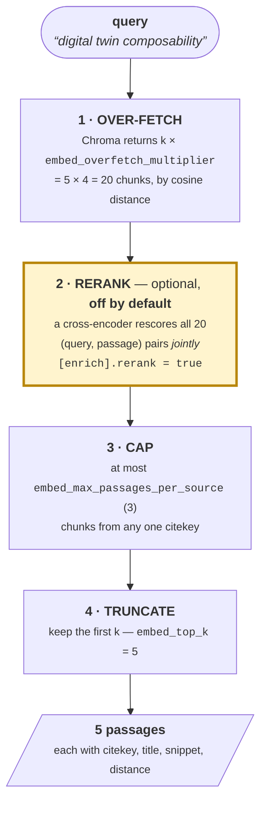
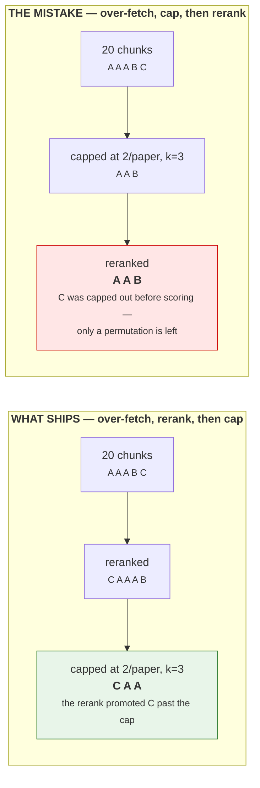

# 🔭 Corpus search: how a query becomes passages

Status: **reference.** Written 2026-08-26. Updated 2026-08-28.

[RETRIEVAL.md](RETRIEVAL.md) answers *which* search to build -- BM25,
embeddings, or the topic model -- and stops there. This document answers
what happens **inside** one `embed_index.search()` call: the four stages
a query passes through, why they are in that order, and which of them
you can change from `config.toml`.

Read this if you are turning `[enrich].rerank` on, choosing a
`rerank_model`, or wondering why a paper you know is in the corpus did
not come back.
[RAG.md](RAG.md) is the level above: the same stages across six other
RAG systems, with the trade-off each choice buys.

## 🧭 Table of contents

- [Before stage 1: the shape of the query](#-before-stage-1-the-shape-of-the-query)
- [The four stages](#-the-four-stages)
- [Why the rerank sits where it does](#-why-the-rerank-sits-where-it-does)
- [What reranking does and does not buy](#-what-reranking-does-and-does-not-buy)
- [What it costs](#-what-it-costs)
- [FlashRank, evaluated and declined](#-flashrank-evaluated-and-declined-2026-08-29)
- [Choosing a reranker](#-choosing-a-reranker)
- [Turning it on](#-turning-it-on)
- [When a paper does not come back](#-when-a-paper-does-not-come-back)
- [What BM25 does instead](#-what-bm25-does-instead)

## ❓ Before stage 1: the shape of the query

Everything below is about what happens *to* a query. This section is
about the query itself, because on the BM25 path the wording you choose
changes the answer more than any setting in the table further down.

**Asking a question retrieves different papers than asking in keywords.**
Measured 2026-08-28 over the 497-parsed corpus, six paired queries at
`k=10` -- each phrased once as a natural-language question and once as
the equivalent keyword string:

| | mean overlap@10 | top-1 identical |
| --- | --- | --- |
| question form vs keyword form | **4.7 / 10** | 2 of 6 |

Less than half the same papers. The cause is visible in the tokenizer:
`_STOPWORDS` (`chitragupta/retrieval.py`) holds twenty function words and
**no interrogatives**, and the `len(w) > 2` filter passes `how`, `why`,
`who` and `can`:

```text
'what are the failure modes of co-simulation' -> ['what', 'failure', 'modes', 'simulation']
'why does model calibration matter'           -> ['why', 'does', 'model', 'calibration', 'matter']
```

`what`, `why`, `does` and `matter` are scored as ordinary BM25 terms. The
damage is not that they add noise -- it is that they are **rare in
academic PDFs**, so they carry high IDF and compete for the ranking
against the terms you meant.

**Measured against real ground truth, question phrasing costs recall.**
The overlap figure above says two phrasings disagree; it does not say
which is right. `bench_retrieval_keyword_selfretrieval.py`'s ground truth
answers that, and is the right instrument because **no retrieval method
built it**: the query is a paper's own author-assigned `keywords` field
and the correct answer is that paper. Over the 208 parsed entries that
carry keywords, wrapping each in interrogative glue (`what is X`, `how
does X work`, `why is X important`):

| Query form | recall@5 | recall@10 |
| --- | --- | --- |
| author keywords (baseline) | **0.808** | **0.865** |
| wrapped as a question | 0.731 (-0.077) | 0.812 (-0.053) |
| question, interrogatives stripped | 0.788 (-0.019) | 0.846 (-0.019) |
| keywords, interrogatives stripped | 0.808 (**+0.000**) | 0.865 (**+0.000**) |

Three things follow, and the second is the one that keeps the advice
above in place:

- **Stripping is free and provably inert on keyword queries** -- the last
  row is +0.000 at both cut-offs, so nothing that already searches in
  keywords can be harmed by it.
- **It recovers most of the loss, not all of it: 75% at k=5, 64% at
  k=10, leaving about two recall points on the floor.** And that is the
  *favourable* case. Repeat it with wordier templates that add ordinary
  words like "role", "practice" or "evaluate" and recovery falls to
  roughly a third, because those are not stopwords and no stopword list
  can reach them. **A question is not merely a keyword query with
  interrogatives attached; it carries generic content words that compete
  for the ranking on their own.**
- So `plans/outline-driven-drafting-and-manual-edits.md`'s proposal to
  strip interrogatives is worth doing and is **not** a licence to write
  queries as questions. Keywords remain the advice.

**This is a BM25 property, not a dense one.** The embedding path encodes
the whole string, so an interrogative shifts the vector slightly rather
than competing as a high-IDF term. It is still noise; it is not this
failure.

One related defect, recorded because the term is central here and the fix
is not the same one: **`co-simulation` tokenizes to `simulation`** -- the
`co` is dropped by the `len(w) > 2` filter.

## 🪜 The four stages

`chitragupta/enrich/embed_index.py::search(query, k)` is four stages, of
which the second is optional and off by default.



**Every size in that diagram is a `config.toml` key.** All three live
under `[enrich]`, all three are validated at load, and
[CONFIG.md](CONFIG.md#-the-three-that-size-a-search) is the reference:

| Stage | Key | Default | Reach for it when |
| --- | --- | --- | --- |
| 1 | `embed_overfetch_multiplier` | `4` | the right paper never comes back **at all** |
| 2 | `rerank` / `rerank_model` | `false` | the right paper comes back, but 4th or 5th |
| 3 | `embed_max_passages_per_source` | `3` | one paper is filling the whole result |
| 4 | `embed_top_k` | `5` | you want more or fewer passages per search |

**Why over-fetch at all.** Chroma ranks *chunks*, not documents, so a
single thoroughly-matched paper can otherwise occupy every one of the
`k` slots. Fetching `k × 4` gives the cap something to promote *from* --
see the next section. At a multiplier of `1` the cap can only ever
shorten the result, never improve it, which is the failure #305 existed
to fix.

**Why the cap is keyed on citekey, not title.** Two untitled or
same-titled documents are still different papers, and bucketing them
together would silently drop one.

**`snippet_chars` stops being cosmetic when stage 2 is on.** The
cross-encoder scores the *truncated snippet*, not the whole 200-word
chunk, so shrinking `snippet_chars` narrows what the reranker may judge
on as well as what you see. This is deliberate: the passage you are
shown is then exactly the evidence the ranking was based on. It is not a
`config.toml` key -- callers pass it -- but it is worth knowing before
tuning it alongside the four above.

## ⚖ Why the rerank sits where it does

This is the one ordering decision in the file, and it is worth stating
because the wrong order looks identical in a code review.



The cap's purpose is that dropping a dominant paper's excess chunks
**promotes another paper's chunk into the window**. Run the rerank
first and a promotion can change *which document* survives. Run it
after, and it can only permute the papers the bi-encoder already chose
-- the cross-encoder's opinion arrives too late to matter.

This is not a theoretical distinction. Measured over 256 real queries,
the two orders return a **different set of papers on 217 of them
(85%)**, and the correct order scores better (nDCG@5 0.5281 against
0.4962). `tests/test_enrich_embed_index.py::TestSearchReranks` pins it
so a refactor cannot quietly swap the two.

## 📊 What reranking does and does not buy

Measured on this project's own corpus (642 ledger items, 497 parsed,
40,741 chunks) against 256 queries whose correct answer no retrieval
method chose -- full method and caveats in `bench/RESULTS.md`,
*"2026-08-26: where a cross-encoder rerank sits, relative to the
per-citekey cap"*.

| | off (today) | on (`ms-marco-MiniLM-L6-v2`) | change |
| --- | --- | --- | --- |
| recall@3 | 129 / 256 | **139 / 256** | **+10 queries** |
| recall@5 | 156 / 256 | 156 / 256 | **none** |
| nDCG@5 | 0.4949 | **0.5281** | +0.033 |
| distinct papers in top 5 | 3.590 | 3.574 | **none** |

Three things to take from that table:

- **It improves ordering, not recall.** The right paper is not found
  more often; it is found *higher*. If you read the top 3 and stop,
  that is worth something. If you read all 5, it is worth nothing.
- **recall@5 is unchanged because the swaps cancel**, not because
  nothing happened: the correct paper is lost 20 times and gained 20
  times across those 256 queries.
- **It does not improve source diversity, and cannot.** With a cap of 3
  and `k` of 5, the number of distinct papers in a result is bounded to
  {2, 3, 4, 5} by the **cap**, not by the ordering. Reranking reshuffles
  within that regime. If you want more sources per query, lower
  `embed_max_passages_per_source` or raise `k`; reranking is not that
  lever.

## 💸 What it costs

A reranker runs once per `search()` call, inside a drafting loop, so
what matters is the *added* latency per call. Measured in the same
process as the baseline it is compared against (`bench/RESULTS.md`,
*"2026-08-26b"*); pool 20 is the shipped setting.

| device | baseline `search()` | + `ms-marco-MiniLM-L6-v2` | + `bge-reranker-base` |
| --- | --- | --- | --- |
| GPU | 12.4 ms | 18.9 ms (**2.5x**) | 67.0 ms (**6.4x**) |
| CPU | 44.2 ms | 210 ms (**5.8x**) | 1001 ms (**23.6x**) |

Plus a one-off model construction of ~1.8-3.5 s on the first reranked
call of a process.

**The `enrich` extra does not require a GPU**, and a genre skill issues
many searches per draft. On CPU with `bge-reranker-base` that is a full
second of added latency on every one of them.

Deepening the pool is the expensive knob, not a free one: 5 → 20 → 50
chunks costs roughly 1x → 3.3x → 7.2x.

### ⚡ FlashRank, evaluated and declined (2026-08-29)

The obvious "make rerank cheap enough to default on" candidate is
[FlashRank](https://github.com/PrithivirajDamodaran/FlashRank) -- ONNX
Runtime, no torch, a 4.4M-parameter default model. Benchmarked on this
host against 20 real 200-word corpus chunks, at the token length the
shipped path actually uses (500-character snippets, ~110-130 tokens):

| Reranker | ms/call | implied `search()` cost |
| --- | --- | --- |
| `ms-marco-MiniLM-L6-v2`, torch fp32 (**shipped**) | 216 | 5.75x |
| FlashRank `TinyBERT-L-2` (its default) | 54 | **2.20x** |
| FlashRank `MiniLM-L-12` (its "best") | 390 | **9.57x** |
| the shipped L6 weights exported to **ONNX int8** | 113 | **3.50x** |

**Declined, on three independent grounds:**

- **Licence.** The library is Apache-2.0 but **the weights it downloads
  are CC-BY-SA-4.0**, repackaged from Apache-2.0 originals. A ShareAlike
  obligation reaching a project that ships a release archive is
  disqualifying on its own.
- **2.2x is not free, and the advantage shrinks toward our shape.**
  Between 512 and 128 tokens the torch baseline falls 7.6x while
  FlashRank falls only 1.9x -- at short passages a 4.4M-parameter model
  is dominated by fixed overhead. This pipeline sits at the unfavourable
  end of that curve, and its own "best" model is *slower than what
  already ships*.
- **The fast model is materially worse** -- NDCG@10 69.84 against
  74.30, MRR@10 32.56 against 39.01 on the sbert authors' own table. The
  rerank gain here already survived swapping to two *stronger* models
  (L12 and `bge-reranker-base`, `bench/RESULTS.md`), so ordering is not
  reranker-limited and a weaker one has no upside.

**Two determinism findings worth keeping**, because they generalise past
this decision. Dynamic int8 quantisation makes a score depend on **what
else is in the batch** -- the same (query, passage) pair scored 4.82e-5
in a pool of 20 and 4.37e-5 alone, 9.2% relative, against 0.000% for
torch fp32. Ordering within a fixed pool is unaffected, so it would not
break the shipped path, but it does mean scores are not comparable across
`k` or `embed_overfetch_multiplier`. And FlashRank's weights are fetched
from `resolve/main` with **no revision pin and no checksum**, so a silent
re-upload would change results with no version bump -- unacceptable for a
pipeline whose proposition is reproducibility.

**What the measurement did surface:** exporting the *existing*
Apache-2.0 L6 weights to ONNX int8 is 1.9x faster at the shipped shape
with no new dependency, no new model and no licence question. ONNX alone
bought almost nothing (1.2x); the win is the quantisation -- which brings
the batch-composition caveat above with it.

## 🧮 Choosing a reranker

`rerank_model` takes a **cross-encoder** -- a model that scores a
`(query, passage)` pair jointly in one forward pass and returns a single
relevance logit. That is a different architecture from `embedding_model`,
which takes a bi-encoder that embeds each side independently.

> **The bge-\*/e5-\* prefix warning does not carry over.**
> [CONFIG.md](CONFIG.md#-choosing-an-embedding-model) rules those
> families out of `embedding_model` because they expect literal
> `"query: "` / `"passage: "` prefixes that this code does not add.
> That applies to *bi-encoders*, which need a role marker because they
> never see the two texts together. `BAAI/bge-reranker-base` is
> `XLMRobertaForSequenceClassification` with `num_labels=1` -- a true
> cross-encoder, no prefix expected -- and is a genuine drop-in here.

### ✅ Measured candidates

All three scored on the same 256 queries, arm 2 (reranked before the
cap), against an un-reranked baseline of recall@3 129, recall@5 156,
nDCG@5 0.4949:

| Model | recall@3 | recall@5 | nDCG@5 | GPU cost | CPU cost | Verdict |
| --- | --- | --- | --- | --- | --- | --- |
| `cross-encoder/ms-marco-MiniLM-L6-v2` **(default)** | 139 | 156 | **0.5281** | **2.5x** | **5.8x** | Best nDCG, cheapest by a wide margin |
| `cross-encoder/ms-marco-MiniLM-L12-v2` | 138 | 152 | 0.5107 | 3.8x | 10.1x | **Rejected** -- worse than its smaller sibling on every metric, and twice the cost |
| `BAAI/bge-reranker-base` | **144** | **157** | 0.5175 | 6.4x | 23.6x | **Rejected as default** -- best recall, but by 5 queries in 256 for 3.5-4.8x the cost. Reasonable if you have a GPU and read only the top 3 |

The default is the cheapest, and it also won the ordering metric. The
recall winner costs several times more for a margin that one
document-level ground truth cannot resolve.

### 🚫 Not a drop-in

- **Any bi-encoder** -- `sentence-transformers/all-mpnet-base-v2` and
  friends. They embed one text at a time and have no notion of a pair;
  `CrossEncoder` will refuse them or produce nonsense.
- **LLM-as-reranker.** Out of scope here by design. This project's
  ranking stays deterministic and local.

## 🔧 Turning it on

`config.toml` is not in the repository -- you create it from
`config.toml.example`. Two keys, both under `[enrich]`:

```toml
[enrich]
rerank = true
rerank_model = "cross-encoder/ms-marco-MiniLM-L6-v2"

# The stage sizes, all optional -- these are the defaults.
embed_top_k = 5
embed_max_passages_per_source = 3
embed_overfetch_multiplier = 4
```

Or for a single run, without editing the file:

```bash
RERANK=true python -m chitragupta.retrieval search "digital twin composability"
```

Two keys rather than one, because `rerank_model = ""` cannot mean "off"
safely here: [CONFIG.md](CONFIG.md#-how-values-are-parsed) documents that
a string setting with the wrong TOML type falls back to its default
*silently*, so a typo would be indistinguishable from a deliberate
off-switch. The boolean says what was intended; the string says what to
load.

**Nothing needs rebuilding.** Unlike `embedding_model`, which
namespaces its own Chroma collection and requires a re-embed, `rerank`
changes ranking only. Turn it on and off freely.

**If the model cannot be loaded, `search()` raises**, naming both the
key and the model id. It does not fall back to un-reranked results: they
would look entirely normal, which is exactly the kind of silent
misconfiguration [CONFIG.md](CONFIG.md#-how-configuration-is-loaded)
refuses elsewhere.

## 🕵 When a paper does not come back

Reranking is often the wrong thing to reach for. In the measurement
above, **69 of 256 correct papers (27%) never entered the 20-chunk pool
at all** -- no reordering can retrieve what stage 1 did not fetch. That
puts a ceiling of 0.73 on dense recall@5 here that a reranker cannot
lift.

Work down this list instead:

| Symptom | Likely stage | What to change |
| --- | --- | --- |
| You phrased the query as a question | **before stage 1** | Re-phrase it as keywords and compare. On the BM25 path this alone changes over half the result -- [above](#-before-stage-1-the-shape-of-the-query) |
| The paper has no parsed text | before stage 1 | It is findable by BM25 (title) but not here -- `build_index` skips documents with no text. Re-run `sync`, check the PDF parsed |
| One paper fills the result | stage 3 | Lower `embed_max_passages_per_source` (to `1` for maximal diversity) |
| The right paper is in the results but 4th or 5th | stage 2 | This is what reranking is for |
| The right paper is absent entirely | stage 1 | Raise `embed_overfetch_multiplier`, or `embed_top_k` -- the pool is their product. Reranking will not help |
| It uses different vocabulary than your query | stage 1 | This is what embeddings are *for*; if it still misses, the chunk may straddle a boundary |

## 🆚 What BM25 does instead

`chitragupta/retrieval.py::search()` has the same
`search(query, k, snippet_chars)` shape and none of these four stages.
It is **one result per citekey by construction** (#305) -- it scores
whole documents, so no cap is needed and none exists.

That also means it has **no cap-position question**, and no
`rerank` key. Reranking BM25's own over-fetched list was measured and
did not help: nDCG@5 fell from 0.7321 to 0.6886. See
`bench/RESULTS.md`.

On this project's corpus BM25 outscores the dense path on every ground
truth tried so far. [RETRIEVAL.md](RETRIEVAL.md#-which-should-i-build)
is where that choice belongs.
