# 📐 The workflow, drawn eleven ways

Status: **reference.** Written 2026-08-06. Updated 2026-08-24.

Every diagram here describes the same pipeline. They come in three groups:

- **[The ladder](#-the-ladder)** -- six views of the whole workflow, ordered
  by how much you already know, from one that assumes nothing to one that
  assumes you are about to change the worker pool.
- **[By genre](#-by-genre)** -- three views of how the *writing* skills
  differ in what they ask of the pipeline. The five genre skills are not
  variations on one template; they disagree about how much of it is worth
  running.
- **[Appendix](#-appendix)** -- the same workflow in time order, and the
  ledger's state machine for one citekey.

Read the one that matches your question and ignore the rest.

One property holds in all eleven: **a genre skill loops on the citation
gate until it exits 0, and shows you nothing before that.** All five
SKILL.md files in `.claude/skills/` carry that instruction, four of them
in the same words: *"Fix and re-run until `OK`. Never present a draft
that hasn't passed."* A gate failure is normally something you never
see.

The fenced `mermaid` blocks below are the source of truth, and GitHub
renders them inline, so a change to the pipeline and a change to its
diagram land in the same diff. `docs/diagrams/` carries the same eleven as
standalone `.mmd` sources and `.svg` exports, for slides, a paper, or a
viewer that doesn't render Mermaid -- see [Editing these](#-editing-these)
at the end.

---

## 🪜 The ladder

| # | Diagram | Written for | Answers |
| --- | --- | --- | --- |
| 1 | [One glance](#-1-one-glance) | Someone who has never heard of this | what are the steps, and who does each one? |
| 2 | [Your first run](#-2-your-first-run) | Someone installing it today | what do I type, in what order, and what does each step tell me? |
| 3 | [The full workflow](#-3-the-full-workflow) | Someone reading the source | what actually runs, what does it write, and where does the module I'm looking at fit? |
| 4 | [Everything on disk](#-4-everything-on-disk) | Someone deciding what to back up, or debugging a wrong file | what are all these files, who wrote them, and what is safe to delete? |
| 5 | [Gates and exit codes](#-5-gates-and-exit-codes) | Someone whose run just failed, or who is scripting it | why did this exit 1, and what is safe to retry automatically? |
| 6 | [Inside one parse](#-6-inside-one-parse) | Someone tuning `[parser].workers`, or changing the pool | what does a worker pool actually do here, and what happens when part of it dies? |

### 🔭 1. One glance

**Written for:** Someone who has never heard of this.
**Answers:** what are the steps, and who does each one?

Deliberately the least detailed diagram here. Two properties do all the
work: phase 1 is the only entrance -- citekeys come from your BibTeX
export and nowhere else -- and phase 4 is the only exit, with no arrow
around it. This is the version in [the README](../README.md#-how-it-works).

The `GATE FAIL` arrow loops back to **drafting**, not to you. A failing
gate is normally invisible: the skill discards the unsupported claim,
rewrites it and runs the gate again. You only get involved in the rarer
case where the paper genuinely isn't in the corpus yet, and that means
going back to phase 1 and adding it.

It carries no commands and no file paths on purpose -- this is the diagram
for someone who has not decided to install anything yet, and a reader who
wants either has [CLI.md](CLI.md) for the commands and
[the artifacts diagram](#-4-everything-on-disk) for the paths.

**Two enclosures carry the division of labour.** `LLM` holds drafting,
the gate and the dossier: the part a model runs, loops over on its own,
and keeps its working state in. `Author Proofs` holds publishing and
review: the part you run once a draft is finished. Nothing crosses
between them except a draft that has passed the gate.

The two dashed boxes are stores and reports rather than steps.
**`DOSSIER`** ([DOSSIER.md](DOSSIER.md)) is written while a draft is
written and read back to change it -- the reason revision does not
re-run the genre skill. **`REVIEW`** ([REVIEW.md](REVIEW.md)) is seven
advisory aids for a finished draft; its arrow back to drafting is dotted
for the same reason the gate's is solid, namely that a review finding is
yours to weigh rather than something that blocks the pipeline.

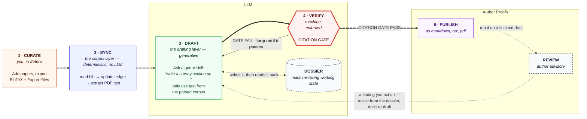

### 🚀 2. Your first run

**Written for:** Someone installing it today.
**Answers:** what do I type, in what order, and what does each step tell me?

The same path as [the Quickstart](../README.md#-quickstart), drawn with
the two checkpoints that actually catch people. The first is the **Export
Files** tick box, which silently produces a bibliography with no PDFs
attached. The second is the first `python -m chitragupta.corpus ledger` after a
sync, which is where you find out whether anything became citable.

Exit codes are on the diagram because at this stage they are the only
feedback you have.

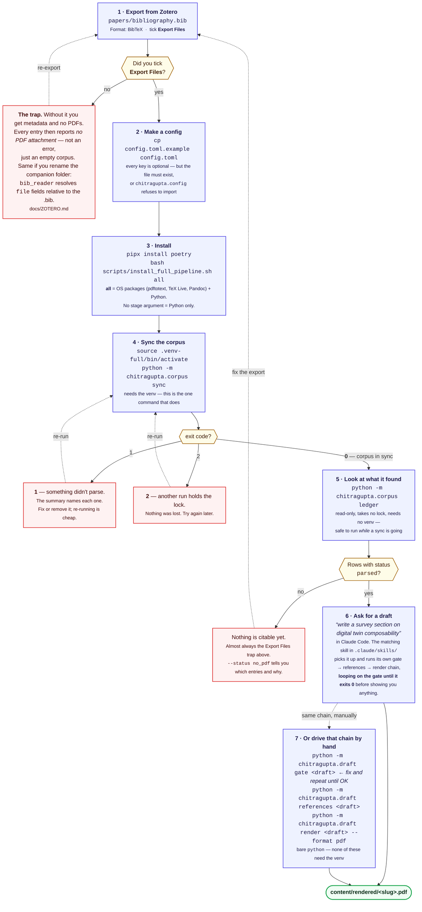

### 🔄 3. The full workflow

**Written for:** Someone reading the source.
**Answers:** what actually runs, what does it write, and where does the module
I'm looking at fit?

The reference diagram. Everything in `chitragupta/` appears here exactly once.
[ARCHITECTURE.md](ARCHITECTURE.md) is the prose companion to it -- the
same system in words, plus what each part needs to run.

Three things it is drawn to make unmissable. The thick edge from
`content/ledger.sqlite` to the gate is the entire safety argument -- the
gate consults the ledger and nothing else. The gate sits on the only path
from a draft to `content/rendered/`. And the `FAIL` edge does not leave
the system: it runs back into the skill, which re-drafts and re-runs the
gate until it exits 0.

Note that the enrichment layer's `docling` stage reads **the PDF itself**,
not `content/parsed/`. It is a second, independent extraction of the same
source, not a refinement of the first one -- which is why it can produce
figures and layout-aware passages that `pdftotext` cannot.

Dotted edges are optional or conditional: the enrichment layer is opt-in,
and each consumer checks the stack exists before using it and degrades to
the lightweight default when it doesn't.

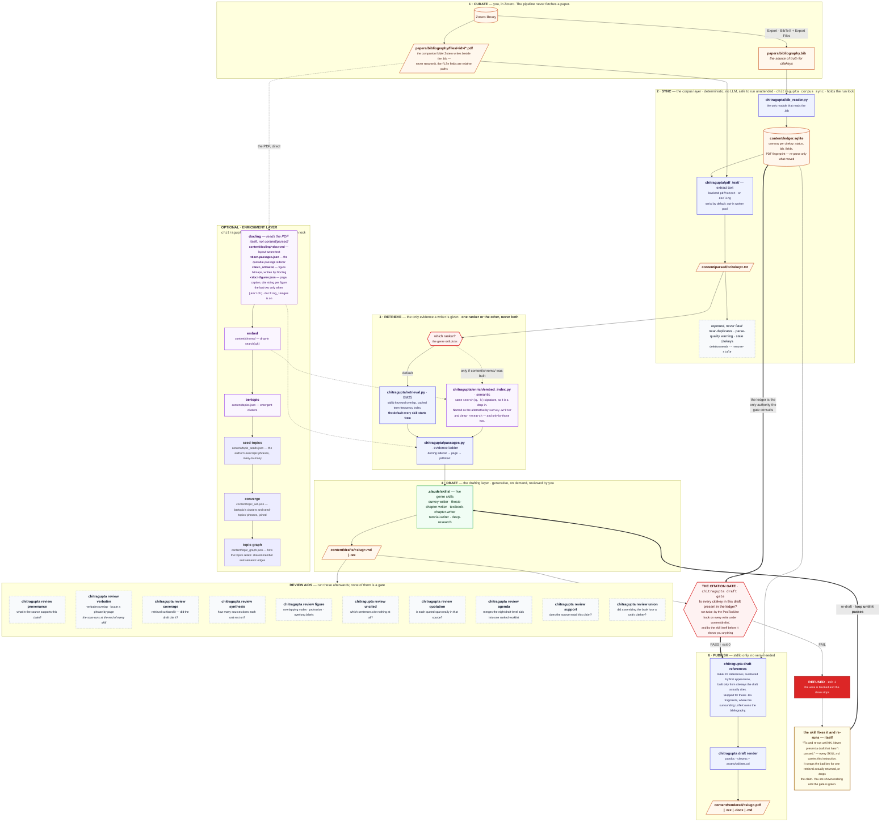

### 📁 4. Everything on disk

**Written for:** Someone deciding what to back up, or debugging a wrong file.
**Answers:** what are all these files, who wrote them, and what is safe to delete?

Same pipeline, but the files are the nodes and the modules are the edge
labels -- the inverse of the full workflow diagram.

The split that matters: everything under `content/` is disposable. Delete
the directory and one `sync` plus one enrichment run rebuilds all of it.
Nothing under `papers/` is disposable, and neither is `config.toml`; both
are gitignored and per-host, so they are also the only things a backup
needs to contain.

With `[enrich].docling_images` on, `docling` also writes each document's
figure bitmaps into `<doc>_artifacts/` and an index of them in
`<doc>.figures.json` -- page, caption, and the string to cite each figure
by. Those are a reading aid for checking a draft against its sources.
Having a paper in your library grants no right to reproduce its figures;
see DEVELOPER.md's "Figures and copyright".

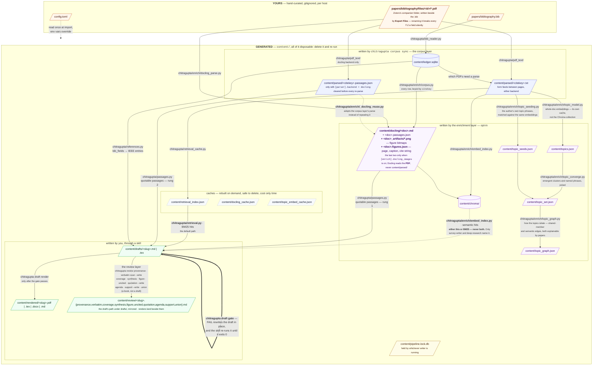

### ✅ 5. Gates and exit codes

**Written for:** Someone whose run just failed, or who is scripting it.
**Answers:** why did this exit 1, and what is safe to retry automatically?

Exit codes are the API for unattended callers: `0` corpus in sync, `1`
corpus not in sync and a human is needed, `2` cycle skipped and no work
was lost.

The distinction worth reading twice is in the failure branch. A document
the backend genuinely cannot read is **never retried** -- re-reading it
every run would spend the same minutes to reach the same answer -- but it
**never goes quiet either**, failing the run until someone deals with it.
A failure caused by the *run* rather than the *document* -- a dead worker,
a timeout, a CUDA OOM -- retries itself next time without being asked.

The gate's `exit 1` is the one failure on this diagram that usually
reaches nobody, because the skill loops on it itself.

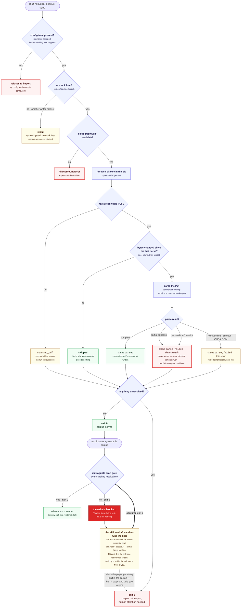

### 📄 6. Inside one parse

**Written for:** Someone tuning `[parser].workers`, or changing the pool.
**Answers:** what does a worker pool actually do here, and what happens when
part of it dies?

The deepest view, and the only part of the repository that runs work in
parallel. Everything else -- retrieval, gating, rendering -- is
deliberately serial.

The through-line: **the pool is clamped to the host, not to the
request.** The ceiling counts the CPUs *this process* may run on
(`os.sched_getaffinity`), not the machine's. An over-large request is
clamped *and said out loud*: silently obeying thrashes, and silently
ignoring leaves someone believing they configured something they did
not.

Five failure modes hang off the pool, each handled where it can be, and
the parent process keeps everything only it can do: sqlite has a single
writer, and the parent is the only place that can order results
deterministically. Full component-by-component write-up in
[docs/PARALLELISM.md](PARALLELISM.md); the reasoning behind the lock is in
[docs/DESIGN.md](DESIGN.md).

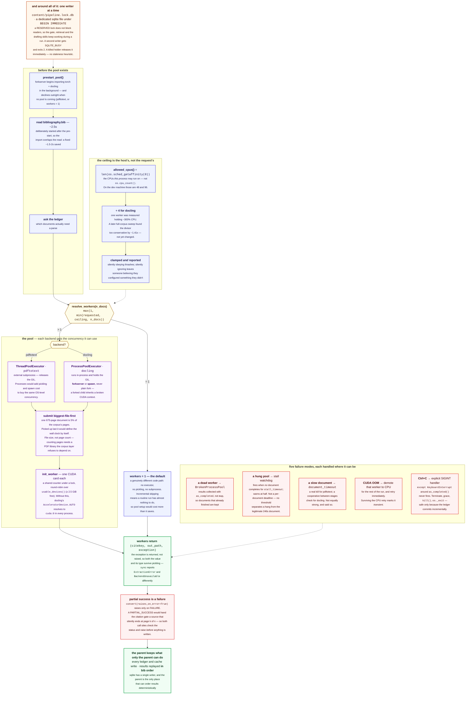

---

## 🎭 By genre

The ladder above draws the pipeline as one thing. It isn't, quite -- the
five genre skills in `.claude/skills/` use very different amounts of it.
The enrichment layer in particular is worth building for two of them,
largely wasted on two others, and reduced to a preview step for the fifth.

| Genre | Skills | Retrieval | Enrichment stages | `chitragupta.draft references` |
| --- | --- | --- | --- | --- |
| [Genre A: corpus-led](#-genre-a-corpus-led) | `survey-writer`, `deep-research` | BM25 **or** `embed_index` | `docling` + `embed`, both worth it | yes |
| [Genre B: teaching](#-genre-b-teaching) | `tutorial-writer`, `textbook-chapter-writer` | BM25 only | none | yes (custom heading) |
| [Genre C: LaTeX-native](#-genre-c-latex-native) | `thesis-chapter-writer` | BM25 only | none | **no -- skipped** |

All five run the same gate, in the same loop, with the same wording.

### 📚 Genre A: corpus-led

**Skills:** `survey-writer`, `deep-research`

**The corpus is the content.** Nearly every sentence is a cited claim, so
these are the two skills that pay off the enrichment layer. `docling`
gives passages good enough to survive review; `embed` gives semantic
recall, finding the paper that makes your point in words you did not
search for. They are also the only two skills whose SKILL.md names
`chitragupta.enrich.embed_index.search()` as an alternative to BM25.

Both read the same corpus the rest of the pipeline does, and that corpus
is the bibliography and nothing else -- so every document either skill can
reach carries a citekey the gate will accept, and there is no class of
source that has to be discussed by title because it may not be cited.

`bertopic` sits off to one side because **no skill calls it.** It is for
you, deciding what the survey should be about before anything is drafted.

Same reason, other direction: `chitragupta.review`'s `coverage` aid ("retrieval
surfaced
this paper -- did the draft actually cite it?") is only a meaningful
question in this genre.

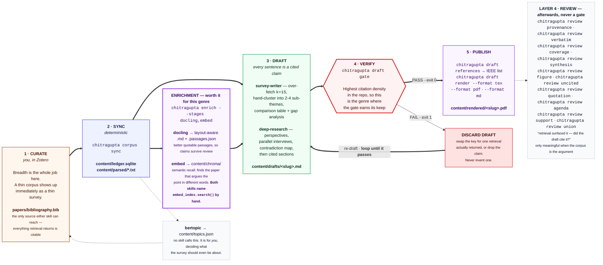

### 🎓 Genre B: teaching

**Skills:** `tutorial-writer`, `textbook-chapter-writer`

**The corpus is a garnish.** Most of the content is original -- worked
examples, exercises, a lesson that has to actually run. Citations are
deliberately confined: `tutorial-writer` bans them mid-lesson and allows
them only in a closing "Where to go next", and `textbook-chapter-writer`
uses them for motivation and background.

So the enrichment layer is mostly wasted here. Neither SKILL.md mentions
`embed_index`; both use `chitragupta.retrieval.search()`, which is stdlib BM25.
Building a semantic index to place four citations is effort in the wrong
place. The rendering they do want at the end is not an enrichment stage
at all -- `render_output` is the drafting layer's own publish step, and
needs no package from the `enrich` group.

This is also the one genre where **the gate can legitimately pass with
zero citations**, and both SKILL.md files say so. An empty reference list
is a correct outcome for a tutorial.

Which points at the real risk: the failure mode in this genre is not a bad
citekey, it is writing the wrong genre -- a tutorial that explains instead
of instructing. Both skills open by warning about exactly that, and no
gate in this repository can catch it.

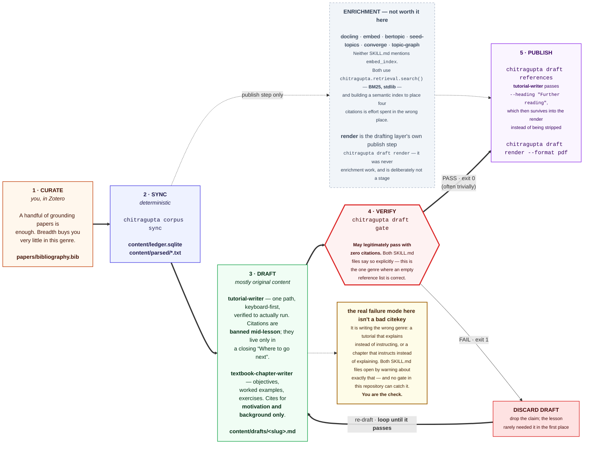

### ✍ Genre C: LaTeX-native

**Skills:** `thesis-chapter-writer`

**The output isn't the deliverable.** This skill emits a standalone `.tex`
fragment with `\citep`/`\citet` and no preamble, meant to be `\input` by
your own thesis document -- so rendering produces a *preview*, not the
artifact that matters. A rendering failure
never blocks presenting the draft.

It is also the only skill that **deliberately skips `chitragupta.draft references`**.
Your thesis owns its own bibliography; a second reference list inside the
fragment would collide with it. That exception is easy to miss when
reading the README's `gate -> references -> render` chain, which is why
it gets its own diagram.

The gate is not relaxed for LaTeX: `chitragupta.draft gate` reads
`\citep`/`\citet` as readily as Markdown `[@key]`, and the loop-until-`OK`
rule is worded identically to the other four skills.

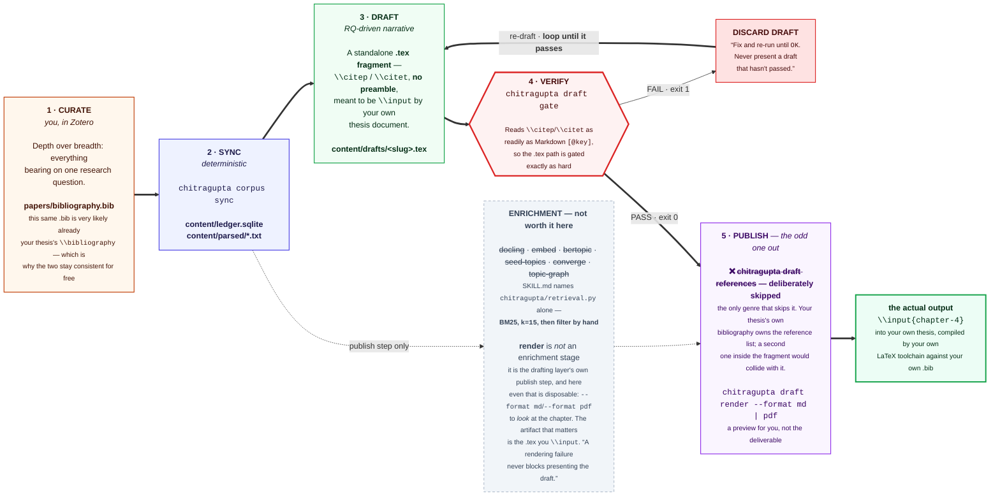

---

## 📎 Appendix

These two answer narrower questions than the groups above, and are kept
separate for that reason.

### ⏱ One draft, in time order

The full workflow with time on the vertical axis instead of dependency.
Useful for two things in particular. The first is seeing that **the gate
runs twice**: the PostToolUse hook fires on every write under
`content/drafts/`, so a bad citekey cannot reach disk even if a skill
forgets, and the skill then runs the gate itself, because the hook fires
only on the tool call that wrote the file. The second is seeing the
**loop** that wraps both of them.

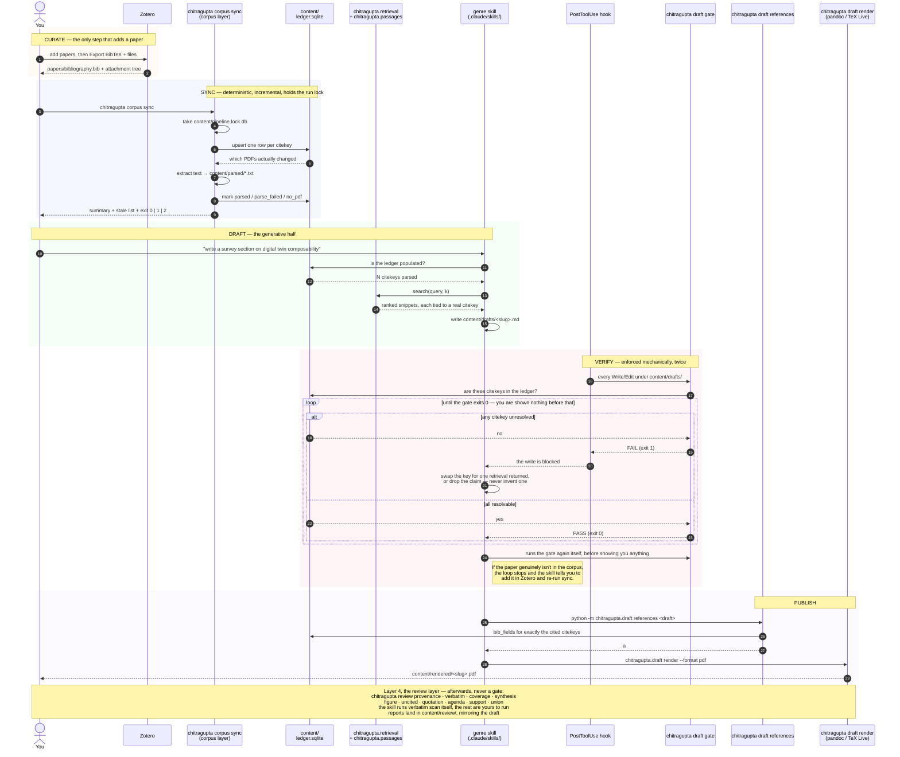

### 📖 The life of a single citekey

The ledger's own state machine, for when the question is "why can't I
cite this paper?". `parsed` is the only state that makes a citekey
citable, and the self-loop on it is the incremental path that makes a
routine re-run nearly free.

Note that `stale` deletes nothing. A bib export that comes back short a
citekey is far more often a botched re-export or a `BIB_FILE` pointing at
the wrong path than an intentional deletion, so the row survives until you
re-run with `--remove-stale`.

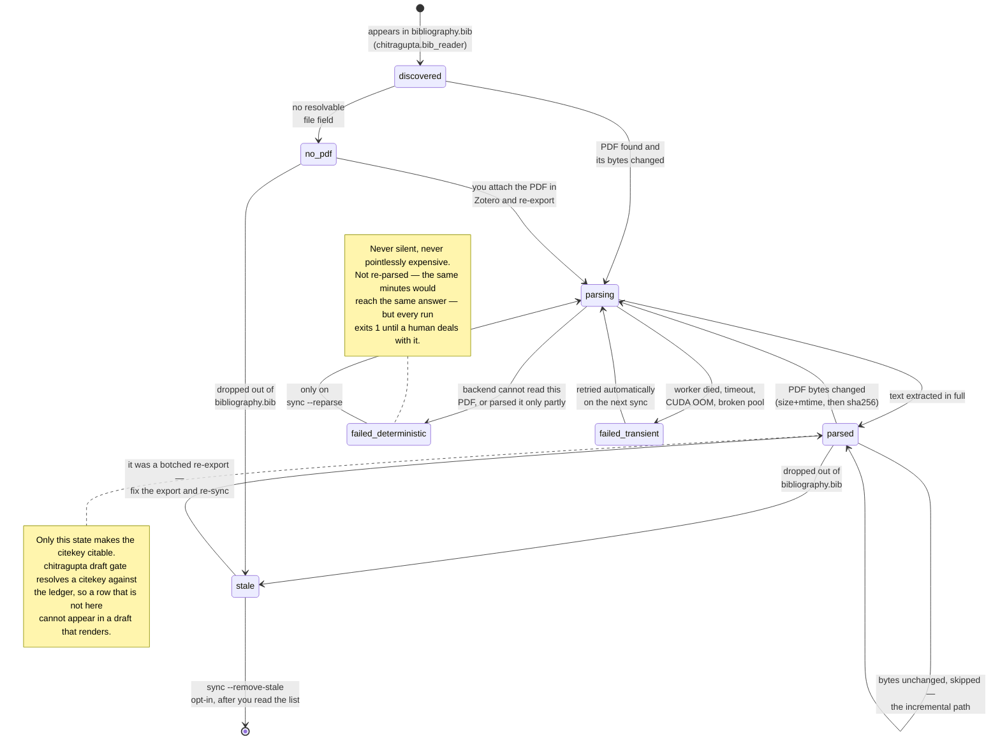

---

## ✏ Editing these

Each diagram is plain Mermaid in a fenced block above. GitHub renders
them, and so does any Mermaid-aware editor. **That block is the source of
truth.**

The same eleven are also checked in as standalone files, so you can drop
one into a slide deck or a paper without copying it out of this document:

| Path | What it is |
| --- | --- |
| `docs/diagrams/<name>.mmd` | the Mermaid source, with a title line |
| `docs/diagrams/svg/<name>.svg` | the rendered export, ~1900px wide on a white background |

| Diagram | `<name>` |
| --- | --- |
| 1. One glance | `v1-overview` |
| 2. Your first run | `v2-first-run` |
| 3. The full workflow | `00-main-workflow` |
| 4. Everything on disk | `v3-artifacts` |
| 5. Gates and exit codes | `v4-gates-and-failure` |
| 6. Inside one parse | `v5-parallelism` |
| Genre A: corpus-led | `g1-corpus-led` |
| Genre B: teaching | `g2-teaching` |
| Genre C: LaTeX-native | `g3-thesis` |
| Appendix: one draft, in time order | `extra-sequence` |
| Appendix: the life of a single citekey | `extra-ledger-state` |

Those are exports, not a second source. Edit the fenced block first, then
re-render, or the two drift apart:

```bash
npm install -g @mermaid-js/mermaid-cli
mmdc -i docs/diagrams/v1-overview.mmd -o docs/diagrams/svg/v1-overview.svg -b white -w 1900
```

Keep them honest the way the rest of this repository stays honest: if a
diagram and the code disagree, the diagram is the bug.
