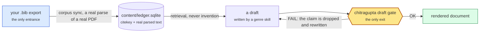
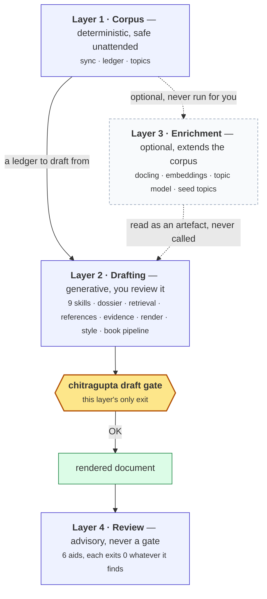
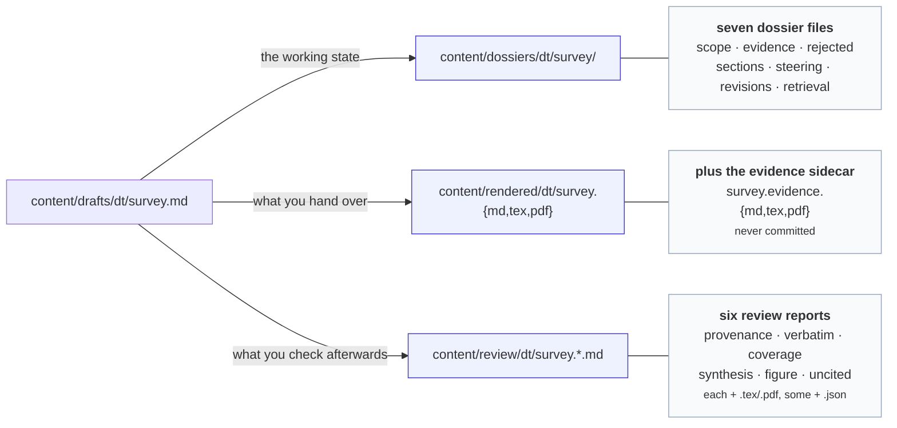

# ✨ Features

Status: **reference.** Written 2026-08-22, describing the pipeline as it
stands at 6.20.2.

**Written for** someone deciding whether this does what they need, and
for anyone who wants the whole capability surface in one place rather
than assembled from twelve documents. **Assumed:** nothing.
**Not covered here:** how to invoke any of it
([CLI.md](CLI.md)), how the workflow *flows*
([DIAGRAMS.md](DIAGRAMS.md) draws it eleven ways), or why the
architecture is shaped this way ([ARCHITECTURE.md](ARCHITECTURE.md),
[SOUL.md](../SOUL.md)).

**This document routes; it does not restate.** Every feature names the
document that owns its detail, and stops there. That is a deliberate
constraint, not modesty: two documents describing one mechanism drift
apart, and this repository has repaired exactly that twice -- a Layer 4
section that still claimed three review aids when there were six (#345),
and a command-count sentence whose arithmetic nothing checked (#348). A
comprehensive features document is the single most likely place for the
third occurrence, so every list and count here is pinned to the code by
`tests/test_features_doc.py`. If you add a review aid or a genre skill
and do not update this file, that test fails.

## 🧭 Table of contents

- [The guarantee everything else serves](#-the-guarantee-everything-else-serves)
- [The four layers](#-the-four-layers)
- [Corpus layer: turning a library into a ledger](#-corpus-layer-turning-a-library-into-a-ledger)
- [Drafting layer: writing something grounded](#-drafting-layer-writing-something-grounded)
- [Review layer: six advisory aids](#-review-layer-six-advisory-aids)
- [Enrichment layer: optional depth](#-enrichment-layer-optional-depth)
- [Cross-cutting features](#-cross-cutting-features)
- [What this deliberately does not do](#-what-this-deliberately-does-not-do)

## 🔑 The guarantee everything else serves

Every feature in this document exists to support one sentence:

> **A citekey may be used only if it appears in your own `.bib` export
> *and* was picked up into the ledger by a real parse of a real PDF.**

Fabricated placeholder references have reached real published papers.
This pipeline is built to make that impossible rather than unlikely, and
the shape of the guarantee is what makes it a guarantee:

Two properties do all the work, and both are structural rather than
enforced by care:

- **One entrance.** Citekeys come from your reference manager's export,
  read by exactly one module (`chitragupta/bib_reader.py`). Nothing in
  the pipeline fetches a paper, invents a citekey, or renames one.
- **One exit.** `chitragupta draft gate` sits on the single path between
  a draft and a rendered document. There is no arrow around it, and a
  `FAIL` is treated like a failing test rather than a lint warning.

A `PostToolUse` hook enforces the same thing mechanically on every write
to a draft, so the instruction to run the gate is belt-and-braces rather
than the only line of defence ([HOOKS.md](HOOKS.md)).

**The nuance that surprises people:** the loop back from a failed gate
goes to *drafting*, not to you. The skill discards the unsupported claim
and writes again, so a gate failure is normally something you never see.
You are involved only in the rarer case where the paper genuinely is not
in the corpus yet.

## 🏗 The four layers

Everything below is one of four layers. They are numbered by the order
you meet them, not by dependency: layer 3 is optional and nothing needs
it.

| Layer | Generative? | Blocks you? | Takes the corpus write lock? |
| --- | --- | --- | --- |
| 1 · Corpus | No -- no LLM, no judgement calls | Only the gate, which lives in layer 2 | **Yes** |
| 2 · Drafting | Yes | The gate does, and only the gate | No -- read-only over the corpus |
| 3 · Enrichment | No | No | **Yes**, same lock as `sync` |
| 4 · Review | No | **Never** | No -- keeps working during a `sync` |

That last column is a feature, not an implementation detail: a review aid
runs while a corpus rebuild is in progress, because an advisory
read-only report has no reason to wait on one.

## 📚 Corpus layer: turning a library into a ledger

Deterministic and safe to run unattended: no LLM, no judgement calls,
same bibliography in, same citekeys out.

| Feature | What it gives you | Detail |
| --- | --- | --- |
| `corpus sync` | bib read, ledger update, PDF text extraction, duplicate-citekey check, stale-citekey report | [ARCHITECTURE.md](ARCHITECTURE.md) |
| `corpus ledger` | inspect what the corpus holds, by citekey, collection or status | [CLI.md](CLI.md) |
| `corpus topics` | the topic clustering, once the enrichment layer has built it | [TOPIC-MODELLING.md](TOPIC-MODELLING.md) |
| Two parser backends | `pdftotext` (fast, bit-reproducible) or Docling (layout-aware) | [PDF-PARSER.md](PDF-PARSER.md) |
| Zotero group support | export a shared group library without Better BibTeX | [EXPORT-ZOTERO-GROUPS.md](EXPORT-ZOTERO-GROUPS.md) |

Four nuances worth knowing before you rely on it:

- **Removal is opt-in.** `sync` only *reports* a citekey that dropped out
  of your bib export; it deletes nothing until re-run with
  `--remove-stale`. A short export is more often a botched one than an
  intentional deletion.
- **A citekey is also a filename stem.** One containing a path
  separator, a character Windows forbids, or a reserved device name is
  **skipped with a warning naming it**, never sanitised -- this project
  does not rewrite citekeys, so the fix is to rename it in your reference
  manager and re-export.
- **Determinism has one asterisk.** With `pdftotext` the parse is
  byte-identical run to run. Docling is not bit-reproducible, and
  [ARCHITECTURE.md](ARCHITECTURE.md) says exactly where that bites.
- **A topic id is not a stable identifier.** Clustering is whole-corpus,
  so adding one document can renumber every other document's topic.
  Stable across a re-run, not across a corpus change.

## ✍ Drafting layer: writing something grounded

### 🤖 Nine skills

Five write a new draft, three change one that already exists, and one
assembles a book from units the others wrote. You never invoke them by
name -- each declares its triggers, and asking in ordinary words selects
one ([GENRE.md](GENRE.md)).

| Skill | Writes | Reader |
| --- | --- | --- |
| `survey-writer` | literature survey, related work, "state of the art" | someone entering a field who needs the map and the gaps |
| `thesis-chapter-writer` | a `.tex` chapter fragment, RQ-driven | an examiner reading adversarially |
| `textbook-chapter-writer` | undergraduate chapter with worked examples | a student studying, not typing |
| `tutorial-writer` | a hands-on lesson to a working result | a learner at a keyboard |
| `deep-research` | multi-perspective report, heaviest by design | someone who needs perspectives reconciled |
| `draft-reviser` | edits an existing draft, from its dossier | -- the cheap, default path for any change |
| `corpus-reviser` | edits an existing draft, re-searching everything | -- by explicit request only |
| `overlap-reviser` | repairs verbatim overlap a scan found | -- one finding at a time |
| `book-assembler` | one LaTeX book from accepted units | [BOOKS.md](BOOKS.md) |

**The rule that saves the most money:** never re-run a genre skill to
change a draft that exists. `draft-reviser` reads the dossier and edits
the affected sections instead. [TOKENS.md](TOKENS.md) measures what the
mistake costs.

### 🗂 The dossier: why a draft is revisable months later

Every drafting run writes `content/dossiers/<the draft's path minus its
suffix>/` -- Markdown, seven files, readable by a human or a model with
no tooling at all.

One path, mirrored four ways, so a draft, its working state, its renders
and its review reports are all findable from the draft's own path. That
mirroring is what lets `draft dossier export` bundle a draft with
everything belonging to it by matching paths, rather than by keeping a
registry that could fall out of step.

Seven files -- `scope`, `evidence`, `rejected`, `sections`, `steering`,
`revisions`, `retrieval` -- each answering a question the draft itself
cannot. **[DOSSIER.md](DOSSIER.md) explains each one**, what it holds and
what goes wrong without it, plus the `claim:`/`quote:` contract and why
the whole thing is Markdown.

It is deliberately machine-facing documentation: a dossier's reader is
usually the model resuming a draft weeks later, not a person. That is the
clean split from [REVIEW.md](REVIEW.md), which is written for you.

`chitragupta draft dossier` is how you work with one by hand: `init`,
`status`, `sections`, `brief`, `check-evidence`, `list`, and `export`/
`restore` for backup. **`status` is the one to know** -- it recomputes
the corpus fingerprint the dossier recorded, and if the corpus has moved
it names the citekeys that appear nowhere in the dossier, neither kept
nor rejected. That distinguishes "new papers exist" from "a paper this
draft cites has left the corpus", which want opposite responses.

### 📖 Evidence: `claim:` and `quote:`

Kept evidence records what a source establishes in the drafter's own
words (`claim:`) separately from its exact wording (`quote:`, optional
and absent by default). Only `claim:` may be drafted prose from. The
ordering is the mechanism: a claim written before any sentence of the
draft exists cannot be a lightly-edited copy of the source.

`chitragupta draft evidence` then renders those quoted spans into an
**evidence sidecar** beside the render -- attributed, in quotation marks,
grouped by the section that leans on them -- so verbatim material has one
legitimate home and the body prose has none. Four of the five genres emit
one; `tutorial-writer` does not, and
[GENRE.md](GENRE.md#-the-evidence-sidecar-decided-per-genre) records why
for each. A sidecar is never committed: it carries wording from
copyrighted sources.

### 🔎 Retrieval, references and rendering

| Feature | What it gives you | Detail |
| --- | --- | --- |
| `draft retrieve` | BM25 search and evidence windows over the parsed corpus | [RETRIEVAL.md](RETRIEVAL.md) |
| `draft references` | an IEEE reference list built only from citekeys the draft already cites | [CLI.md](CLI.md) |
| `draft render` | `.md`, `.tex`, `.pdf`, `.docx` via Pandoc, numbered IEEE-style | [CLI.md](CLI.md) |
| `draft style` | prose checked against the house writing standards -- a review aid, never a gate | [WRITING-STANDARDS.md](WRITING-STANDARDS.md) |
| TikZ figures | figures drawn to a documented style, checked for layout defects | [TIKZ-STYLE.md](TIKZ-STYLE.md) |

### 📕 Book-scale drafting

`draft spec`, `draft unit` and `draft registry` turn the same machinery
into a book: an outline you sign off, a per-section generation contract
with a recorded acceptance, and terminology/claim/cross-reference checks
over the accepted units. Two human sign-offs, not one.
[BOOKS.md](BOOKS.md) has the workflow.

### 🔭 Per-citekey TL;DR

`draft tldr write <citekey>` (summary on stdin) and `draft tldr show
<citekey>` cache a one-paragraph, human-authored summary per citekey
under `content/tldr/`, so skimming a large corpus does not mean opening
every PDF. The summary is never generated by the tool itself -- a person
or a skill composes it -- and it is keyed to a fingerprint of that
citekey's parsed text, so `show` reports a summary stale rather than
silently describing a paper that has since been re-parsed.
`corpus ledger` is untouched: the summary is LLM output, so it stays in
the drafting layer's own sidecar rather than the corpus plane.
[docs/TLDR.md](TLDR.md) has the design, and the unattended-generation
proposal parked at #401.

## 🔍 Review layer: six advisory aids

Run by hand on a finished draft. **None of them gates anything, and none
may be promoted to a gate** -- [SOUL.md](../SOUL.md) has why. Each
produces evidence for a human judgement, never a verdict, and each exits
0 whether it finds something or not.

| Aid | Answers |
| --- | --- |
| `review provenance` | what in each cited source actually supports the claim citing it, quoting a real passage |
| `review verbatim` | how much wording the draft shares with its sources -- and with **any** parsed source, cited or not |
| `review coverage` | retrieval surfaced these sources; did the draft cite them? |
| `review synthesis` | how many sources each unit rests on, at the unit its genre binds at |
| `review figure` | what a TikZ figure's own geometry says -- overlapping nodes, protrusion, overlong labels |
| `review uncited` | which sentences carry no citation at all. The one aid that reads no corpus |

**Why they are not gates, stated once because it is the design and not an
omission:** the gate answers a question with one correct answer -- is this
citekey in the ledger? -- so it can be automatic and absolute. These six
answer questions of judgement, where a machine verdict would be either
wrong often enough to be ignored, or trusted more than it deserves.

**[REVIEW.md](REVIEW.md) explains each aid** -- what it answers, and the
distinctions that are easy to get wrong, such as `coverage` and
`uncited` looking like one question when they are mirror images of it.
It also covers what every report looks like and the two limits worth
knowing before you trust one.

Unlike the dossier, this half is written for **you**: a report is
evidence you weigh once, near the end, not state a machine reloads.

## 🧠 Enrichment layer: optional depth

Nothing above needs it, and it is never run on your behalf by a skill --
it is expensive, and cost a skill may incur unasked is not a decision it
gets to make.

| Stage | What it adds |
| --- | --- |
| `docling` | layout-aware parsing, and per-passage sidecars |
| `embed` | a semantic index for retrieval and the verbatim embedding tier |
| `bertopic` | topic clustering over the corpus |
| `seed-topics` | your own seed topics, folded into that clustering |
| `converge` | the convergence check over repeated topic runs |

[TOPIC-MODELLING.md](TOPIC-MODELLING.md) carries the evidence for the
topic stages; [PERFORMANCE.md](PERFORMANCE.md) covers what they cost.

## 🧩 Cross-cutting features

| Feature | What it gives you | Detail |
| --- | --- | --- |
| One CLI, one level deep | `chitragupta <layer> <verb>`, four layers plus `init`/`doctor`/`install` | [PACKAGING.md](PACKAGING.md) |
| `chitragupta init` | scaffolds a project directory to draft in | [PACKAGING.md](PACKAGING.md) |
| `chitragupta doctor` | tells you what is missing and what to type next | [CLI.md](CLI.md) |
| Config in one file | `config.toml`, every key overridable by environment variable | [CONFIG.md](CONFIG.md) |
| Hooks | the citation gate enforced on every draft write | [HOOKS.md](HOOKS.md) |
| Docker | a target that installs the Pandoc/TeX toolchain when you lack root | `DOCKER.md` (git checkout only) |
| Graceful degradation | every optional dependency has a documented fallback, and says which one it took | [LADDERS.md](LADDERS.md) |
| Parallelism and locking | a worker pool for parsing, one write lock for the corpus | [PARALLELISM.md](PARALLELISM.md) |

**The ladders are the feature most worth understanding.** Nothing here
fails because an optional package is absent; it drops to the next rung
and *says which rung it is on*. A run that silently reported less would
be worse than one that refused.

## 🚫 What this deliberately does not do

Stated because each is a question people ask, and each answer is a
decision rather than a gap:

- **It does not fetch papers.** Curation is yours, in your reference
  manager. There is no auto-download and no auto-sync.
- **It does not rewrite a citekey**, ever -- not to sanitise it, not to
  deduplicate it.
- **It does not promote a review aid to a gate.** Six advisory aids and
  one gate is the design; see [SOUL.md](../SOUL.md).
- **It does not have a genre for everything.**
  [GENRE.md](GENRE.md#-genres-this-project-does-not-have) lists the ones
  it declines and why.
- **It does not revise a draft by re-running the skill that wrote it.**

## 🗺 Where to go next

- Never used it: [README.md](../README.md), then
  [ZOTERO.md](ZOTERO.md) to get your library in.
- Choosing a genre: [GENRE.md](GENRE.md).
- Looking for a command: [CLI.md](CLI.md).
- Want the picture: [DIAGRAMS.md](DIAGRAMS.md), eleven views.
- Wondering what is coming: [FEATURE-ROADMAP.md](FEATURE-ROADMAP.md).
