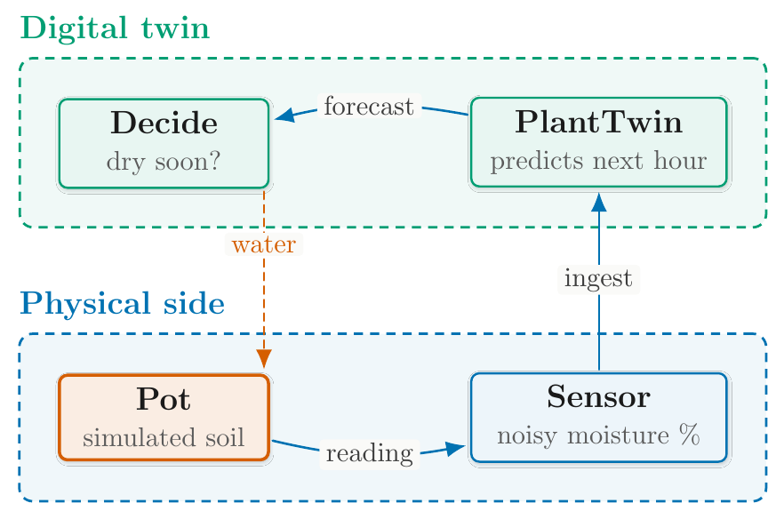

# 🖍 Drawing a figure: the `figure-drawer` skill

Status: **guide.** Written 2026-10-06 (#1027).

**Written for** anyone who wants a figure in a draft: a pipeline, a
control loop, a taxonomy or an architecture, drawn once as TikZ for
the PDF and once as ASCII for every other format. **Assumed:** you have
a draft under `content/drafts/`, or are about to have one from a genre
skill ([GENRE.md](GENRE.md)). **Not covered here:** the figure rules
themselves. The two-form contract, the marker syntax and originality
are [WRITING-STANDARDS.md](WRITING-STANDARDS.md) §10, and what makes
the TikZ half good is [TIKZ-STYLE.md](TIKZ-STYLE.md). This page says
how the skill applies them and when it runs.

## 🧭 Table of contents

- [What it is, and what it is not](#-what-it-is-and-what-it-is-not)
- [Three ways it runs](#-three-ways-it-runs)
- [What you get](#-what-you-get)
- [What it does, step by step](#-what-it-does-step-by-step)
- [A worked example](#-a-worked-example)
- [Thesis fragments](#-thesis-fragments)
- [What it never does](#-what-it-never-does)
- [Why the genre skills keep a short figure step](#-why-the-genre-skills-keep-a-short-figure-step)
- [When something goes wrong](#-when-something-goes-wrong)

## ⚖ What it is, and what it is not

`figure-drawer` owns **how** a figure is drawn: the layout metaphor,
the scaffold it starts from, panel letters, the ASCII twin, the compile
probe and the geometry review. It does not decide **whether** a draft
gets a figure. Each genre sets its own threshold, from the tutorial
(draw every figure that makes a step clearer) to the survey (rarest of
all, since the comparison table usually does the work). `deep-research`
draws no figures.

It also **never presents a draft**. It draws one figure, checks it,
and returns to whichever skill called it. The gate, the render, the
prose check and the verbatim scan stay with that skill.

## 🚦 Three ways it runs

| Who calls it | When | What happens after |
| --- | --- | --- |
| A genre skill: `survey-writer`, `tutorial-writer`, `textbook-chapter-writer`, `thesis-chapter-writer` | mid-draft, once the genre's figure step decides a figure is warranted | back to the genre skill's next step, which places the marker and caption, gates and renders |
| `draft-reviser` | you asked to redraw or fix a figure in an existing draft | back to `draft-reviser`, which logs the change in `revisions.md` |
| You, directly | you asked for a figure in an existing draft | a revision: the session continues in `draft-reviser`'s write-back and gate steps |

You never name a skill. Ask in ordinary words and the right one
answers. A direct request needs three things: **which draft, where in
it, and what the figure shows.**

```text
Draw a figure for step 4 of
content/drafts/labs/first-twin.md showing the loop between the pot,
its sensor and the twin.
```

```text
The retrieval diagram in content/drafts/rag/survey.md overflows the
page. Redraw it.
```

```text
Add a figure to section 2 of content/drafts/thesis/methods.tex showing
the three study phases.
```

On a direct request the genre's threshold does not apply, because you
asked for the figure. With no draft to put it in, the skill says so and
stops.

## 🎯 What you get

Two files under the draft's topic directory, plus one line (or block)
in the draft that names them:

| Draft | In the draft | Files |
| --- | --- | --- |
| `.md` (survey, tutorial, textbook chapter) | `<!-- figure: figures/<name> -->` on a line of its own, a caption line directly below it if the figure warrants one, and `<!-- figureref: <name> -->` wherever prose points at it | `figures/<name>.tex` and `figures/<name>.txt` |
| `.tex` (thesis chapter) | `\input{figures/<name>.tex}` then `%figure: figures/<name>`, inside a hand-written `figure` float with `\caption` and `\label` when captioned | the same pair |

The renderer puts the TikZ in the `tex` and `pdf` outputs and the ASCII
form, in a code block, in `md`, `html` and `docx`. Nothing writes
"Figure 3" by hand: the renderer, or your thesis's own LaTeX, numbers
it.

A flat draft (`content/drafts/<slug>.md` with no topic directory) would
put its figures in `content/drafts/figures/`, shared with every other
flat draft. The skill asks whether to move the draft and its dossier
into a topic directory first, or to drop the figure.

## 🪜 What it does, step by step

Each step names the document that owns its rule.

1. **Looks before drawing.** `python -m chitragupta.draft figures
   <citekey>` lists a cited paper's figures, with a crop of each. Seeing
   how a concept is usually drawn is fine. Reproducing one is not
   ([AGENTS.md](../AGENTS.md), [WRITING-STANDARDS.md](WRITING-STANDARDS.md)
   §10).
2. **Commits to a layout metaphor and copies its scaffold** from
   `assets/tikz/`: pipeline, map, layered stack, control loop, branching
   tree, hub-and-spoke or zoned spine. It re-labels the scaffold, leaves
   the house style block alone, and runs
   `python -m chitragupta.figure sync` on the copy to keep that block
   current ([TIKZ-STYLE.md](TIKZ-STYLE.md)).
3. **Letters the panels** `(a)`, `(b)`, `(c)` in both forms, if the
   figure has more than one.
4. **Writes the ASCII twin** in §10's 7-bit alphabet, showing the same
   boxes, arrows and letters.
5. **Keeps every citekey out of both files**, because the gate reads
   the draft and does not follow `\input`.
6. **Probes and compiles.** `kpsewhich tikz.sty` first. If TikZ is
   missing, it writes no pair: the ASCII goes inline instead (a fence in
   Markdown, `verbatim` in a thesis fragment), with no marker. Otherwise
   it compiles the figure alone in a minimal document with `pdflatex`,
   because a broken figure fails the whole PDF render.
7. **Reads the geometry.** `python -m chitragupta.review figure <draft>`
   reports overlaps, protrusions and hand-loaded libraries. It is a
   review aid, never a gate ([REVIEW.md](REVIEW.md)).
8. **Returns** the two paths and whether the probe passed.

The skill folder also holds a `reference.md` that it reads only when a
step sends it there: which metaphor fits, a worked panelled figure,
fitting a figure without scaling it, and an annotated exemplar.

## 🌱 A worked example

Step 4 of a potted-plant tutorial wires a simulated pot to a digital
twin that predicts when the soil will dry and waters it. The request:

```text
Draw a figure for step 4 of the potted-plant tutorial showing the loop
between the pot, its sensor and the twin.
```

The cycle closing is the whole point, so the metaphor is a **control
loop**, and the drawing starts from `assets/tikz/control-loop.tex`.
Two zone cards separate the physical side from the twin, and the one
edge that crosses back (the twin watering the pot) is drawn as the
loop's return:



The figure's own body, below the house style block the scaffold
carries:

```latex
\begin{tikzpicture}[cg]
  \node[cgkey, text width=24mm] (pot) {\cglab{Pot}{simulated soil}};
  \node[cgbox, right=26mm of pot, text width=30mm] (sensor)
    {\cglab{Sensor}{noisy moisture \%}};
  \node[cgalt, above=24mm of sensor, text width=30mm] (twin)
    {\cglab{PlantTwin}{predicts next hour}};
  \node[cgalt, above=24mm of pot, text width=24mm] (decide)
    {\cglab{Decide}{dry soon?}};
  \draw[cgedge] (pot) to[bend right=12] node[cgtag] {reading} (sensor);
  \draw[cgedge] (sensor) -- node[cgtag] {ingest} (twin);
  \draw[cgedge] (twin) to[bend right=12] node[cgtag] {forecast} (decide);
  \draw[cgback] ([xshift=13mm]decide.south)
    -- node[cgtag, text=cgAccent, pos=0.3] {water}
    ([xshift=13mm]pot.north);
  \begin{scope}[on background layer]
    \node[cgzone=cgFlow, fit=(pot)(sensor)] (zp) {};
    \node[cgzone=cgAlt, fit=(twin)(decide)] (zt) {};
  \end{scope}
  \cgzonelabel{zp}{cgFlow}{Physical side}
  \cgzonelabel{zt}{cgAlt}{Digital twin}
\end{tikzpicture}
```

and its ASCII twin, which is all a reader of the `md`, `html` or `docx`
output sees:

```text
  Digital twin
  +---------------+    forecast    +---------------------+
  |    Decide     |<---------------|      PlantTwin      |
  |   dry soon?   |                | predicts next hour  |
  +---------------+                +---------------------+
          :                                   ^
          : water                             | ingest
          v                                   |
  +---------------+    reading     +---------------------+
  |      Pot      |--------------->|       Sensor        |
  | simulated soil|                | noisy moisture %    |
  +---------------+                +---------------------+
  Physical side
```

The first draw did not pass the pre-flight list in
[TIKZ-STYLE.md](TIKZ-STYLE.md): the two zone cards overlapped, "moisture"
hyphenated inside its box, and the return edge ran through the
"Physical side" title. Wider boxes, more vertical room and an offset
return edge fixed all three, with no change of scale. After that,
`review figure` reported no layout findings and `figure sync --check`
reported the block current.

## 🎓 Thesis fragments

A thesis chapter is a `.tex` fragment that you `\input` into your own
thesis, so two things are yours to act on:

- **TikZ libraries.** When the render prints a `[tikz-libraries]` line,
  add the `\usetikzlibrary{...}` it names to your thesis preamble,
  beside `\usepackage{tikz}`. A figure file must never load a library
  itself inside the float ([TIKZ-STYLE.md](TIKZ-STYLE.md) says why).
- **Unicode.** When it prints a `[unicode]` line, copy
  `chitragupta-unicode.sty` next to your thesis and load it.

The fragment never writes `\renewcommand{\thefigure}`: your thesis's
own counter numbers the figure. [WRITE-A-THESIS-CHAPTER.md](WRITE-A-THESIS-CHAPTER.md)
covers the rest of putting a fragment into a thesis.

## 🚫 What it never does

- **Never puts a citekey in a figure file.** Attribution goes in the
  prose beside the figure, where the gate can see the key (CLAUDE.md's
  one rule).
- **Never reproduces a source figure**, in either notation.
- **Never scales a figure to fit.** No `\resizebox`, no `scale=`. A
  figure that does not fit gets a different layout.
- **Never gates.** `review figure` and `figure sync --check` report;
  `python -m chitragupta.draft gate` stays the only gate.
- **Never presents a draft.** It returns to its caller.

## 🧱 Why the genre skills keep a short figure step

Skills are picked by their trigger descriptions, not called by name, so
a step that says "now use `figure-drawer`" depends on the model actually
loading it, in Claude Code, Codex and OpenCode alike. Each genre's
figure step therefore keeps whatever must hold even if that handoff is
skipped:

- its threshold for drawing at all;
- its output shape (the marker, or the thesis's `\input` and float);
- the TikZ probe and the compile check, with its inline fallback;
- an originality line;
- **no citekey inside either figure file.**

Everything else lives once, in `figure-drawer`.
`tests/test_skill_figure_step.py` pins each stub and fails if a rule
that moved comes back into a genre skill.

## 🩹 When something goes wrong

| Symptom | Likely cause | What to do |
| --- | --- | --- |
| The figure came back as ASCII inline, with no marker | `kpsewhich tikz.sty` found no TikZ on this host | install TeX Live's `texlive-pictures`, then ask for the figure again |
| The whole PDF render fails | a figure file does not compile | ask to fix that figure; the skill re-runs the probe |
| Labels look small in the PDF | the draft wraps the figure in `\resizebox` | remove the wrapper and ask for a re-layout ([TIKZ-STYLE.md](TIKZ-STYLE.md)) |
| `review figure` reports nothing for a busy figure | its nodes have no names, so nothing was measured | name every node |
| A render warns that the figure's style block is stale | the block predates the installed one | `python -m chitragupta.figure sync <file>` |
| Your thesis build fails on `of` in a node position | the TikZ library is not loaded in your preamble | add the `[tikz-libraries]` line's libraries to it |
| A survey asked for a figure and got none | the survey's threshold: the comparison table usually carries that structure | ask directly if you still want one |
