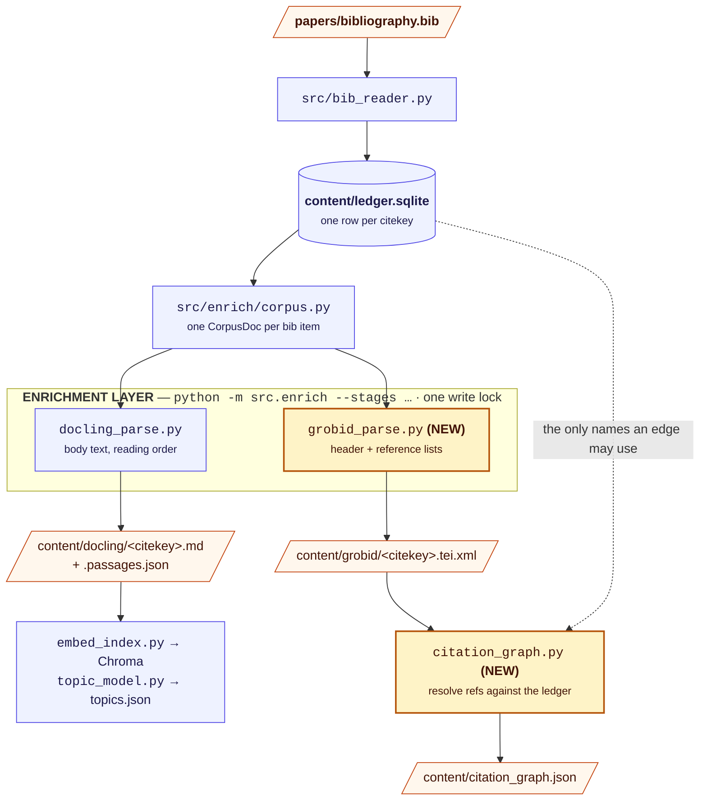
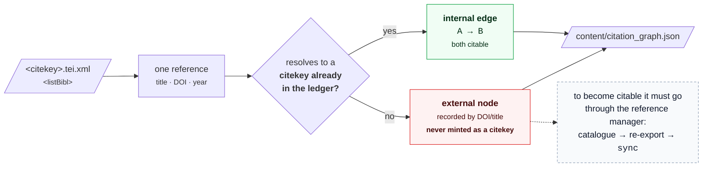

# Proposal: a GROBID stage for a corpus-internal citation graph

Status: **a proposal, not a plan.** Written 2026-08-07.

Nothing described here is built, and `[grobid]` is not a setting that
exists. This document argues a case and
records what it would cost; the decision has not been taken.

**Written for** someone weighing whether to add the stage. It assumes
[ARCHITECTURE.md](ARCHITECTURE.md) for the four layers and
[PDF-PARSER.md](PDF-PARSER.md) for why GROBID was removed from this
repository on 2026-08-01 -- which this proposal has to answer before it
can argue anything else.

Originally drafted 2026-08-07, against an earlier layout of this
repository, and updated here for the current one.

## Table of contents

- [Answering the removal first](#answering-the-removal-first)
- [Where the repository stands today](#where-the-repository-stands-today)
- [Why GROBID and docling, not GROBID instead of docling](#why-grobid-and-docling-not-grobid-instead-of-docling)
- [Proposed design](#proposed-design)
- [Respecting the citekey invariant](#respecting-the-citekey-invariant)
- [What it would cost](#what-it-would-cost)
- [What this does not change](#what-this-does-not-change)
- [Open questions](#open-questions)

## Answering the removal first

GROBID was in this repository and was **removed on 2026-08-01**. Any
proposal to bring it back has to say what is different, so:

> What GROBID uniquely offered -- parsing a paper's own reference list
> into structured author/title/year/DOI records, via the
> `/api/processFulltextDocument` endpoint this repo never called --
> serves *corpus discovery* [...] If corpus-growth-by-snowballing later
> becomes a real workflow, the case to revisit is for
> `/api/processFulltextDocument` specifically -- not the header endpoint
> that was here.
>
> -- [PDF-PARSER.md](PDF-PARSER.md#why-grobid-was-removed)

**This proposal is exactly that revisit.** The removed integration called
`/api/processHeaderDocument` for title, authors and abstract -- metadata
`papers/bibliography.bib` already supplies for every document, which is
why it earned nothing. What is proposed here calls
`/api/processFulltextDocument` for reference *lists*, which the bib file
does not supply and nothing else in the pipeline can derive.

That is a genuine difference in capability, not a re-litigation. It does
**not** dispose of the operational objection -- a pinned JDK 21, a
multi-GB Gradle build, and a long-running service -- which is unchanged
and is the main cost weighed in [What it would cost](#what-it-would-cost).

## Where the repository stands today

Two layers touch PDFs, and neither produces bibliographic structure:

- **The corpus layer** (`src/pdf_text.py`, via `python -m src.corpus sync`)
  extracts plain text per citekey to `content/parsed/<citekey>.txt`,
  feeding BM25 retrieval in `src/retrieval.py`. It dispatches through
  `_EXTRACTORS` to `pdftotext` (default) or `docling`. One file in, one
  text file out.
- **The enrichment layer** (`src/enrich/docling_parse.py`, via
  `python -m src.enrich --stages docling`) always uses docling regardless
  of `[parser].backend`, producing `content/docling/<citekey>.md` plus a
  `.passages.json` sidecar of reading-ordered, quotable passages. This
  feeds embeddings and BERTopic.

What neither produces is **structured bibliographic metadata and a
citation graph**. The only metadata source is `papers/bibliography.bib`
itself, parsed by `src/bib_reader.py` -- whatever your reference manager
exported. There are no in-text citation contexts, no resolved reference
list per paper, and no way to ask "does paper A cite paper B" *within
this corpus*.

`_EXTRACTORS` looks like the seam for a new backend, and it is the wrong
one. It exists to swap what the corpus layer's plain text is *made of*:
one PDF in, one `.txt` out. GROBID's TEI is structurally different data
-- nested XML with header, body and back sections -- and forcing it
through that table would mean either discarding everything but body text
(defeating the point) or making `pdf_text.py` non-uniform in its return
type. The right precedent is `docling_parse.py`: a corpus-wide stage
under `src/enrich/`, run from `src/enrich/__main__.py`, independent of
`[parser].backend`.

## Why GROBID and docling, not GROBID instead of docling

Each is purpose-built for something the other is not:

| | GROBID | docling |
|---|---|---|
| Header metadata | Purpose-built (title, authors, affiliations, abstract) | General layout detection, not citation-schema-aware |
| References | Structured TEI records, ~0.87-0.90 F1 | No dedicated citation parser |
| Body text and sections | Adequate; sometimes misses full section isolation | Strong -- this repo depends on it for reading order |
| Quotable passages | Not its job | The `.passages.json` sidecar a claim is quoted from |
| Output | XML/TEI | JSON, Markdown |

**GROBID answers "what is this paper and what does it cite"; docling
answers "what does this paper actually say."**

The cost argument is favourable. A GROBID call does sequence labelling,
not layout or OCR inference, so it is orders of magnitude cheaper per
document than a docling parse -- which [PERFORMANCE.md](PERFORMANCE.md)
measures at 55m 30s for a serial 501-PDF pass with OCR off, CPU-bound
even on a GPU host (~7% SM utilisation on an A40). GROBID writes to a
separate artefact, so it does not compete for the same CPU-bound budget.

## Proposed design

### Where the stage sits



The two new modules are shaded. Note that both read
`src/enrich/corpus.py`, which sources the corpus from the ledger and
nothing else -- so every document GROBID sees is one a draft is allowed
to cite. That is a constraint, not an accident; see
[AGENTS.md](../AGENTS.md).

### `src/enrich/grobid_parse.py`

Modelled on `docling_parse.py`: corpus-wide, incremental, self-probing.
It calls GROBID's `/api/processFulltextDocument` per PDF and writes the
TEI to `content/grobid/<citekey>.tei.xml`.

It must follow the same three conventions every stage here follows:

- **Report, don't assume.** Probe `GET {url}/api/isalive` before running
  and report `service-unavailable` rather than failing hard -- the
  client/server equivalent of the existing `missing-binary`.
- **Be incremental.** Fingerprint each PDF by `(size, mtime_ns)` as
  `docling_parse.py` does, so a second run over an unchanged corpus is
  free.
- **Report per document.** It holds the write lock, so it must be
  observably making progress -- `[done/total] <citekey>`, per
  [DESIGN.md](DESIGN.md)'s concurrency policy.

Status vocabulary, matching `src/enrich/__main__.py`:

| Condition | Report |
|---|---|
| `[grobid].enabled = false` | `skipped` |
| Service unreachable at `[grobid].url` | `service-unavailable` |
| TEI written | `ok` |
| GROBID returns malformed or empty TEI for one PDF | `partial`, with a warning naming the citekey -- one bad document does not fail the corpus |

### `src/enrich/citation_graph.py`

Parses each TEI's `<listBibl>`, extracts each referenced work's
title/DOI, and resolves it against the ledger's existing citekeys.



Output is an edge list of `citekey -> [citekeys it cites, restricted to
this corpus]`.

**This is the gap nothing else can fill.** BM25 in `src/retrieval.py` and
the embedding index in `src/enrich/embed_index.py` both rank on body-text
similarity. Neither can answer "what does this corpus treat as
foundational" or "cluster these papers by citation structure rather than
by topic model" -- there is no citation-structure data to answer from.

### Configuration

A new section, following the existing `[parser]`/`[enrich]` pattern, each
key overridable by an env var of the same name:

```toml
[grobid]
enabled = false                  # GROBID_ENABLED
url = "http://localhost:8070"    # GROBID_URL
timeout_seconds = 120            # GROBID_TIMEOUT_SECONDS
consolidate_citations = 1        # GROBID_CONSOLIDATE_CITATIONS
                                 # 0/1/2 -- GROBID's own levels; higher is
                                 # more accurate, slower, and needs
                                 # external lookups
```

`consolidate_citations` deserves a flag in the requirements table:
GROBID's consolidation calls CrossRef to resolve incomplete reference
strings, so **this stage may need network access per document at parse
time** -- a different network profile from anything else here, where the
network is needed once for model downloads and never again.

### Runtime

GROBID runs as a long-lived service, not an in-process import:

```bash
docker run --rm -p 8070:8070 grobid/grobid:0.9.0
```

That fits the existing container story ([DOCKER.md](../DOCKER.md)) as a
sidecar. Invocation would extend `--stages`:

```bash
.venv-full/bin/python -m src.enrich --stages grobid,citation_graph
```

## Respecting the citekey invariant

**The hard rule is unchanged and this stage does not get an exception.**
GROBID's consolidated references routinely resolve to DOIs and titles not
in `papers/bibliography.bib`. Those become **edges to external nodes**,
never new citable claims. `citation_graph.py` may only ever *resolve* a
reference against an *existing* ledger citekey; it must never mint one.

Two consequences worth stating, because both are new since the original
draft:

- **There is no longer a second, uncitable document namespace to appeal
  to.** The original draft justified this by analogy with `papers/pdfs/`,
  a directory of raw PDFs that were indexed but never citable. That
  directory, its config key and its `doc:<stem>` id namespace were all
  removed precisely because a permanently non-citable case was a
  cost every downstream stage paid. **Reintroducing one here would undo
  that**, so external nodes must live in `citation_graph.json` alone --
  never in the ledger, never in Chroma, never anywhere a retrieval call
  can return them.
- **A citekey is also a filename**, enforced by
  `bib_reader.citekey_problem()`. Anything writing
  `content/grobid/<citekey>.tei.xml` inherits that guarantee, and must not
  construct a path from a GROBID-derived string, which carries no such
  guarantee.

## What it would cost

Honest accounting, since the operational objection that removed GROBID
still stands:

| Cost | Detail |
|---|---|
| A pinned JDK 21 | Its bundled Kotlin compiler cannot parse a JDK 25 version string. Unchanged since the removal |
| A multi-GB, multi-minute build | Or accepting the prebuilt Docker image and its footprint |
| A long-running service on port 8070 | The only component here that is not a batch job -- a genuinely new operational shape |
| Per-document network | With `consolidate_citations > 0`. New for this pipeline |
| A new artefact in the reproducibility contract | [ARCHITECTURE.md](ARCHITECTURE.md#what-is-reproducible-and-what-is-not) is artifact-by-artifact; `.tei.xml` and `citation_graph.json` each need a row, and consolidation makes the graph depend on an *external service's* state, so it is unlikely to be reproducible at all |

**The case turns on one question: is snowballing a real workflow here?**
If corpus growth stays "notice a paper, catalogue it in Zotero,
re-export", the graph is interesting but unused, and this is a service
and a JDK for a feature nobody runs. If it becomes routine, this is the
only design that supports it without touching the citekey invariant.

## What this does not change

- **The corpus layer** -- `sync`, `pdf_text.py`, BM25 retrieval:
  untouched.
- **`[parser].backend`** -- untouched. GROBID is not a `pdf_text.py`
  backend and does not appear in `_EXTRACTORS`.
- **docling, embeddings, BERTopic** -- untouched; they run independently
  and write to separate artefacts.
- **The gate chain** -- `citation_gate` → `references` → `render_output`:
  untouched. The citation graph is an *optional additional input* a genre
  skill may consult, never a replacement for the gate.
- **Who runs it** -- a human, like every other enrichment stage. No skill
  builds it.

## Open questions

- **Does the graph have a consumer?** `content/topics.json` is already an
  artefact nothing reads (see [DEVELOPER.md](../DEVELOPER.md)). Adding a
  second unread artefact, at the cost of a JDK and a service, would be a
  worse version of the same mistake. A concrete consumer -- a
  `survey-writer` step, a retrieval signal -- should be named before this
  is built.
- **How well does title/DOI resolution actually work** against a real bib
  file, where the same paper appears as a preprint in one entry and a
  published version in another? The edge count is meaningless if
  resolution is unreliable, and this is measurable before any of the above
  is built: run GROBID over 20 PDFs by hand and check the resolution rate.
- **Is `consolidate_citations = 0` enough?** It avoids the per-document
  network entirely. Whether unconsolidated reference strings resolve well
  enough against the ledger is exactly what the pilot above would answer.
