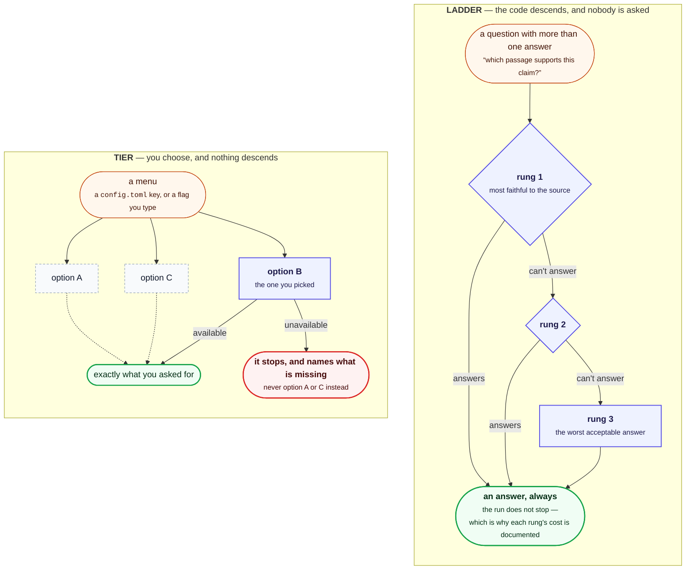
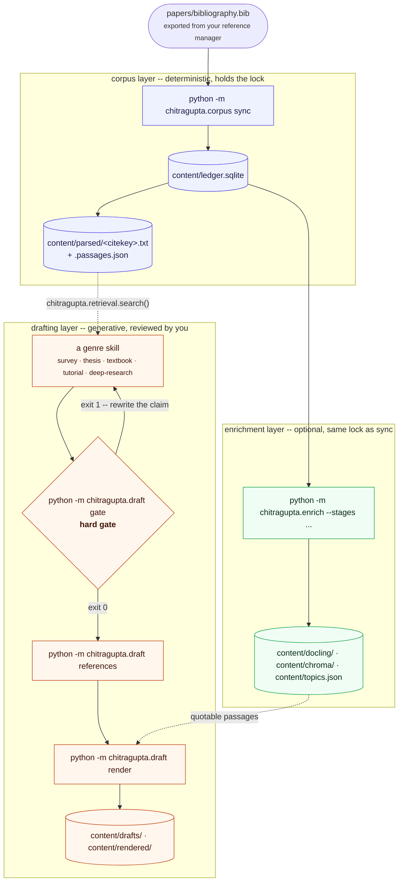
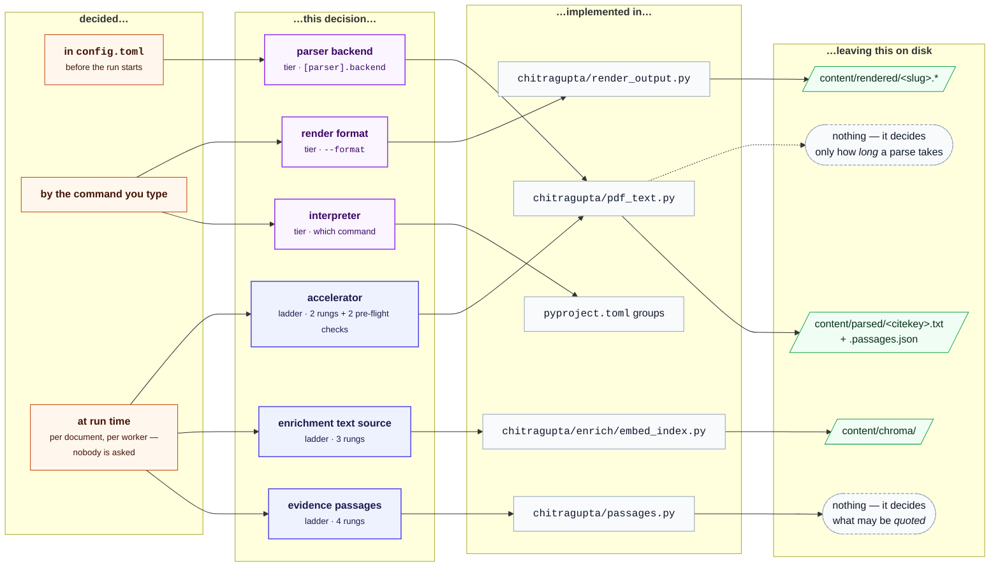

# The pipeline, its ladders, and its tiers

Status: **reference.** Written 2026-08-06.

**Written for** anyone who has hit a fallback and wants to know what they
lost by it. **Assumed:** [CLI.md](CLI.md) for the commands named here.
**Not covered here:** the code that implements each rung, which is
[ARCHITECTURE.md](ARCHITECTURE.md)'s territory.

Most of this repository does one job per module. This page is about the
places where it does *one job two ways*: where the same question has more
than one answer, and something has to pick. "What text supports this
claim?" is one such question. "How do I turn a draft into a PDF?" is
another.

There are six such places. Three pick for you, silently, at run time.
Three you pick yourself, in a config file or on a command line. Telling
those two apart is the whole point of the page, because they fail
differently: the first kind degrades quietly and you may not notice for
weeks, the second kind stops and names what is missing.

Read [docs/ARCHITECTURE.md](ARCHITECTURE.md) first if you want to know
*what the parts are*, and [docs/DIAGRAMS.md](DIAGRAMS.md) if you want to
see the workflow drawn. This page assumes both and asks a narrower
question: where does this pipeline choose, and what does it choose
between?

## Table of contents

- [The terms](#the-terms)
- [The pipeline in one pass](#the-pipeline-in-one-pass)
- [The three ladders](#the-three-ladders)
  - [1. Evidence passages](#ladder-1-evidence-passages)
  - [2. Enrichment text source](#ladder-2-enrichment-text-source)
  - [3. Accelerator](#ladder-3-accelerator)
- [The three tiers](#the-three-tiers)
  - [1. Parser backend](#tier-1-parser-backend)
  - [2. Interpreter](#tier-2-interpreter)
  - [3. Render format](#tier-3-render-format)
- [What is deliberately not a ladder](#what-is-deliberately-not-a-ladder)
- [The mapping](#the-mapping)

## The terms

Seven words, used precisely throughout this repository. The first four
describe the shape of the system; the last three describe how it decides.

**Pipeline.** Everything from a BibTeX export to a rendered document. Not
a single process: it is four layers that run at different times, on
different commands, and under different assumptions about whether a human
is watching.

**Layer.** One of four groups of modules, distinguished by *who runs
them and what they are allowed to do*.

| Layer | What it is | Runs when |
|---|---|---|
| **1. Corpus** | `python -m chitragupta.corpus sync` and the ledger it maintains. Deterministic, unattended-safe. | On demand or on a schedule |
| **2. Drafting** | The genre skills in `.claude/skills/`, and the gate/references/render chain each runs on its own output. Generative, reviewed by you. | When you ask for a draft |
| **3. Enrichment** | `python -m chitragupta.enrich` -- Docling, embeddings, topic modelling. Optional, opt-in, and nothing above depends on it. | Never, unless you choose to |
| **4. Review** | `citation_provenance`, `verbatim_check`, `citation_coverage`, `synthesis`, `figure_layout`, `uncited_prose`. Advisory over a finished draft -- never a gate. | When you ask, and at the end of a drafting skill's run |

The numbers are introduction order, not a dependency rank.

**Stage.** One step within a layer, with its own name and its own status.
The enrichment layer is the only one that literally enumerates them
(`--stages docling,embed,bertopic`, each reporting `ok`, `partial`,
`skipped`, `missing-binary` or `error`). There are three, and every one
of them writes a corpus artefact -- which is why the layer takes the same
write lock as `sync`, and why its unit of work is the corpus rather than
a draft.

**Artefact.** A file a stage writes, under `content/`. Artefacts are how
the layers communicate: no layer calls into another, they read each
other's files, and a layer that hasn't run leaves the file absent rather
than empty.

**Ladder.** An ordered chain the code walks *automatically*: it tries the
first rung, and falls to the next when that one cannot answer. Nobody is
asked. The run does not stop.

**Rung.** One option in a ladder. Rungs are ordered best-first, and "best"
always means *most faithful to the source*, never fastest.

**Tier.** A menu you choose from, with no automatic descent. If the option
you picked is unavailable, the pipeline says so and stops that piece of
work. It does not quietly substitute a neighbour.

The distinction between the last two is the one worth holding on to:

> A **ladder** answers "this is the best I could do." A **tier** answers
> "you asked for something this host cannot give you."

Drawn side by side, because the shapes are what separate them -- one
descends on its own, the other doesn't descend at all:

The asymmetry in those two shapes is the whole reason to name them apart.
A ladder always reaches an answer, so its worst rung is silent -- the
output still looks like output, and nothing in the run says which rung
produced it. A tier can only give you what you asked for or nothing, so
its failure is loud and self-describing. Everything below is one or the
other.

A ladder that silently reaches its worst rung is the failure mode this
repository worries about most, because the output still looks like output.
That is why each ladder below states what its bottom rung costs you, not
just what it is.

## The pipeline in one pass

Every command above and the flags it takes are in
[docs/CLI.md](CLI.md); the same workflow drawn eleven other ways is in
[docs/DIAGRAMS.md](DIAGRAMS.md).

### What the enrichment layer works on

Worth stating plainly, because the natural assumption is the expensive
one and it is wrong. **By default the enrichment layer parses your whole
corpus, not the papers a draft happens to cite.** One flag changes that,
for one of the three stages. The rest of this section is its reach.

`chitragupta/enrich/__main__.py` calls `corpus.build_corpus()`, which returns
**every row in the ledger, and nothing else.** `ledger.all_items()` is a
bare `SELECT * FROM items`. So this is every citekey your BibTeX export
produced, including entries whose reference-manager record has no PDF
attached.

That the bibliography is the *only* source is a guarantee the rest of the
layer is built on, not an accident of the current implementation. Every
document carries a real citekey, which is its whole identity. So every
Chroma hit, every topic member and every figure record names something a
draft is allowed to cite.

An earlier version also swept a hand-filled directory of raw PDFs into
the corpus, under ids the citation gate would always reject. That cost
every stage downstream a permanently non-citable case, in exchange for
indexing evidence no draft was ever allowed to use.

If a paper is worth indexing it is worth cataloguing: put it in your
reference manager, re-export, and re-run `python -m chitragupta.corpus sync`.

Every stage then receives that whole list, and unless you say otherwise
nothing filters it by draft, by reference list, or by citation: a draft
citing eleven papers does not cause eleven papers to be parsed. The
default unit of work is the corpus.

Only the documents that have a PDF get parsed, though, which is worth
knowing before reading a stage's counts. Measured on this project's own
corpus: `build_corpus()` returns **642 documents, of which 497 have a PDF
to parse** -- the remaining 145 are ledger entries with no attachment.

That is why the enrichment layer is opt-in and why its cost is quoted
per-corpus rather than per-draft: on this project's own 501-PDF corpus, a
first Docling pass is 3330s serial and 310s at twelve workers
([docs/PERFORMANCE.md](PERFORMANCE.md)).

### Scoping a run to one draft

`--for-draft content/drafts/<slug>.md` narrows that list to the papers
the named draft cites, read out of it with the same
`citation_gate.extract_citekeys` the hard gate uses.

It exists because the honest advice was otherwise "run it over
everything, once, and budget an hour". Most people defer that decision
rather than take it, and deferring it is why rung 1 of the passage ladder
below is so often absent. The flag makes the layer something you can try
on one chapter and judge before committing the machine to the whole
library. Flags and worked output are in
[docs/CLI.md](CLI.md#enriching-one-drafts-papers).

Which stages it reaches is the part worth being precise about, because it
is fewer than it sounds:

| Stage | Under `--for-draft` | Why |
|---|---|---|
| `docling` | scoped | Per-document by nature. Its artefacts are keyed by citekey and its cache is per-document, so eleven of them is a subset of the corpus-wide result, not a different one |
| `embed` | **refused** | The Chroma collection records nothing about how much of the corpus it covers, and every skill that reads it decides by asking only whether `content/chroma/` exists. A partial index would answer as though it were complete |
| `bertopic` | **refused** | Overwrites `content/topics.json` whole. Clustering is inherently whole-corpus -- one added document can move every assignment -- so a scoped run would replace a topic model with something that isn't one |

So the filter changes the behaviour of exactly one stage of the three,
and the other two are deliberately out of reach.

The two refusals are a **tier**, not a ladder, in this page's vocabulary,
and they are the reason the flag is safe to offer at all. Asked to scope
`embed`, the run stops and prints the two commands to use instead.

It does not descend to a neighbouring answer. Not "run it over the whole
corpus anyway", which is the hour of work `--for-draft` exists to avoid.
And not "index the eleven", which is the silently-partial artefact this
page's opening worries about. Allowing the second would need the Chroma
collection to record its own coverage first. Until it does, the honest
answer is to refuse.

What makes the scoped `docling` run safe in the other direction is that
its cache is per-document, and is never rewritten to match the scope. A
narrow run followed by a full one parses nothing twice, and neither does
a full run followed by a narrow one.

It is also why the `docling` stage now adopts the corpus layer's parse
where it can. When `[parser].backend = "docling"` has already parsed a
citekey, the two layers would otherwise produce the same document twice
from the same PDF, and the second pass buys nothing. The dependency runs
one way only: the enrichment layer reads `content/parsed/`, and the
corpus layer neither knows nor cares that it does.

Reuse is refused in three cases:

- a document the corpus layer wrote no parsed text for -- a bib entry
  with no PDF attached, or one whose parse failed;
- a run with figures on, because the corpus layer writes no bitmaps;
- artefacts older than their PDF.

## The three ladders

### Ladder 1: Evidence passages

**The question:** a claim cites `smith_2024` -- which part of that source
supports it, and may it be quoted?

**Where:**
[`chitragupta/passages.py`](https://github.com/prasadtalasila/chitragupta/blob/main/src/passages.py),
read by
`chitragupta.review provenance` and (not yet) `chitragupta.draft retrieve`.

| # | Rung | Written by | Quotable? |
|---|---|---|---|
| 1 | `content/docling/<citekey>.passages.json` | enrichment layer's `docling` stage | **yes** |
| 2 | `content/parsed/<citekey>.passages.json` | corpus layer, when `[parser].backend = "docling"` | **yes** |
| 3 | `content/parsed/<citekey>.txt` split on form feeds | corpus layer, either backend | no -- page only |
| 4 | `pdftotext -layout` run fresh on the PDF | nobody; computed on demand | no -- page only |

Rungs 1 and 2 hold the same kind of record, from
`passages.passage_records()`: one entry per prose text item, carrying the
text, its semantic label, its page and its bounding box.

They are separate files because the two layers own separate directories
and re-run on separate schedules. The corpus layer must be able to
invalidate *its* sidecar on every re-parse without deleting an enrichment
sidecar it did not write and cannot reproduce. Rung 1 wins when both
exist, because the enrichment stage parses the PDF a second time under
its own OCR and figure settings.

Rung 2 is self-healing. `sync` treats a citekey it calls `parsed` whose
sidecar is missing as one that needs parsing again. A corpus parsed
before this project kept Docling's document model therefore gains
passages on the next run, and a sidecar deleted by hand comes back.

That check is skipped for `pdftotext`, which resolves no reading order
and writes no sidecar. Demanding one would re-parse the whole corpus on
every run.

**What the bottom two rungs cost you.** `pdftotext -layout` preserves a
page's *visual* arrangement rather than its reading order. On a
two-column paper a single output line can therefore splice together two
unrelated columns -- 82%-89% of long lines on 4 of the 10 papers in this
project's sample.

Ranking survives that. Quoting does not, because an excerpt cut from
spliced text is a collage of two arguments that *reads* as evidence. So
rungs 3 and 4 return a `Passage` whose `text` is `None`. The guarantee is
structural rather than advisory: a caller that wants to quote has nothing
to quote. See [docs/CITATION-PROVENANCE.md](CITATION-PROVENANCE.md).

### Ladder 2: Enrichment text source

**The question:** what text should be embedded, chunked and clustered for
this document?

**Where:** `embed_index.get_text()` in
[`chitragupta/enrich/embed_index.py`](https://github.com/prasadtalasila/chitragupta/blob/main/src/enrich/embed_index.py),
also used by
`chitragupta/enrich/topic_model.py`.

| # | Rung | Note |
|---|---|---|
| 1 | `content/docling/<citekey>.md` | the enrichment layer's own parse; image references are stripped before embedding |
| 2 | the ledger's `parsed_path` `.txt` | whatever the corpus layer produced, verbatim |
| 3 | `pdftotext -layout` into a temp file | for a bib item the corpus layer has not parsed -- a parse that failed, or one not re-run since the PDF was attached |

This ladder is why the enrichment layer's `embed` stage does not *require*
its `docling` stage: running `--stages embed` alone works, but on
plainer text.

**What the bottom rungs cost you.** Less than in ladder 1, and for a
reason worth naming: embedding is bag-of-words-ish enough that column
splicing moves words around *within* a page rather than between pages. The
cost is quality of retrieval, not correctness of attribution.

**One thing to know before you change it.** `build_index()` skips
re-encoding a document whose text hashes the same as last run. The hash is
taken over whatever this ladder returned -- so a change to any rung's
*output* invalidates that cache and re-encodes the corpus. Restoring page
breaks to the corpus layer's `.txt` (see ladder 1's rung 3) did exactly
that, once.

### Ladder 3: Accelerator

**The question:** which device parses this PDF?

**Where:**
[`chitragupta/pdf_text.py`](https://github.com/prasadtalasila/chitragupta/blob/main/src/pdf_text.py),
for both the corpus
layer's docling backend and the enrichment layer's docling stage.

| # | Rung | Falls when |
|---|---|---|
| 1 | one CUDA device per worker, round-robin | -- |
| 2 | that worker on the CPU, permanently for the run | the device raises CUDA out-of-memory |

Two checks run *before* the ladder and decide what its top rung even is,
which is why this reads as three mechanisms rather than one:

- `usable_devices()` refuses a card with less than 2560 MiB free. A
  docling worker holding the layout, table and OCR models sits at ~1.7 GiB
  plus a CUDA context of its own, so a card already full would give every
  worker assigned to it a model load that cannot succeed. That matters
  more than it sounds: a poisoned worker fails in ~19s where a working one
  takes minutes, so the pool feeds it work *preferentially*. One real run
  had four such workers claim and fail 334 of 456 documents.
- `_parse_visible_devices()` maps `CUDA_VISIBLE_DEVICES` to physical
  cards, because `nvidia-smi` ignores that variable and every CUDA process
  obeys it. Without the mapping a worker can be handed a `cuda:3` that
  does not exist in its own view.

**What the bottom rung costs you.** Time, and nothing else. The demotion
is deliberately permanent for the run rather than retried per document --
a card that just ran out is likely to do it again, and thrashing between
devices costs more than finishing slowly. See
[docs/PERFORMANCE.md](PERFORMANCE.md) for what a GPU is and isn't worth
here.

## The three tiers

Three here, four in
[ARCHITECTURE.md](ARCHITECTURE.md#ladders-and-tiers)'s tier-set table,
and both are right. The fourth is the **detection tiers** behind
`chitragupta/review/verbatim_check.py`'s `scan`.

It has no section here because this page's question -- *where does the
pipeline choose, and what does it choose between?* -- has no answer for
it. Nothing picks a detection tier: every available one runs, and the
findings are unioned. It is a tier set only in the sense the table's
third column asks about, namely what happens when an option is
unavailable.

[PLAGIARISM.md](PLAGIARISM.md) treats it for a reader of a report, and
[PLAGIARISM-DESIGN.md](PLAGIARISM-DESIGN.md) for someone changing one.

### Tier 1: Parser backend

**Set by:** `[parser].backend` in `config.toml`, or the `PARSER` env var.

| Option | Needs | Page breaks | Quotable passages | Speed |
|---|---|---|---|---|
| `pdftotext` (default) | `poppler-utils` on `PATH` | yes -- form feeds | no | fastest |
| `docling` | the `enrich` Poetry group, in a venv | yes -- form feeds | **yes**, writes ladder 1's rung 2 | ~6.65s/PDF serial |

**If the one you picked is unavailable:** `sync` warns and skips parsing.
It does **not** silently substitute the other backend -- a corpus half
parsed by each would be impossible to reason about afterwards.

Two backends were evaluated and removed on 2026-08-01 (`markitdown`,
`grobid`); [docs/PDF-PARSER.md](PDF-PARSER.md) keeps the comparison as a
record of the decision.

### Tier 2: Interpreter

**Set by:** which command you are running. This is a tier and not a ladder
because nothing degrades: a module either imports or raises
`ModuleNotFoundError`.

| # | Needs | Commands |
|---|---|---|
| 1 | bare `python`, stdlib only | `chitragupta.draft` (all six commands), `chitragupta.corpus ledger`, `chitragupta.review` (all four aids), `chitragupta.passages` |
| 2 | a venv with `bibtexparser` | `python -m chitragupta.corpus sync` |
| 3 | a venv with the `enrich` group | `python -m chitragupta.enrich` |

Tier 1 is a design constraint, not an accident: the citation gate is the
one thing that must run everywhere, including as a hook on a machine that
has never installed this project's dependencies. `chitragupta/passages.py` belongs
to that tier too, which is why it describes a Docling document purely
through `getattr` and never imports the library. See
[docs/ARCHITECTURE.md](ARCHITECTURE.md#which-interpreter-and-why).

### Tier 3: Render format

**Set by:** `--format` on `python -m chitragupta.draft render`.

| Format | Needs | Note |
|---|---|---|
| `md` from a `.md`/`.markdown` draft | nothing | done in-process; citation numbering is not a format conversion, and pandoc's Markdown writer mangles it |
| `md` from a `.tex` draft | pandoc | a real conversion, so it goes to pandoc after all |
| `tex`, `docx` | pandoc | |
| `pdf` | pandoc + `pdflatex` | |

**If a binary is missing:** reported as `missing-binary`, never a
traceback, and never silently downgraded to a format that would have
worked. A `.pdf` you asked for and did not get is a fact you need to see.

## What is deliberately not a ladder

Naming three ladders implies the rest of the pipeline doesn't fall back,
and mostly that is true by design. Two near-misses are worth stating so
they aren't mistaken for rungs:

- **The ledger's change detection** (`chitragupta/ledger.py`) checks size and
  mtime before hashing a PDF. That is an *optimisation* with one answer --
  hashing is the fallback that stat merely defers, and both agree. A
  ladder's rungs disagree; these don't.
- **The enrichment layer's Docling cache** re-parses when a PDF's
  `(size, mtime_ns)` changes, when `_CACHE_VERSION` moves, or when an
  expected output file is missing. Also one answer, reached three ways.

## The mapping

Everything above at once. Read left to right: *when a decision is made,
which decision it is, what implements it, and what it leaves behind.* The
three ladders all sit in the right-hand column of "decided at run time".
The three tiers are all settled before a single PDF is opened.

Two things that diagram makes visible and the table below does not.

The parser backend is the only decision that reaches into two others. It
decides whether the evidence ladder has a rung 2 to land on, and it
shares `chitragupta/pdf_text.py` with the accelerator ladder.

And two decisions leave nothing on disk at all. They change what you are
*allowed to do* with the files, or how long it takes to get them. That is
exactly why neither shows up in a backup, and neither can be inspected
after the fact.

The same thing as a table. Read a row as: *this decision selects this
thing, is made here, is implemented there, and shows up on disk as that.*

| Decision | Kind | Selects | Decided | Implemented in | Artefact |
|---|---|---|---|---|---|
| Evidence passages | ladder, 4 rungs | what may be quoted | at read time, per citekey | `chitragupta/passages.py` | `*.passages.json`, else nothing |
| Enrichment text source | ladder, 3 rungs | what gets embedded | at index time, per doc | `chitragupta/enrich/embed_index.py` | `content/chroma/` |
| Accelerator | ladder, 2 rungs (+2 pre-flight checks) | which device parses | per worker, per run | `chitragupta/pdf_text.py` | none -- affects time only |
| Parser backend | tier | how PDFs become text | `[parser].backend` | `chitragupta/pdf_text.py` | `content/parsed/*.txt` |
| Interpreter | tier | what can run at all | the command you type | `pyproject.toml` groups | none |
| Render format | tier | what the draft becomes | `--format` | `chitragupta/render_output.py` | `content/rendered/` |

And the same decisions against the layer that makes them:

| Layer | Ladders it walks | Tiers it obeys | Lock |
|---|---|---|---|
| 1. Corpus (`chitragupta.corpus sync`) | accelerator | parser backend, interpreter 2 | **holds it** |
| 2. Drafting (genre skills) | evidence passages | interpreter 1, render format | none |
| 3. Enrichment (`python -m chitragupta.enrich`) | enrichment text source, accelerator | interpreter 3, render format | **same lock as sync** |
| 4. Review (the three aids) | evidence passages, detection tiers | interpreter 1, render format | none |

The two lock-holders never run at once: the second to start exits `2`
rather than interleaving writes to `content/`.

Review's "none" is load-bearing rather than incidental: the layer is
read-only over the corpus and must keep working during a `sync`.

It is also the row easiest to make false by accident. An enrichment stage
wrapping `provenance` or `render` would sit inside that layer's lock, so
a review aid and a drafting-layer render would each take a lock their own
layer says they do not. Keeping those two out of the stage list is what
keeps this table true rather than aspirational.

## See also

- [docs/ARCHITECTURE.md](ARCHITECTURE.md) -- what the parts are, and which
  interpreter each needs
- [docs/DIAGRAMS.md](DIAGRAMS.md) -- the same workflow drawn eleven ways
- [docs/CONFIG.md](CONFIG.md) -- every setting these tiers read
- [docs/CITATION-PROVENANCE.md](CITATION-PROVENANCE.md) -- what ladder 1
  is ultimately for
- [docs/PLAGIARISM-DESIGN.md](PLAGIARISM-DESIGN.md) -- the detection
  tiers in full: what the exact tier catches, what it cannot, and why the
  other two are not mutually exclusive with it
- [docs/PDF-PARSER.md](PDF-PARSER.md) -- how the parser tier was chosen
- [docs/PERFORMANCE.md](PERFORMANCE.md) -- what each of these costs
