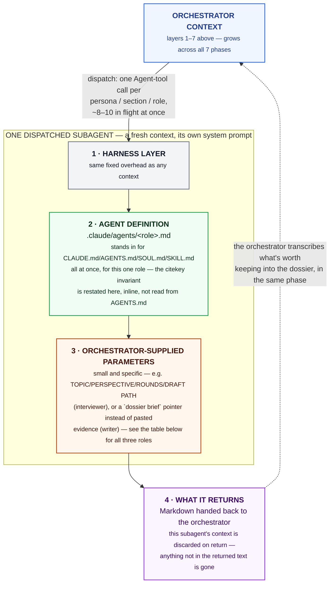

# PROMPTS.md

What text does the model actually see when a genre skill runs? This
document answers that for two skills that sit at opposite ends of this
pipeline's complexity: `textbook-chapter-writer`, a single-context skill,
and `deep-research`, a multi-agent one. They do **not** look the same --
the second half of this document is about why.

This file is self-contained: read it without any other doc open. Where
it names a file, that is so you can go verify the claim yourself, not
because you need to have already read it.

## Vocabulary this document assumes

- **The prompt**: everything the model is given before it generates --
  the harness's own system prompt, plus whatever project files, prior
  tool output and conversation turns are in context at that point.
- **CLAUDE.md**: this repository's router, loaded into every Claude Code
  session automatically. It is one page and contains almost no rules
  itself -- it says which of two longer files governs the task at hand
  and sends the agent there.
- **AGENTS.md / SOUL.md**: `AGENTS.md` is the rulebook for an agent
  *drafting content* with this pipeline (the citekey invariant, the
  four layers, the gate). `SOUL.md` is the one-page "why" behind it and
  the tie-breaker if two docs disagree. Both are pointed to by
  `CLAUDE.md`, not inlined in it.
- **A skill**: a Markdown file under `.claude/skills/<name>/SKILL.md`.
  Invoking one loads its full body into the current context, as
  instructions to follow for the rest of the turn -- it is not a
  function call, it is more text added to the same prompt.
- **A subagent**: a *separate* model context, dispatched by the running
  skill (via an `Agent`-style tool call), with its own system prompt --
  usually a file under `.claude/agents/<name>.md` -- and only the
  specific inputs the dispatching skill hands it. It cannot see the
  dispatching session's conversation, and the dispatching session
  cannot see its intermediate reasoning, only what it returns.
- **The dossier**: `content/dossiers/<draft path minus suffix>/`, a set
  of Markdown files (`scope.md`, `evidence.md`, `rejected.md`,
  `retrieval.md`, `steering.md`, `sections.md`) that record the
  judgment behind a draft -- reader, kept/rejected sources, glossary --
  so a later revision doesn't have to reconstruct it from a stale
  conversation. `docs/DRAFT-ITERATION.md` is the full design.

## 1. A single-context skill: `textbook-chapter-writer`

This skill never dispatches a subagent. Everything happens in one
context, so its prompt is one stack that only ever grows, in this
order:

```mermaid
flowchart TB
  L1["<b>1 · HARNESS LAYER</b><br/><i>fixed overhead, present on every turn</i><br/><br/>Claude Code's own system prompt<br/><small>tool definitions · platform · environment</small><br/><br/>SessionStart hook output<br/><small>e.g. the corpus-config preflight check</small>"]

  L2["<b>2 · PROJECT ROUTER</b><br/><i>CLAUDE.md, auto-loaded by the harness every turn</i><br/><br/><b>CLAUDE.md</b><br/>“drafting content? → read AGENTS.md,<br/>that file and the skill are the whole contract”<br/><small>+ the one hard rule, stated once:<br/>never fabricate a citekey</small>"]

  L3["<b>3 · GOVERNING CONTRACT</b><br/><i>read because CLAUDE.md said to</i><br/><br/><b>AGENTS.md</b><br/><small>citekey invariant in full · the bib file as<br/>source of truth · the four layers · the gate</small><br/><br/><b>SOUL.md</b><br/><small>the one-page why · tie-breaker on disagreement</small>"]

  L4["<b>4 · SKILL BODY</b><br/><i>loaded whole the moment the skill is invoked</i><br/><br/><b>.claude/skills/textbook-chapter-writer/SKILL.md</b><br/><small>frontmatter + the full 18-step process<br/>(name the reader → objectives → scope →<br/>… → gate → render → present)</small>"]

  L5["<b>5 · CROSS-GENRE STANDARDS</b><br/><i>pulled in on demand, as steps reach them</i><br/><br/>docs/WRITING-STANDARDS.md — shared prose rules<br/>docs/DRAFT-ITERATION.md — the dossier's design<br/>docs/PLAGIARISM.md — what the verbatim scan<br/>does and does not catch<br/>assets/style/acronyms.toml<br/><small>+ the user's own file, if config.toml points at one</small>"]

  L6["<b>6 · RUN-SPECIFIC STATE</b><br/><i>created and re-read during this run</i><br/><br/>content/dossiers/&lt;slug&gt;/scope.md<br/><small>reader · glossary · covers / does-not-cover</small><br/>content/dossiers/&lt;slug&gt;/retrieval.md<br/><small>every search() call, logged via --log</small><br/>content/dossiers/&lt;slug&gt;/rejected.md<br/><small>worked examples &amp; exercises dropped</small><br/>content/dossiers/&lt;slug&gt;/steering.md<br/><small>the user's in-chat asks</small><br/>content/ledger.sqlite + src.retrieval.search() hits"]

  L7["<b>7 · THIS TURN</b><br/><br/>The user's actual request<br/><small>topic · reader level · any steering</small><br/>Relevant entries from the user's own<br/>persistent memory, if any"]

  OUT{{"<b>ALL SEVEN LAYERS, CONCATENATED</b><br/>are what the model generates against"}}

  L1 ==> L2 ==> L3 ==> L4 ==> L5 ==> L6 ==> L7 ==> OUT

  classDef harness fill:#f3f4f6,stroke:#6b7280,stroke-width:1.5px,color:#111827
  classDef router fill:#eef2ff,stroke:#4f46e5,stroke-width:1.5px,color:#1e1b4b
  classDef contract fill:#fef2f2,stroke:#dc2626,stroke-width:1.5px,color:#450a0a
  classDef skill fill:#f0fdf4,stroke:#16a34a,stroke-width:1.5px,color:#052e16
  classDef standards fill:#faf5ff,stroke:#9333ea,stroke-width:1.5px,color:#3b0764
  classDef state fill:#eff6ff,stroke:#2563eb,stroke-width:1.5px,color:#1e3a8a
  classDef turn fill:#fff7ed,stroke:#c2410c,stroke-width:1.5px,color:#431407
  classDef out fill:#fefce8,stroke:#a16207,stroke-width:3px,color:#422006

  class L1 harness
  class L2 router
  class L3 contract
  class L4 skill
  class L5 standards
  class L6 state
  class L7 turn
  class OUT out
```



Layers 1-3 are fixed cost on every turn in this repository, regardless
of skill. Layer 4 is what makes this *this* skill rather than
`survey-writer` or `tutorial-writer`. Layers 5-6 arrive incrementally,
pulled in as the skill's own numbered steps reach the point that needs
them -- step 0 pulls in `acronyms.toml`, step 3 pulls in a retrieval
call, and so on -- rather than all at once at the start. Layer 7 is
the only layer that changes from one invocation of this skill to the
next.

## 2. A multi-agent skill: `deep-research`

`deep-research` shares layers 1-3 with every other skill in this
pipeline -- CLAUDE.md still routes to AGENTS.md/SOUL.md first, the
citekey invariant still binds it. Layer 4 onward is where it stops
looking like the diagram above, for one structural reason:
**`deep-research` is not one context, it is one orchestrating context
plus a dozen short-lived subagent contexts it dispatches and discards.**
A subagent's prompt is built fresh each time, and does not inherit the
orchestrator's conversation -- only the specific fields the orchestrator
decides to hand it.

### 2a. The orchestrating context

Same first three layers as any skill, then:

```mermaid
flowchart TB
  PRIOR["<i>layers 1–3: harness, CLAUDE.md, AGENTS.md/SOUL.md —<br/>identical to every other skill, see diagram above</i>"]

  L4["<b>4 · SKILL BODY</b><br/><br/>.claude/skills/deep-research/SKILL.md<br/><small>the 7 phases</small><br/>.claude/skills/deep-research/reference.md<br/><small>exact protocol, depth-preset defaults,<br/>the report template, the peer-review<br/>reconciliation rule — pulled in because<br/>SKILL.md cites it by name rather than<br/>repeating it</small>"]

  L5["<b>5 · CROSS-GENRE STANDARDS</b><br/><i>same as every other skill</i><br/><br/>docs/WRITING-STANDARDS.md<br/>assets/style/acronyms.toml"]

  L6["<b>6 · RUN STATE</b><br/><i>grows phase by phase — most of what makes a<br/>deep-research prompt large by the time Phase 7 runs</i><br/><br/>content/dossiers/deep-research-&lt;slug&gt;/scope.md<br/>content/dossiers/deep-research-&lt;slug&gt;/evidence.md<br/><small>every interviewer's kept claims (Phase 2) and<br/>every writer's added sources (Phase 5),<br/>transcribed by the orchestrator itself —<br/>a subagent never writes here</small><br/>content/dossiers/deep-research-&lt;slug&gt;/rejected.md<br/><small>every discarded citekey, with the query and why</small><br/>content/dossiers/deep-research-&lt;slug&gt;/sections.md<br/><small>the outline → citekey plan (Phase 4), reconciled<br/>to what the report actually cites (Phase 7e)</small><br/>subagent packets returned from Phases 2, 5 and 7<br/><small>read once, transcribed above, then gone</small>"]

  L7["<b>7 · THIS TURN</b><br/><br/>topic · reader · scope · depth preset<br/>(quick / standard / deep) · any steering"]

  PRIOR ==> L4 ==> L5 ==> L6 ==> L7

  classDef prior fill:#f3f4f6,stroke:#9ca3af,stroke-width:1px,color:#374151,stroke-dasharray:4 3
  classDef skill fill:#f0fdf4,stroke:#16a34a,stroke-width:1.5px,color:#052e16
  classDef standards fill:#faf5ff,stroke:#9333ea,stroke-width:1.5px,color:#3b0764
  classDef state fill:#eff6ff,stroke:#2563eb,stroke-width:1.5px,color:#1e3a8a
  classDef turn fill:#fff7ed,stroke:#c2410c,stroke-width:1.5px,color:#431407

  class PRIOR prior
  class L4 skill
  class L5 standards
  class L6 state
  class L7 turn
```



The orchestrator never pastes a subagent's returned packet, or the
dossier's accumulated evidence, into a *later* subagent's dispatch
prompt. It hands back a **pointer** instead:

```bash
python -m src.draft dossier brief content/drafts/deep-research-<slug>.md --section "<heading>"
```

`docs/TOKENS.md` has the reasoning: pasted evidence is spent as output
tokens once per writer it's pasted into, while a pointer costs about
forty tokens and the writer reads the underlying rows inside its own
context. That discipline is why the orchestrator's own prompt does not
balloon by the size of every packet every subagent ever returned --
only the transcribed, deduplicated dossier does.

### 2b. A dispatched subagent's context (the part that's genuinely different)

Each subagent dispatched from Phases 2, 5 and 7 gets its **own** fresh
context. Its shape is not layers 1-7 above; the orchestrator's
conversation, `CLAUDE.md`, `AGENTS.md` and `SOUL.md` are not
automatically forwarded into it. What replaces layers 2-4 is a single
file the harness loads as that subagent's system prompt:



Three roles fill that shape differently:

| Role | Defined in | Gets (step 3) | Returns (step 4) |
|---|---|---|---|
| `deep-research-interviewer` (Phase 2, one per persona, parallel) | `.claude/agents/deep-research-interviewer.md` | `TOPIC`, `PERSPECTIVE`, `ROUNDS`, `DRAFT PATH` (for `--log`) | Core position, cited key claims, one unique insight, citekeys consulted **and** citekeys discarded with the query and why |
| `deep-research-writer` (Phase 5, one per section, parallel) | `.claude/agents/deep-research-writer.md` | `TOPIC`, `READER`, `GLOSSARY`, its section's outline fragment, and a `dossier brief --section` command in place of pasted evidence | The section's cited prose, plus `### Sources added` / `### Candidates discarded` blocks |
| `peer-reviewer` (Phase 7a, one per role, parallel, `standard`/`deep` only) | `.claude/agents/peer-reviewer.md` | The full assembled draft, `DRAFT PATH`, and one assigned lens (`domain-accuracy`, `methodology-rigor`, `clarity-completeness`, `devils-advocate`) -- never another reviewer's critique | A verdict (`ready` / `needs revision` / `reject`) plus severity-rated concerns |

No subagent ever writes to `content/dossiers/`. That is a rule stated
explicitly in `SKILL.md`, not an incidental property: each subagent's
context vanishes on return, so anything worth keeping has to be
transcribed by the orchestrator, in the same phase, before it moves on
-- a fourth Phase-2 packet sitting unread while a fifth is dispatched is
exactly how a discarded citekey's reasoning gets lost for good.

## 3. Why the two don't look the same

| | `textbook-chapter-writer` | `deep-research` |
|---|---|---|
| Number of contexts | One, for the whole run | One orchestrator + up to ~10 subagents in flight at once (concurrency-capped per `reference.md` §1), several times over across Phases 2/5/7 |
| Where the citekey invariant lives | Read once, from `AGENTS.md` | Restated locally inside each `.claude/agents/*.md` definition, since a subagent doesn't inherit `AGENTS.md` |
| How evidence reaches later steps | Stays in the one context that found it | Deliberately **not** pasted forward -- transcribed to the dossier, then handed to later subagents as a `dossier brief` pointer |
| What ends the run's growth | The chapter is written once, in the one context | The orchestrator's own context still only grows across all 7 phases -- the saving is in what it hands to *each subagent*, not in its own size |
| Citation stance | Optional -- a chapter with none is a complete, valid output | Mandatory -- every claim resolves to a real citekey or is stated as "not found in the corpus" |

Both skills obey the same router (`CLAUDE.md`) and the same hard rule
(never fabricate a citekey), and both write a dossier for the same
reason -- so a revision next month doesn't have to redo the judgment
this run already made. What differs is *where* that rule and that
judgment live at any given moment: in one growing context for
`textbook-chapter-writer`, or handed piece by piece into contexts that
are built, used once, and thrown away, for `deep-research`.
