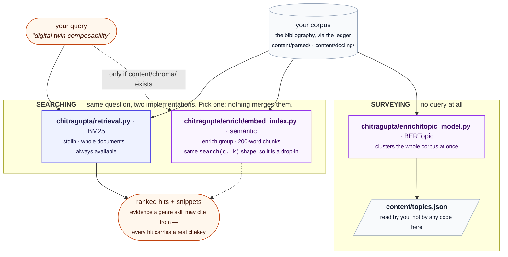

# 🔎 Retrieval: BM25, embeddings, and topic models

Status: **reference.** Written 2026-08-06. Updated 2026-09-13.

Three things in this repository search or organise your corpus. Two of
them answer the same question in different ways, and the third answers a
different question entirely. This document says which is which, so you can
decide what is worth building.

**Written for** someone choosing whether to run
`python -m chitragupta.enrich --stages embed,bertopic`, or wondering why a
draft cited a paper they didn't expect. **Assumed:** you have run
`python -m chitragupta.corpus sync` and have a populated ledger. **Not
covered:** how to
tune any of them -- see [CONFIG.md](CONFIG.md) for the settings and
[PERFORMANCE.md](PERFORMANCE.md) for what each costs.
For how this pipeline's choices compare with six other RAG systems,
stage by stage, see [RAG.md](RAG.md).

## 🔭 The short answer

| | **BM25** | **embeddings** | **topic model** |
| --- | --- | --- | --- |
| Module | `chitragupta/retrieval.py`, `chitragupta/retrieval_passages.py` | `chitragupta/enrich/embed_index.py` | `chitragupta/enrich/topic_model.py` |
| Question it answers | which sources match this query? | *the same question* | what clusters exist in my corpus? |
| Takes a query | yes | yes | **no** |
| Method | Okapi BM25 over whitespace tokens | dense vectors, cosine distance | UMAP then HDBSCAN over one vector per document |
| Unit of a hit | a whole document, or **one paragraph** -- the caller picks ([below](#-the-passage-unit)) | a 200-word chunk | a whole document |
| Corpus | ledger rows only, so every hit is citable | *the same* | *the same* |
| Needs | stdlib, bare `python` | venv + `enrich` group + a model download | venv + `enrich` group |
| Used by | every genre skill, by default | `survey-writer`, `deep-research` (only if built) | **nothing in this repository** |



## 🔎 BM25 -- the default, and always available

`chitragupta/retrieval.py` ranks whole documents by Okapi BM25 over
whitespace-separated tokens, with the usual constants (`k1 = 1.5`,
`b = 0.75`) and every `[retrieval]` field weight at 1.0
([below](#-title-and-abstract-can-outweigh-body-text)). Scoring itself
lives in `chitragupta/retrieval_scoring.py`; this module owns what text
an item contributes, that one owns what the text scores. It is
stdlib-only: no model download, no venv, nothing to
build. `search(query, k)` returns
`SearchResult(citekey, title, score, snippet)`, and the snippet is a
window of the real text around the matched terms, so a skill can judge
relevance itself rather than trusting a score.

Two properties matter when you compare it with the alternative:

- **Every hit is citable.** It reads the ledger, so every result already
  has a citekey that `citation_gate` will accept.
- **It reads the corpus layer's own directory and nothing else.**
  `content/parsed/<citekey>.txt`, plus the `<citekey>.passages.json`
  sidecar beside it that says where that document's reference list starts
  ([below](#-a-papers-own-bibliography-is-not-indexed)). Running
  the enrichment layer's `docling` stage does not improve BM25 --
  `content/docling/` is not on its read path, and the sidecar BM25 reads
  is deliberately the corpus layer's, not that layer's richer one. The
  only way Docling's output reaches keyword
  retrieval is `[parser].backend = "docling"` in the corpus layer, which
  changes what
  `sync` writes into `content/parsed/`. (That choice also decides whether
  a claim can be quoted from a real paragraph or only located to a page:
  see [CITATION-PROVENANCE.md](CITATION-PROVENANCE.md#-what-the-corpus-layer-keeps-when-it-uses-docling).)

Term-frequency statistics are cached to `content/retrieval_index.json`,
keyed by a cheap per-document fingerprint (title, `parsed_path`, ledger
`status`, and the parsed file's size and mtime -- not its content), so a
call only re-tokenizes documents whose text changed or whose ledger
status moved off `parsed`.

### ⚖ Title and abstract can outweigh body text

A query term can be made to count for more when it appears in a paper's
**title** or its **abstract** than when it appears in the body, under
`[retrieval]` in `config.toml`:

```toml
[retrieval]
weight_title = 1.0
weight_abstract = 1.0
```

The weighted term frequency is a delta on the ordinary one, applied once
before BM25's saturation — `tf + (weight - 1) × tf_in_field`. Two
consequences are worth knowing before you turn a dial:

- **1.0 is not an approximation of "off". It is off**, exactly: every
  added term is multiplied by zero, so the ranker never reads a field
  count at all and the scores are bit-identical to a build without the
  feature. Above 1.0 the field counts for more; 0.0 discounts it
  entirely. A negative or infinite weight is rejected when the config
  loads, rather than surfacing later as a ranking nobody can explain.
- **Document length is deliberately not weighted**, where textbook BM25F
  normalizes per field. Weighting it would move the corpus's average
  document length the moment any weight left 1.0, so "1.0 changes
  nothing" would stop being true and no measurement would have a
  baseline. The cost is that a weight raises a document's score without
  raising its modelled length; the baseline is worth more.

**`weight_abstract` needs a structural passage sidecar, and the shipped
`[parser].backend` is `pdftotext`, which writes none.** On a default
install there is no abstract for it to weight and the setting is
silently inert; `[parser].backend = "docling"` is what makes it live.
`weight_title` always applies — a title comes from the ledger. The
abstract is read from the corpus layer's own sidecar and never from
`content/docling/`, which is what keeps the promise
[above](#-bm25----the-default-and-always-available) that running the
enrichment layer does not change what BM25 ranks.

**Both ship at 1.0, and that is a measurement rather than caution.**
Swept over both BM25 ground truths on this project's own corpus
(`bench/RESULTS.md`, 2026-09-15): title weighting is weakly positive at
2.0 on both arms (nDCG +0.0025 and +0.0029, no recall lost) but the gain
on real drafting queries is **one query in 96**, and the two arms
disagree in sign at higher weights. Abstract weighting leaves recall
**unchanged at every weight** on the independent arm and costs 1–4
queries on the other, with the field populated for 318 of 642 items — so
that is a result about the field, not about coverage. No value was
supported by both arms, so none was adopted. Read that table before
setting either dial on your own corpus; the right value there is an
empirical question this one cannot answer for you.

### 🔡 Where the token-length floor came from

A token shorter than **two characters** is not indexed and not scored,
on either side. Two is a measurement, not a default: the floor was three
until #790, which put `AI`, `ML`, `DT`, `5G` and `QA` outside the index
entirely, so a search for one of them returned nothing and the CLI could
only warn that it would.

Swept by `bench/bench_retrieval_token_floor.py` over 258 author-keyword
self-retrieval queries (2026-09-16), **on the 32 queries whose own terms
the floor actually changes**:

| floor | recall@1 | recall@5 | MRR@5 | nDCG@5 |
| --- | --- | --- | --- | --- |
| 3 (before) | 0.5938 | 0.8438 | 0.6964 | 0.7335 |
| **2 (now)** | **0.6875** | **0.9062** | **0.7812** | **0.8130** |

Six of those 32 queries rank their own paper better and one worse. Over
all 258, where most queries carry no short word at all, the same change
is recall@5 0.8101 → 0.8178 and nDCG@5 0.7254 → 0.7319 — smaller,
because it is the same handful of queries averaged over eight times as
many.

**Read both columns, because the unaffected queries are not a control.**
A lowered floor admits tokens to every *document*, so the mean document
grows from 5,479 tokens to 5,870, and document length is what BM25
divides by. Queries that never changed a term therefore move too: over
the whole set the change is 7 better against 4 worse, where the affected
subset alone is 6 against 1. The difference between those two pairs is
the collateral cost of renormalizing every document.

**It forced one fix beyond the tokenizer, in window selection.**
`_windows` -- which chooses the snippet `search` shows and the passage
`evidence` returns -- used to anchor on `str.find`, a substring search. A
three-character term made that a rare nuisance; a two-character one makes
it routine, because "ai" sits inside maintainer, said, detail, fair and
failed. Measured across the queries this change enables, 37 of 134
appearances of a two-character term in a returned snippet were
substring-only, meaning the snippet did not contain the word the reader
searched for. Anchoring and scoring now match on a word boundary, which
brings that to 18 -- and those remaining are incidental: the window is
chosen on a real word match and the short string merely also occurs
somewhere in its 500 characters. The boundary agrees with the tokenizer
by construction, so "co" matches in "co-simulation" and not in "control",
exactly as the index counted it.

**What it costs on disk and on the clock**, measured on the same
646-item corpus when the schema bump forced the rebuild:
`content/retrieval_index.json` grows 2.8%, from 12,244,618 to 12,586,273
bytes, and the whole re-tokenization takes about 7 seconds once. The
on-disk growth is far below the 7.1% growth in tokens because the added
tokens are repeats of a small vocabulary and the file stores counts, not
occurrences.

**It stopped at 2 because 1 was measured and bought nothing.** At floor 1
recall@5 lands on the same 0.8178, nDCG@5 slightly below floor 2's, and
the mean document grows another 5.9% to 6,216 tokens — 13.5% above where
it started. What floor 1 admits is visible in why: of the 1,016 tokens the
two lowered floors add, the most widespread are `1`, `3`, `2`, `4`, `s`,
`e`, `i` and `g`, sitting in 450–500 of 646 documents apiece. Those are
list markers, figure numbers and OCR fragments, and IDF makes them nearly
free rather than positively useful.

**The issue's own premise did not survive the measurement, and the
conclusion held anyway.** #790 argued that short stopwords are already
excluded by the stopword list, "so the floor's entire remaining effect is
to discard short *content* words". On this corpus it is not: retrieval
imports a 19-word core list, and the floor was the only thing keeping
`or`, `it`, `if`, `no`, `we`, `up`, `so` and `do` — each in 400–500 of
646 documents — out of the index. Lowering it admits all of them. That
they cost nothing measurable is the issue's *other* argument being right:
a term that appears everywhere earns a low IDF on its own, and no
word list had to be grown to handle it.

**What this has not been measured against.** One ground truth, and one
that leans toward the change: a self-retrieval query is a paper's own
`keywords` field, where an acronym appears as a standalone token far more
often than in the prose a person actually types. That inflates how *often*
the floor helps rather than which direction it moves, which is why the
affected-subset counts are reported beside the means. The independent
live-logged set that decided #762 and #787 could not be built when this
ran — it needs a restored book's own retrieval logs, gitignored per-host
data absent from this host — so the confirmation those two entries had,
this one does not. `bench/RESULTS.md`'s 2026-09-16 entry carries the full
tables and the argument.

### 📚 A paper's own bibliography is not indexed

A reference list is dozens of *other* papers' titles sitting inside this
one's body text, so a short query naming a subject used to match the
bibliography of every paper that merely cites work on it. On the corpus
this was measured against, **792,963 of 4,231,367 indexed tokens --
18.7%** -- sat after a reference heading; the median document gave up
17.9% of its tokens to one and the worst gave up 80.8%. It cost twice:
spurious term frequencies, and an inflated document length, so a paper
with a long bibliography was penalised by BM25's own length
normalization for text that is not its own.

The indexed text therefore stops at that heading, and so does every
snippet and every `evidence` window -- one cut in
`chitragupta/_reference_cut.py`, applied where all three read their text,
because a snippet quoting a reference list is evidence of nothing.

**What identifies the span, since no label does.** Docling has no
`reference` label -- the same caveat [TLDR.md](TLDR.md) records about
there being no `abstract` one. So the cut is structural: a
`section_header` passage in `content/parsed/<citekey>.passages.json`
whose text *is* `References` / `Bibliography` / `Works Cited` /
`Literature Cited` (optionally numbered), and everything from the last
such heading to the end of the document. A heading that merely starts
with the word -- "Reference architecture" -- is not one, and neither is
the same word carrying a different label.

**It is backend-dependent, and that is licensed rather than overlooked.**
A `pdftotext` parse leaves no sidecar, so those items are indexed exactly
as before. 459 of 497 parsed items here have a locatable heading; the
other 38 are untouched. `_INDEX_SCHEMA_VERSION` moved to 2, so every
cache entry written under the old rule is discarded rather than mixed
with new ones. `dossier status` scores drift from this same index
([DRAFT-ITERATION.md](DRAFT-ITERATION.md)), so the first sweep after this
arrived can surface candidates on a draft nobody edited: what moved is
what the corpus now looks like to BM25, which is exactly what that report
is for.

**What the rule costs, measured rather than assumed.** On 79 of those 459
a heading follows the cut -- overwhelmingly `Acknowledgements`,
`Competing interests`, `Author contributions` and author biographies,
which is why "to the end of the document" is the right rule here and not
a lazy one. Two outliers pay for it with real prose: a working paper
whose appendix tables follow its references, and a report whose last
chapter bibliography is followed by workshop summaries. A book with a
bibliography per chapter keeps every chapter's but the last.

**Retrieval quality, before and after**, on the same two arms
`bench/bench_retrieval_keyword_selfretrieval.py` and
`bench/bench_retrieval_live_logs.py` score everything else with, BM25 row
only:

| arm | queries | recall@5 | nDCG@5 |
| --- | --- | --- | --- |
| keyword self-retrieval | 256 | 0.8086 → **0.8086** | 0.7296 → **0.7150** |
| live drafting logs | 96 | 0.8542 → **0.8646** | 0.4729 → **0.4526** |

Read that honestly: recall is flat on one arm and up a little on the
other, and nDCG slips on both. Per query, the self-retrieval arm moves 37
of 236 distinct queries (16 better, 21 worse) and the live-logs arm 54 of
96 (19 better, 35 worse), so the aggregate is rank swaps inside the top
five rather than sources appearing or vanishing. The self-retrieval arm
is biased against the cut for a specific reason -- its query is a paper's
own keywords, and a paper's own bibliography is full of them, so removing
it removes a signal that particular ground truth rewards.

**What those two arms structurally cannot score is where the gain is.**
Both rank *papers*, and the ranking barely moves, because a paper that
matches in its bibliography almost always matches in its body too: of the
1,760 top-five hits across both arms, **not one** matched only in its
reference list, so no result slot was being wasted. What moves is the
text handed back. Of the snippets those same hits returned before the
cut, **235 of 1,241 (18.9%)** on the self-retrieval arm and **42 of 455
(9.2%)** on the live-logs arm were cut from a reference list -- author
lists, DOIs and journal titles offered to a drafting agent as the
evidence for citing that paper. After the cut that is zero by
construction, which is the checklist item neither recall nor nDCG can
see.

**Zero for the documents the cut reaches, which is not all of them.** A
`pdftotext` parse, or a docling parse with no locatable heading, is
indexed whole, so a snippet from one can still be a reference list. That
residual is bounded rather than hoped at: such documents are **67 of
1,280 (5.2%)** and **20 of 480 (4.2%)** of the top-five hits on the two
arms. Note also what this does *not* touch -- an in-text citation in a
paper's own prose is that paper's text and stays in the snippet. What
goes is the reference section, not the act of citing.

Two further figures explain the rank churn rather than excusing it. The
median top-five hit *gains* 6.4% (self-retrieval) and 3.6% (live logs) of
its score, because dropping the bibliography drops a length-normalization
penalty it was paying; only 27 and 13 hits respectively lose more than a
quarter of their score. So the cut mostly rescales, and rescaling reorders
a top five whose members were already close together.

### 🪟 One window chooser, shared and deterministic

A snippet used to be the window around the *first* occurrence of
whichever query term came out of the term set first. Two things were
wrong with that. A document mentioning a word in its abstract and
discussing it forty thousand characters later was judged on the abstract.
And because the term set is a Python `set`, whose iteration order depends
on per-process string hashing, **the same query on the same document
returned a different snippet run to run.**

Both `search` and `evidence` now go through one chooser. Candidate
windows are anchored on every occurrence of every term **as a whole
word**, scored by how many *distinct* query terms fall inside on the same
word-boundary rule, de-overlapped, and returned in
document order. The boundary matches the tokenizer's, so a term is found
in the window exactly where the index counted it -- "co" in
"co-simulation" and not in "control"
([above](#-where-the-token-length-floor-came-from) has what that was
worth). Ties break on position. Nothing reads the set's order, so
the result is deterministic by construction -- and it is the
best-covering passage rather than an arbitrary one, so a passage late in
a long paper is reachable.

This mattered enough to fix on its own, and it mattered more than it
looked: [REJECTION.md](REJECTION.md) describes an arrangement, since
removed, in which a short window was the sole basis for *rejecting* a
source. An irreproducible snippet there meant an irreproducible
rejection.

### 📊 A window that lands in a table keeps the whole table

Docling serialises tables as Markdown pipe tables, and 274 of 497 parsed
texts in the corpus this was measured against contain one -- so BM25 has
always indexed their cell text. What it could not do was hand one back
usefully. A real row here measures **~450 characters** against a
500-character default window, so a hit inside a table returned a fragment
cut through the middle of a single row, and the header row naming the
columns -- most of why the table was worth retrieving -- was in a
different window or absent entirely.

A chosen window that touches a run of two or more consecutive lines
beginning with `|` therefore widens to that whole block, and the block is
rendered **line by line** rather than through the usual whitespace
normalisation, which would otherwise collapse every row onto one line. A
window that touches no such block is byte-identical to what it was
before; this is invisible to the callers it does not serve, which is most
of them. `chitragupta/retrieval_tables.py` owns it.

Two consequences worth knowing:

- **A table hit can exceed the requested width**, capped at 4000
  characters. Over the cap, whole rows are dropped from the end rather
  than the block being cut mid-row -- the header row is first, so it is
  the last thing to go.
- **Fewer windows may come back than were asked for.** Two windows that
  each caught a different corner of the same table are not overlapping
  when the chooser de-overlaps them, and become the identical block once
  widened; the duplicate is dropped rather than spending a caller's
  result budget printing one table twice.

### 🔍 `evidence` -- zooming in on one document

```bash
python -m chitragupta.draft retrieve evidence "<query>" --citekey <key>
```

Returns the passages of that one document which bear on the query --
2 x 600 characters by default, more text than a snippet and chosen for
the query rather than for where a term first appeared. A passage that
lands inside a table is widened to the whole table, so it can exceed that
width -- see [above](#-a-window-that-lands-in-a-table-keeps-the-whole-table).

**It is a lookup, not a stage.** Nothing is obliged to call it; a caller
satisfied by a `search` snippet is done. Use it when a snippet is not
enough to judge a source you are minded to cite -- that is, to make an
*acceptance* more careful. Being more careful about a source you are
about to cite cannot lose you one you never saw, which is the direction
that makes this safe. [REJECTION.md](REJECTION.md) has the argument for
why the reverse -- using a cheap read to reject more -- was tried and
withdrawn.

Both subcommands take `--log <draft>`, which appends the call and the
size of its payload to that draft's dossier (`retrieval.md` -- see
[DRAFT-ITERATION.md](DRAFT-ITERATION.md)). That is what makes the cost of
retrieval for a given draft a measurement rather than an estimate.

## 📄 The passage unit

```bash
python -m chitragupta.draft retrieve search "<query>" --unit passage
```

Everything above ranks whole documents. `--unit passage` ranks the corpus
layer's reading-ordered paragraphs instead, and hands back the paragraph
that scored -- verbatim, with its page. Same BM25, same corpus, same
stdlib-only requirement; a smaller unit.

**It is opt-in, and it should be**, because it trades recall for
quotability: **recall@5 falls from 0.8086 to 0.6914** on one arm and
0.8646 to 0.7812 on the other, while the fraction of returned text cut
mid-sentence falls from 99.8% to 16.4% and every hit gains a page
number. [The figures are below](#-what-it-costs-measured). So:

| Use `--unit passage` when… | Stay on the default when… |
| --- | --- |
| You want a paragraph you can quote, and the page it sits on | You are asking "did this paper argue X?" -- a document-level question |
| You already know roughly which papers matter and want their best passage | You are still finding out which papers matter, where recall is the thing that matters |
| Your corpus is parsed with `[parser].backend = "docling"` | Any part of your corpus was parsed with `pdftotext` -- those sources are [unreachable here](#-what-this-unit-structurally-cannot-return) |

No genre skill switches to it, and none should on this evidence alone.

### 🔁 What it actually changes: one criterion instead of two

The document unit does two things with two unrelated scoring functions,
and only the first of them is BM25:

| | ranks | displays |
| --- | --- | --- |
| Function | `_bm25_scores` | `_snippet` → `_windows` |
| Criterion | IDF × saturated term frequency, normalized against corpus `avgdl` | count of *distinct* query terms inside a 500-character window |
| When | over the whole ledger | **after** the top *k* is already decided |

So the text a drafting skill is shown as evidence was chosen by a rule
that had no part in deciding the source was worth showing. The window
chooser is good at what it does -- it is deterministic and picks the
best-covering passage rather than an arbitrary one
([above](#-one-window-chooser-shared-and-deterministic)) -- but it is
not the ranker, and it cuts at a character count rather than at a
paragraph.

The passage unit collapses the two: **what ranks is what is shown.** The
page comes along for free, because a sidecar record already carries one.

### 📚 Where the paragraphs come from

`chitragupta/passages.py`'s rung 2 -- `content/parsed/<citekey>.passages.json`,
the corpus layer's own parse -- and deliberately not the enrichment
layer's richer rung 1, because BM25 promises that running
`chitragupta.enrich` does not change what it ranks. `_reference_cut`'s
boundary is read as a *position* in the passage list rather than
re-derived, so both units cut the bibliography at the same heading.

Two exclusions beyond that, both about BM25's length normalization
rewarding a short dense match -- harmless when the unit is a whole
document, and not when it is a paragraph:

- **`section_header` and `title` passages are never indexed.** A
  three-word heading whose text *is* your query is the highest-scoring
  object in any passage index that admits it, and it is evidence of
  nothing. Structural, not configurable.
- **A passage under `[retrieval].min_passage_tokens` (default 20) is
  not indexed.** This is also what keeps a one-line bibliography entry
  out on the documents whose reference heading could not be located.

Note the second consequence of that arithmetic, since the issue behind
this feature guessed it the other way round: reference-list entries are
*more* dangerous as passages than as pooled document text, not less.
Short and stuffed with other papers' title words is exactly the shape
BM25 over-rewards at this scale.

### 🧢 One paper cannot take the page

The document unit returns one result per citekey by construction -- its
scores are a dict keyed by citekey -- so its `search()` has never needed
a cap. A well-matched paper has as many passages as it has paragraphs,
so this unit does: `[retrieval].max_passages_per_source`, default 3.

The cap is applied to the **fully ranked** list, so dropping a dominant
paper's excess passages promotes another paper's passage into the window
rather than merely shortening the result. That is why there is no
over-fetch multiplier here and there is one on the embedding path: Chroma
returns a pre-truncated candidate list and BM25 does not.
[CONFIG.md](CONFIG.md#-retrieval----bm25s-field-weights-cap-and-floor) has
both keys.

### 🕳 What this unit structurally cannot return

A citekey parsed by `pdftotext` leaves no passage sidecar, so it is not
ranked low here -- it is **absent from the index entirely**, however well
it matches. Falling back to a document-level score for those would put
two incomparable numbers in one ranking, so the gap is reported instead:
the CLI counts such sources and names them under the results.

On a corpus parsed with `[parser].backend = "docling"` that count is
zero. On a `pdftotext` corpus this unit has nothing to search at all,
which is the honest answer and the reason it is a flag rather than the
default.

**Scores from the two units are not comparable.** `N`, every document
frequency and `avgdl` are computed over passages on one path and over
documents on the other. Nothing in this repository sorts them into one
list, and nothing should.

### 📊 What it costs, measured

On the 497-document corpus this was measured against, the passage index
holds **47,355 paragraphs**, and a query costs **130 ms against 34 ms**
for the document unit -- about 3.8x, for an index rebuilt incrementally
on the same stat-fingerprint terms
(`content/retrieval_passage_index.json`, its own file and its own schema
version, because the two indexes are invalidated by different things).

**And it costs recall.** Scored by `bench/bench_retrieval_passage.py` on
the same two arms as everything else here, passage hits collapsed to
citekeys so that recall@5 means the same thing on both rows
(2026-09-15, shipped defaults: cap 3, floor 20):

| arm | queries | recall@5 | nDCG@5 |
| --- | --- | --- | --- |
| keyword self-retrieval | 256 | 0.8086 → **0.6914** | 0.7296 → **0.5879** |
| live drafting logs | 96 | 0.8646 → **0.7812** | 0.4729 → **0.3261** |

That is a real loss, not measurement noise, and the reason is structural
rather than fixable by tuning: **a document pools every paragraph's
evidence into one score, and a passage stands alone.** A paper that
argues your query diffusely across ten paragraphs loses to one that says
it once, emphatically. Collapsing back to citekeys afterwards cannot
recover evidence the smaller unit never pooled.

**What it buys, on the same hits:**

| | document | passage (cap 3) |
| --- | --- | --- |
| Hits that begin or end mid-sentence | **99.8%** / 99.8% | **16.4%** / 13.5% |
| Hits carrying a page number | 0% | **100%** |
| Distinct sources in the top five | 5.00 | 3.72 / 4.16 |

(Two figures per cell are the keyword and live-logs arms.) The first row
is the feature: a document-unit snippet is a character window, so it is
cut wherever 500 characters land and essentially always starts or ends
mid-sentence; a passage is a whole paragraph and mostly does not. The
residual 16% is real -- Docling splits some paragraphs across a page
break, and a table or formula record has no sentence to end.

**Read the third row as a loss the cap recovers, not a gain.** The
document unit is 5.00 of 5 *by construction*, and no cap can beat that.
At cap 1 the passage unit matches it (5.00) and gives up its second-best
paragraph per source; at the shipped cap of 3 it recovers 3.72. Source
diversity is something this unit spends, and the cap is what limits the
spending.

### 🔢 Where the passage-length floor's default came from

A different floor from the tokenizer's
([above](#-where-the-token-length-floor-came-from)), and the two are
easy to confuse: that one is the shortest *token* that may be indexed,
measured in characters, and this one is the shortest *passage*, measured
in tokens.

Swept on both arms at cap 3, recall@5:

| floor | 1 | 10 | **20** | 40 |
| --- | --- | --- | --- | --- |
| keyword self-retrieval | **0.7539** | 0.7500 | 0.6914 | 0.7148 |
| live drafting logs | 0.7083 | 0.7500 | **0.7812** | 0.7708 |

The two arms disagree, and the disagreement is informative rather than
awkward. The self-retrieval arm's query is *a paper's own author-assigned
keywords*, which is exactly the text that lands in short passages -- so
that arm rewards admitting them, for the same reason
[it was biased against the reference cut](#-a-papers-own-bibliography-is-not-indexed).
The live-logs arm's queries are real drafting questions in prose, and it
prefers 20.

20 is chosen on the live-logs arm because that is the arm whose queries
look like the ones this feature will actually serve, and the cost on the
other arm is stated here rather than omitted. A corpus of unusually
terse prose is a fair reason to lower it.

## 🧠 Embeddings -- a replacement for BM25, not an addition

`chitragupta/enrich/embed_index.py` chunks each document into 200 words with
40 words of overlap, encodes each chunk with a sentence-transformers model
(`sentence-transformers/all-MiniLM-L6-v2` by default), and stores the
vectors in a Chroma collection under `content/chroma/`. The collection is
namespaced by model name, so switching models starts a fresh collection
instead of mixing dimensions.

It is designed as a **drop-in**: `search(query, k, snippet_chars)` has the
same shape as BM25's, so callers do not change. Nothing in this repository
fuses or re-ranks the two -- there is no hybrid search here. A skill uses
one or the other.

**This ranks chunks, not documents**, so without a check a
single well-matched paper could fill every one of the `k` slots. `search`
caps each citekey at `[enrich].embed_max_passages_per_source` (default
3) chunks among the top `k`, applied to the over-fetched ranked list
before it is truncated -- so dropping a dominant paper's excess chunks
promotes another paper's chunk into the result, rather than merely
shortening it ([CONFIG.md](CONFIG.md#-enrich----the-optional-enrichment-layer)).

BM25's *document* unit needs no such cap -- it is one-per-citekey by
construction -- but its [passage unit](#-the-passage-unit) does, and has
one. The cap belongs to the unit rather than to the ranker, which is why
the two settings live in different tables and why only this one needs an
over-fetch multiplier beside it: Chroma truncates its candidate list and
BM25 does not.

**A cross-encoder can reorder the over-fetched passages before that
cap, and is off by default.** It improves ordering rather than recall
and cannot improve source diversity at all, and it makes a search call
2.5x dearer on a GPU. The stage order, the measurements behind that
default, and how to choose a `rerank_model` are in
[CORPUS-SEARCH.md](CORPUS-SEARCH.md), which is this section at the level
of one `search()` call.

**When it earns its cost.** BM25 cannot match a paper that argues your
point in different words. If your corpus is large, or written across
communities that use different vocabulary for the same idea, semantic
recall is the reason to build this. On a small, vocabulary-consistent
corpus, BM25 is usually enough -- which is why it stays the default.

**Every hit is citable, exactly as with BM25.** The enrichment layer
indexes the ledger and nothing else, so a chunk that comes back from
Chroma always carries a real citekey that `citation_gate` will accept.
(An earlier version also swept a directory of raw PDFs gathered outside
the bib file. Those hits came back with an empty citekey and could never
be cited, and that second source is gone.) The way to make a paper
searchable here is therefore the same as everywhere else in this
repository: catalogue it in your reference manager, re-export, and
re-run
`sync`. `python -m chitragupta.enrich` prints what it is about to work on at the
top of
every run, before any stage touches it:

```text
Corpus: 42 doc(s) from papers/bibliography.bib
```

**Who uses it.** `survey-writer` and `deep-research` name it as the
alternative to BM25, and `deep-research`'s subagents check that
`content/chroma/` exists before reaching for it. The other three genre
skills use BM25 only.

## 🗂 Topic model -- a different question

`chitragupta/enrich/topic_model.py` takes no query. It embeds each document once
as
a whole, reduces with UMAP, clusters with HDBSCAN, and writes
`content/topics.json`: one topic assignment per document, plus a topic
table. It needs at least two documents with text.

Three things to know before you run it:

- **Nothing in this repository reads `content/topics.json`.** No module,
  no genre skill. It is written for you to read when deciding what a
  survey should even be about. `survey-writer` groups its themes by
  judgement over the evidence it retrieved, and says so explicitly.
- **All-outliers is a correct answer on a small corpus.** HDBSCAN's
  default minimum cluster size will legitimately put every document in
  topic `-1` when there are few of them. Don't force clusters into
  existence by lowering it; the honest result is that the corpus is not
  yet big enough for the question.
- **It is the one stage that cannot be incremental.** Clustering is
  whole-corpus by nature -- adding a document can move every assignment.
  Only the encoding is cached (`content/topic_embed_cache.json`, keyed by
  text hash and model name), never the clustering.

## ⚖ Which should I build?

| If you want to… | Do this |
| --- | --- |
| Draft from a modest, consistent corpus | Nothing. BM25 is already running |
| Get a quotable paragraph and a page out of a search | Nothing to build -- `retrieve search --unit passage`, if your corpus is docling-parsed. Costs recall; [the figures](#-what-it-costs-measured) |
| Quote sources accurately in a review | `--stages docling` -- it is the passage sidecar, not the ranker, that improves quoting |
| Find papers that argue your point in other words | `--stages docling,embed` |
| Decide what your survey should cover | `--stages docling,embed,bertopic`, then read `content/topics.json` yourself |

`docling` comes first in each of those because the embedding stage prefers
`content/docling/<doc>.md` over the plain parsed text when it exists --
better reading order in, better chunks out.
