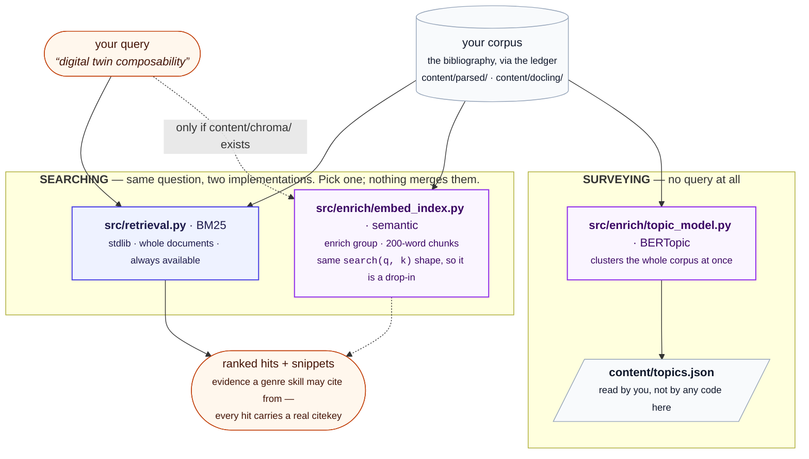

# Retrieval: BM25, embeddings, and topic models

Status: **reference.** Written 2026-08-06.

Three things in this repository search or organise your corpus. Two of
them answer the same question in different ways, and the third answers a
different question entirely. This document says which is which, so you can
decide what is worth building.

**Written for** someone choosing whether to run
`python -m src.enrich --stages embed,bertopic`, or wondering why a
draft cited a paper they didn't expect. **Assumed:** you have run
`python -m src.sync` and have a populated ledger. **Not covered:** how to
tune any of them -- see [CONFIG.md](CONFIG.md) for the settings and
[PERFORMANCE.md](PERFORMANCE.md) for what each costs.

## The short answer

| | **BM25** | **embeddings** | **topic model** |
|---|---|---|---|
| Module | `src/retrieval.py` | `src/enrich/embed_index.py` | `src/enrich/topic_model.py` |
| Question it answers | which sources match this query? | *the same question* | what clusters exist in my corpus? |
| Takes a query | yes | yes | **no** |
| Method | Okapi BM25 over whitespace tokens | dense vectors, cosine distance | UMAP then HDBSCAN over one vector per document |
| Unit of a hit | a whole document | a 200-word chunk | a whole document |
| Corpus | ledger rows only, so every hit is citable | *the same* | *the same* |
| Needs | stdlib, bare `python` | venv + `enrich` group + a model download | venv + `enrich` group |
| Used by | every genre skill, by default | `survey-writer`, `deep-research` (only if built) | **nothing in this repository** |



## BM25 -- the default, and always available

`src/retrieval.py` ranks whole documents by Okapi BM25 over
whitespace-separated tokens, with the usual constants (`k1 = 1.5`,
`b = 0.75`). It is stdlib-only: no model download, no venv, nothing to
build. `search(query, k)` returns
`SearchResult(citekey, title, score, snippet)`, and the snippet is a
window of the real text around the matched terms, so a skill can judge
relevance itself rather than trusting a score.

Two properties matter when you compare it with the alternative:

- **Every hit is citable.** It reads the ledger, so every result already
  has a citekey that `citation_gate` will accept.
- **It reads `content/parsed/<citekey>.txt` and nothing else.** Running
  the enrichment layer's `docling` stage does not improve BM25 --
  `content/docling/` is not on its read path. The only way Docling's output reaches keyword
  retrieval is `[parser].backend = "docling"` in the corpus layer, which
  changes what
  `sync` writes into `content/parsed/`. (That choice also decides whether
  a claim can be quoted from a real paragraph or only located to a page:
  see [CITATION-PROVENANCE.md](CITATION-PROVENANCE.md#what-the-corpus-layer-keeps-when-it-uses-docling).)

Term-frequency statistics are cached to `content/retrieval_index.json`,
keyed by a cheap per-document fingerprint (the parsed file's size and
mtime, not its content), so a call only re-tokenizes documents whose text
changed.

### One window chooser, shared and deterministic

A snippet used to be the window around the *first* occurrence of
whichever query term came out of the term set first. Two things were
wrong with that. A document mentioning a word in its abstract and
discussing it forty thousand characters later was judged on the abstract.
And because the term set is a Python `set`, whose iteration order depends
on per-process string hashing, **the same query on the same document
returned a different snippet run to run.**

Both `search` and `evidence` now go through one chooser. Candidate
windows are anchored on every occurrence of every term, scored by how
many *distinct* query terms fall inside, de-overlapped, and returned in
document order. Ties break on position. Nothing reads the set's order, so
the result is deterministic by construction -- and it is the
best-covering passage rather than an arbitrary one, so a passage late in
a long paper is reachable.

This mattered enough to fix on its own, and it mattered more than it
looked: [REJECTION.md](REJECTION.md) describes an arrangement, since
removed, in which a short window was the sole basis for *rejecting* a
source. An irreproducible snippet there meant an irreproducible
rejection.

### `evidence` -- zooming in on one document

```bash
python -m src.retrieval evidence "<query>" --citekey <key>
```

Returns the passages of that one document which bear on the query --
2 x 600 characters by default, more text than a snippet and chosen for
the query rather than for where a term first appeared.

**It is a lookup, not a stage.** Nothing is obliged to call it; a caller
satisfied by a `search` snippet is done. Use it when a snippet is not
enough to judge a source you are minded to cite -- that is, to make an
*acceptance* more careful. Being more careful about a source you are
about to cite cannot lose you one you never saw, which is the direction
that makes this safe. [REJECTION.md](REJECTION.md) has the argument for
why the reverse -- using a cheap read to reject more -- was tried and
withdrawn.

Both subcommands take `--log <draft>`, which appends the call and the
size of its payload to that draft's dossier (`retrieval.md` -- see
[DRAFT-ITERATION.md](DRAFT-ITERATION.md)). That is what makes the cost of
retrieval for a given draft a measurement rather than an estimate.

## Embeddings -- a replacement for BM25, not an addition

`src/enrich/embed_index.py` chunks each document into 200 words with
40 words of overlap, encodes each chunk with a sentence-transformers model
(`sentence-transformers/all-MiniLM-L6-v2` by default), and stores the
vectors in a Chroma collection under `content/chroma/`. The collection is
namespaced by model name, so switching models starts a fresh collection
instead of mixing dimensions.

It is designed as a **drop-in**: `search(query, k, snippet_chars)` has the
same shape as BM25's, so callers do not change. Nothing in this repository
fuses or re-ranks the two -- there is no hybrid search here. A skill uses
one or the other.

**When it earns its cost.** BM25 cannot match a paper that argues your
point in different words. If your corpus is large, or written across
communities that use different vocabulary for the same idea, semantic
recall is the reason to build this. On a small, vocabulary-consistent
corpus, BM25 is usually enough -- which is why it stays the default.

**Every hit is citable, exactly as with BM25.** The enrichment layer
indexes the ledger and nothing else, so a chunk that comes back from
Chroma always carries a real citekey that `citation_gate` will accept.
(An earlier version also swept a directory of raw PDFs gathered outside
the bib file, and those hits came back with an empty citekey and could
never be cited; that second source is gone.) The way to make a paper
searchable here is therefore the same as everywhere else in this
repository: catalogue it in your reference manager, re-export, and re-run
`sync`. `enrich.py` prints what it is about to work on at the top of
every run, before any stage touches it:

```
Corpus: 42 doc(s) from papers/bibliography.bib
```

**Who uses it.** `survey-writer` and `deep-research` name it as the
alternative to BM25, and `deep-research`'s subagents check that
`content/chroma/` exists before reaching for it. The other three genre
skills use BM25 only.

## Topic model -- a different question

`src/enrich/topic_model.py` takes no query. It embeds each document once as
a whole, reduces with UMAP, clusters with HDBSCAN, and writes
`content/topics.json`: one topic assignment per document, plus a topic
table. It needs at least two documents with text.

Three things to know before you run it:

- **Nothing in this repository reads `content/topics.json`.** No module,
  no genre skill. It is written for you to read when deciding what a
  survey should even be about. `survey-writer` groups its themes by
  judgement over the evidence it retrieved, and says so explicitly.
- **All-outliers is a correct answer on a small corpus.** HDBSCAN's
  default minimum cluster size will legitimately put every document in
  topic `-1` when there are few of them. Don't force clusters into
  existence by lowering it; the honest result is that the corpus is not
  yet big enough for the question.
- **It is the one stage that cannot be incremental.** Clustering is
  whole-corpus by nature -- adding a document can move every assignment.
  Only the encoding is cached (`content/topic_embed_cache.json`, keyed by
  text hash and model name), never the clustering.

## Which should I build?

| If you want to… | Do this |
|---|---|
| Draft from a modest, consistent corpus | Nothing. BM25 is already running |
| Quote sources accurately in a review | `--stages docling` -- it is the passage sidecar, not the ranker, that improves quoting |
| Find papers that argue your point in other words | `--stages docling,embed` |
| Decide what your survey should cover | `--stages docling,embed,bertopic`, then read `content/topics.json` yourself |

`docling` comes first in each of those because the embedding stage prefers
`content/docling/<doc>.md` over the plain parsed text when it exists --
better reading order in, better chunks out.
