# 🕸 Topic discovery: from a phrase to the papers, the graph, and an overview

Status: **reference.** Written 2026-09-02. All five parts documented
here -- the `topic-graph` enrichment stage, the `corpus discover`
reader, its precision tier, the gold-set benchmark and the HTML graph
page -- are built; the design they implement is
`plans/g5-topic-discovery.md` (G5-G9 in
[FEATURE-ROADMAP.md](FEATURE-ROADMAP.md)'s numbering).
[TOPIC-MODELLING.md](TOPIC-MODELLING.md) covers how topics come to
exist at all; this document covers what happens next -- relating them,
finding them, and reading them.

**Written for** you, before a draft exists: someone with a synced
library asking "what is my corpus actually about, and where should the
next draft start?" The how-it-is-computed passages carry their
reasoning for the curious and are safe to skim -- the worked session
below is the part to read first.

> **On the sources quoted below.** None of the systems and papers this
> feature borrows from is in `content/ledger.sqlite`, so none has a
> citekey; each is named inline with a link and listed in full at the
> end, the same rule TOPIC-MODELLING.md follows and for the same reason
> ([AGENTS.md](../AGENTS.md)). What was taken from each -- and,
> as importantly, what was deliberately not -- is recorded in
> [INSPIRATION.md](INSPIRATION.md#-topic-discovery); this document
> quotes a source only where a specific mechanism came from it.

## 🧭 Table of contents

- [What the feature is for](#-what-the-feature-is-for)
- [A worked session](#-a-worked-session)
- [The topic graph file](#-the-topic-graph-file-and-when-to-look-inside-it)
- [Overlap edges](#-overlap-edges-shared-members-gated-by-surprise)
- [Semantic edges](#-semantic-edges-best-match-cosine-mutual-top-k)
- [The hierarchy](#-the-hierarchy)
- [The reader: corpus discover](#-the-reader-corpus-discover)
- [The resolution ladder](#-the-resolution-ladder)
- [The precision tier](#-the-precision-tier)
- [The overview file](#-the-overview-file---out)
- [The gold set](#-the-gold-set)
- [The graph page](#-the-graph-page)
- [Alternatives considered](#-alternatives-considered)
- [Sources](#-sources)

## 🎯 What the feature is for

Start from a phrase, find the corpus's real topics near it, see each
topic's papers with their bibliographic details, walk to the linked
topics, and take away an extractive overview grounded enough to seed a
draft. Scripted (`--json` everywhere) and interactive (successive
invocations, or the `--html` graph page), and with no generative model
anywhere: embeddings, BM25, classic statistics and a cross-encoder
scorer. Every citekey shown comes from the ledger via the
topic artefacts -- the same rule that binds every other part of this
project.

Two relations, kept distinct on purpose, and drawn side by side in
figure 13:

- **topic -> papers** -- already recorded in `content/topic_set.json`'s
  members; discovery displays it, annotated with ledger detail.
- **topic <-> topic** -- derived by the `topic-graph` stage, with two
  typed edge families that are never merged into one score, because
  they answer different questions and their disagreement is itself a
  discovery cue: two topics can share many papers while saying
  different things, and can say the same thing while sharing none.



The "keep papers and concepts in one graph and walk it" shape follows
MiniRAG (Fan et al., 2025), whose heterogeneous index puts text chunks
and entities in a single graph so one traversal answers "which
documents" and "which concepts relate" together -- with its LLM-driven
entity extraction replaced by the topic model this project already has,
and its Neo4j-scale storage replaced by one JSON file, because a
personal corpus is hundreds of papers, not millions.

## 🧪 A worked session

Everything this page describes also exists as committed artefacts over
the five-paper sample corpus: a full `corpus discover` transcript
([`discover_digital_twin.txt`](examples/sample-project/content/discover_digital_twin.txt)),
the graph it read
([`topic_graph.json`](examples/sample-project/content/topic_graph.json)),
the offline page
([`topic_map.html`](examples/sample-project/content/topic_map.html)),
and a measured gold set with its per-rung scores
([`topic_gold.toml`](examples/sample-project/content/topic_gold.toml),
[`topic_gold_results.json`](examples/sample-project/content/topic_gold_results.json))
-- including one deliberately misspelled query the fuzzy rung has to
catch and one out-of-corpus query that must fall through to search.

Below, real output from a four-paper fixture (two seed papers about
digital twins, three about machine learning, one -- `dt2022` -- in
both). First, the map:

```console
$ chitragupta corpus discover
2 topics over 4 papers

  digital twin      seed       2 papers
  machine learning  emergent   3 papers
```

Then one topic. Every member carries its ledger entry and, crucially,
the *other* topics it belongs to -- a paper is always shown inside its
neighbourhood -- and both linked-topic families arrive with their
evidence:

```console
$ chitragupta corpus discover "digital twin"
digital twin  (seed, 2 papers)

  [0.90] *dt2021*.
  [0.80] *dt2022*.
         also in: machine learning

linked topics:
  semantically near: machine learning  (0.31, bridge: dt2022 <-> dt2022)
```

Note what is *absent*: no overlap edge, although the topics share
`dt2022`. Sharing one paper between topics of size 2 and 3 in a 4-paper
corpus is arithmetic, not affinity -- the hypergeometric gate
(below) computed p = 1.0 and withheld the edge. On a toy corpus that
looks strict; on a real one it is what keeps two large topics from
being "linked" merely for both being large.

The inverse question, and the machine-readable form:

```console
$ chitragupta corpus discover --paper dt2022
topics:
  [0.80] digital twin
  [0.40] machine learning

$ chitragupta corpus discover "digital twin" --json | jq .resolved_via
"exact"
```

And a phrase the corpus cannot place falls back honestly -- labelled a
search result, never dressed up as a topic membership, with each hit
still annotated by its topics so the reader can step back onto the
graph:

```console
$ chitragupta corpus discover "cyber replica of a physical system" --json
{
  "resolved_via": "search",
  "results": [
    {"citekey": "dt2021", "topics": [{"label": "digital twin", ...}], ...}
  ]
}
```

## 📦 The topic graph file, and when to look inside it

You normally never open `content/topic_graph.json` -- `corpus discover`
and the `--html` page read it for you. It is documented here for the
day you script against it with `--json`, or wonder why the tool asked
you to re-run a stage. One enrichment run
(`chitragupta enrich --stages topic-graph`, the sixth and last stage)
writes it from the topics the earlier stages already found; if those
inputs are missing, or were built under a different embedding model,
the stage stops and tells you which one to re-run rather than
producing plausible-looking nonsense.

```json
{
  "model": "...",
  "n_docs": 497, "n_topics": 53,
  "p_value": 0.01, "neighbors": 5,
  "corpus_mean": [0.0],
  "topics": [{"label": "digital twin", "provenance": "seed",
               "size": 12, "centroid": [0.0]}],
  "edges_overlap": [{"a": "...", "b": "...", "jaccard": 0.21,
                      "overlap_coeff": 0.83, "p_value": 0.0004,
                      "shared": ["citekey1", "citekey2"]}],
  "edges_semantic": [{"a": "...", "b": "...", "similarity": 0.74,
                       "bridge": ["citekeyA", "citekeyB"]}],
  "hierarchy": [{"id": "node-0", "a": "...", "b": "...",
                  "distance": 0.31}]
}
```

Keys are topic **labels**, never topic ids: ids are unstable across
runs, and the topic model's own documentation says anything downstream
must key on labels or citekeys. The single-artefact,
derive-once-read-many split follows the corpus convention FlashRAG
(Jin et al., 2024) makes explicit -- one canonical corpus, every index
a derived artefact keyed back to it -- which this repository already
practises with the ledger.

## 🔗 Overlap edges: shared members, gated by surprise

An overlap edge exists between two topics when they share more papers
than chance would predict. Three decisions, each with its reason:

- **Both Jaccard and the overlap coefficient travel on every edge.**
  Jaccard (`|A∩B| / |A∪B|`) punishes size imbalance: a seed topic
  rank-truncated at `[enrich].seed_topic_max_papers` sitting entirely
  inside a 40-paper emergent cluster scores 0.15 despite full
  containment. The overlap coefficient (`|A∩B| / min(|A|,|B|)`) reads
  that case as what it is -- a sub-topic, scoring 1.0. Theme G's topic
  sizes are systematically unequal by construction, so the imbalance is
  routine, not exotic; but overlap alone loses the symmetric-similarity
  reading, so both are reported and neither is the edge's gate.
- **The gate is a hypergeometric tail test, not a weight floor.** The
  edge survives when the probability of sharing at least this many
  papers by chance -- drawing `|B|` papers from `n_docs` with `|A|` of
  them marked -- is below `[enrich].topic_graph_p_value`. This is the
  test gene-set enrichment analysis runs on exactly this shape of
  question ("do these two sets overlap more than sampling would
  explain?"). A weight floor is a knob someone must re-tune per corpus;
  a significance level is not, and it also refuses the edge two large
  topics would otherwise get merely for both being large -- the worked
  session above shows it doing so.
- **`shared` names the citekeys.** Every overlap edge is explainable by
  pointing at real papers. That is the difference between a discovery
  aid and a black box, and it is the property the tests pin first.

## 🧲 Semantic edges: best-match cosine, mutual top-k

Two topics can be about the same thing and share no papers -- a seed
topic that matched review articles and an emergent cluster of case
studies, say. Semantic edges catch that, and three decisions shape
them:

- **Average best-match, not centroid-to-centroid.** HDBSCAN clusters
  are non-convex, and a non-convex cluster's centroid can sit outside
  the cluster it summarises. Instead, each member of topic A is scored
  by its best cosine against B's members and the direction averages are
  symmetrised -- the greedy-matching idea BERTScore (Zhang et al.,
  2020) applies to tokens, applied here to papers. At this corpus's
  scale (hundreds of documents, tens of topics) the exact computation
  costs nothing, so the approximation the centroid would be is all
  downside.
- **Mean-centred space**, the same space `topic_descriptors` uses and
  for the same measured reason: on a corpus that is all about one
  subject, every raw vector shares a large common component and cosines
  bunch together; centring removes it. The artefact stores
  `corpus_mean` so the reader can move a query embedding into the same
  space without loading the embed cache.
- **Mutual top-k selection** (`[enrich].topic_graph_neighbors`): an
  edge survives only when each topic ranks the other within its top k.
  A global similarity floor either floods the dense region of the topic
  space or starves the sparse one; mutual k-NN adapts to both. And each
  edge carries `bridge` -- the single closest pair of papers across it
  -- so even semantic edges answer "show me why" with citekeys.

## 🌳 The hierarchy

An agglomerative merge tree over the topic centroids
(`scipy.cluster.hierarchy.linkage`, average linkage, cosine distance),
stored for the G9 tree view: which topics are siblings under a broader
theme. Not BERTopic's `hierarchical_topics()`, for two reasons: that
needs the fitted model object, which no stage persists -- re-fitting to
read a tree would repeat expensive work a derivation stage's contract
forbids -- and it covers emergent topics only, where a centroid exists
here for every topic, seed and emergent alike.

## 📖 The reader: `corpus discover`

Three invocations of one corpus-layer verb, all with `--json`, all
lock-free -- [CLI.md](CLI.md#-chitragupta-corpus-discover) is the
per-flag reference:

```console
chitragupta corpus discover                      # every topic
chitragupta corpus discover "digital twin"       # one topic
chitragupta corpus discover --paper smith2021    # one paper's topics
```

The reader computes no topic and no edge. It resolves, joins ledger
detail (through `references.entries()`, the one citekey-to-entry
formatter this project has), and displays -- which is what lets it sit
in the corpus layer at tier 1, upgrading its semantic rung only when
the enrich extra is installed.

## 🪜 The resolution ladder



Four rungs, best first, and the output names which one fired
(`resolved_via`), because "which mechanism answered" is the difference
between a topic membership and a plausible guess:

1. **exact** -- case-insensitive equality against topic labels.
2. **fuzzy** -- `difflib` near-match at a 0.75 cutoff, for typos and
   near-forms only; the default 0.6 accepts matches a reader would call
   wrong.
3. **hybrid** -- two rankings fused by Reciprocal Rank Fusion: BM25
   over each topic's own vocabulary (its label plus its c-TF-IDF
   terms, one small document per topic, scored by the same tokenizer
   and arithmetic as `chitragupta/retrieval.py`) beside cosine of the
   query's embedding against the stored centroids. RRF
   (`score = Σ 1/(60 + rank)`; Cormack, Clarke and Büttcher, 2009) is
   rank-based, so the two scores never need calibrating against each
   other -- their paper's finding is that this "simple ranked list
   fusion" beats individual rankers and learned fusion methods, and it
   is ~10 lines of code. The rung claims the phrase when the best
   centroid cosine clears `[discover].min_similarity` *or* the query
   hit a topic's own vocabulary lexically; the floor gates only the
   semantic evidence.
4. **search** -- nothing above answered; `retrieval.search()` over
   papers, clearly labelled, each hit annotated with its topics.

Two provenance notes on the rung structure itself. Fusing a lexical and
a dense ranking by rank is the `QueryFusionRetriever` pattern from
LlamaIndex, minus its optional LLM query expansion -- with `num_queries`
set to one, that whole path is LLM-free, which is what made it
borrowable. OpenScholar (Asai et al., 2024) fuses differently --
it *unions* candidate pools and lets one trained cross-encoder be the
sole common scale -- and that is exactly the shape the precision tier
below adds on top of this rung: RRF orders the candidates, the
cross-encoder rescores the fused list.

Without the enrich extra the semantic half is skipped with a one-line
note and the rung degrades to BM25 alone -- the same honest-degradation
posture every enrich stage's self-probe takes, never a silent
substitution. An unresolvable phrase whose fallback also returns
nothing exits 1 naming the known topics -- on **stderr**, like every
other refusal this verb raises (an absent artefact, a citekey in no
topic). A refusal is diagnostics, not a payload, so stdout carries a
document or nothing at all and `--json` never has to parse English.

## 🎯 The precision tier

Two additions sit on top of the hybrid rung, both enrich-tier and both
degrading exactly as the semantic rung does -- silently reordering
nothing, saying nothing false:

- **Cross-encoder rescoring.** The fused candidates are rescored by
  the same cross-encoder the embed index reranks with (one model, one
  cache, one config key: `[enrich].rerank_model`), over
  (phrase, topic-vocabulary) pairs. A cross-encoder reads the query and
  the candidate *jointly*, so it catches term-overlap-without-relevance
  failures a bi-encoder's two separate vectors cannot -- OpenScholar's
  recall-then-precision cascade (110M-parameter retriever, 340M
  reranker) sized down to a topic list, where scoring every candidate
  costs milliseconds. It reorders only: the scorer sees exactly what
  the ladder fused and can promote or demote but never add a candidate.
- **A topology-ranked neighbourhood.** When the hybrid rung places a
  phrase near *several* topics, the view carries a `neighbourhood`
  ranking: personalised PageRank over the topic graph, seeded from
  every matched candidate, with each edge weighing the stronger of its
  overlap and semantic readings. This is MiniRAG's topology-based
  scoring with its LLM step deleted. A singular resolution gets no
  walk -- the linked-topics lists already answer "what is next to this
  one", and a one-seed walk would restate them.

## 📝 The overview file (`--out`)

The topic view plus **representative snippets**, written as Markdown --
the raw material for a new draft. From the worked session:

```markdown
# digital twin

A seed topic covering 2 papers.

## Papers

- [0.90] *dt2021*.
- [0.80] *dt2022*.
  - also in: machine learning

## Linked topics

- machine learning -- semantically near (0.31, bridge dt2022 <-> dt2022)

## Representative snippets

> Digital twins mirror physical systems in real time for monitoring.
>   -- `dt2021`
```

Snippets are *selected, never generated*: candidate sentences from
member papers' parsed text, ranked by cosine to the topic centroid in
the same centred space, quoted verbatim with their citekeys. That is
the extractive-refiner idea from FlashRAG's component taxonomy --
compression by selection rather than by an LLM -- chosen here because
Theme G's roadmap declines abstractive summaries on the record:
a summary asserting a claim no paper made is the fabricated citekey's
failure class wearing different clothes. When the enrich extra is
absent the section says snippets cannot be ranked, rather than quietly
vanishing; when no member has parsed text it says that instead.

## 📏 The gold set

`bench/topic_discovery_eval.py` scores the whole ladder against a gold
file you write yourself (`content/topic_gold.toml`, template at
`assets/style/topic_gold.toml.example`): phrases you would actually
type, each with the topics -- and optionally the citekeys -- it should
reach. It reports hit@1, recall@5, MRR and NDCG@5 for query->topic and
member-recall for topic->paper, **overall and per resolution rung**,
because a floor change moves queries *between* rungs and an overall
mean would hide exactly that movement.

The same file carries a second kind of record, read by a second script.
`[[group]]` records name **topics that belong together** -- the sets you
would put in one section of a survey, topic labels only -- and
`bench/topic_cluster_eval.py` scores the app's Markov clustering against
them, once per edge family across the inflation slider's own range, so
the default the slider opens at is a measurement rather than a feel.

Two things about that score are deliberate. It is **pairwise over the
gold-covered topics only**: grouping gold is partial by design -- a
handful of groupings, silent about the rest of the graph -- so you are
never asked to partition a whole corpus, and a metric like adjusted Rand
that wants a complete reference partition would be the wrong tool. And
the partition it scores is **`assets/webapp/families.js`'s own**, driven
through `node`, not a Python re-implementation: a second version of the
numbers the browser shows would be free to disagree with it.

On the real 131-topic corpus, with 21 topics named across six groupings,
the two families do not agree about the best inflation -- paper-sharing
peaks well above the shipped 2.0, semantic nearness at 2.0 itself. That
disagreement is the per-family design talking, and it is exactly why the
app never fuses the two.

This is legacy AutoRAG's methodology pointed at one corpus: measure
every retrieval configuration against a small labelled set, never tune
by feel. Its LLM-generated QA datasets were deliberately not borrowed --
hand-writing ~40 queries for a corpus you know is cheaper and more
trustworthy, and an invented expectation measures nothing. The gold set
is what turns `[discover].min_similarity`'s "0.35 is a starting point,
not a measurement" into a measurement; re-run the script after every
knob change and quote the numbers in the PR that moves the knob.

## 🖼 The graph page

`chitragupta corpus discover --html topics.html` writes the whole graph
as **one static file**: inline CSS and JavaScript, the data embedded as
a JSON island (with `<` escaped, so no topic label can close the script
tag early), and no reference to the network anywhere -- the page keeps
working from `file://` after the corpus that produced it has moved on.
Topics sit on a circle (a deliberate non-choice of force layout: at
tens of topics a circle is legible, renders identically every run, and
costs no physics code) **in the stored merge tree's leaf order**, so
that neighbouring positions hold similar topics and the chords come out
short and clustered rather than sweeping across the whole diagram --
the circle is a weak but real encoding, not an arbitrary one, and it
stays deterministic because the tree is read from the artefact rather
than settled by a simulation. A topic the tree does not mention (it had
no vector, or the corpus has fewer than two topics that did) keeps its
artefact order and follows the leaves. Overlap edges are drawn solid
and semantic edges dashed, seed topics green and emergent blue;
clicking a topic opens its
papers, both linked-topic lists with their evidence, and the stored
hierarchy is a collapsible tree. It is a pure renderer of the same
artefacts `--json` reads, so the page cannot disagree with the
terminal.

Being one more view of those artefacts is also why the flag composes
with `--json` rather than refusing it: `--html FILE --json` reports the
write as `{"written": FILE}`, so a caller driving `discover` for
machine-readable output gets a document on every invocation and never a
plain sentence it cannot parse.

One deviation from the plan, recorded there too: the plan named a
`discover graph` subcommand, but the reader's positional argument is a
free phrase, and a reserved word would shadow any topic literally
labelled "graph" -- so it shipped as the `--html` flag.

## 🕸 The interactive app

`chitragupta corpus discover --app topicapp/` writes the graph as a
**directory** rather than one file: `index.html`, the interaction code
(`absence.js`, `graph.js`, `ego.js`, `families.js`, `panel.js`,
`app.js`, `style.css`), a vendored
[cytoscape.js](https://js.cytoscape.org/)
(pinned; `assets/webapp/vendor/README.md` records the version and why it
is committed rather than fetched), and `data.js` -- the same joined
payload the `--html` page embeds, shipped as a JavaScript assignment
because `fetch()` of a local JSON file is blocked under `file://`. The
whole directory can be handed to a reader as a download; opening
`index.html` needs no server, no install and no network, forever.

What the page adds over the static `--html` circle:

- **It opens grouped, not as a hairball.** A real corpus is 131 topics
  and 800-odd overlap edges; drawn loose that is a picture nobody can
  read. The app therefore opens at a **cut of the stored merge tree**
  yielding roughly eight groups, each drawn collapsed as one meta-node
  carrying its member count, with the edges between groups bundled --
  one bundle per group pair *per edge family*, never fused across the
  two. A **resolution slider** walks the cut from one group to no
  grouping at all, "collapse all" / "expand all" do what they say, and
  double-clicking a group opens just that one in place. Clicking a
  group lists its topics; clicking a bundle names every link it stands
  for, counted per family.

  Two things this is not. It is not a clustering: the merge tree is
  already in `topic_graph.json` and already in `--json`, and cutting it
  at a distance is deterministic, so the same slider position always
  gives the same groups. And it is not a corpus claim: the grouping is
  computed in the reader's browser, the panel says so, nothing is
  written back, and `--json` reports no grouping. A reader who wants a
  group to become real edits `content/seed_topics.toml` themselves.

  The grouped view is laid out as a deterministic nested circle --
  groups round one circle, each group's topics round a smaller one
  inside it -- rather than by a force layout: it renders identically
  every run, and cose treats a compound parent as one body and its
  children as another system, which piles an expanded group on itself.
- **Type-ahead search, multiple topics.** Typing shows candidate topics
  as you type -- matched on labels and on each topic's own top terms --
  and Enter (or a click) pins the topic as a removable chip. Several
  chips compose.
- **The graph focuses on the selection without deleting the rest.**
  With topics pinned, the whole corpus stays drawn and everything
  outside the neighbourhood is dimmed to background -- removing it
  costs the reader their sense of how much of the corpus their
  selection *is*, which on 131 topics is most of the picture. A "hide
  the rest of the corpus" toggle restores the old hard filter.
  Grouping is suspended while anything is pinned: browsing the corpus
  and reading one neighbourhood are two different jobs, and one canvas
  does one of them at a time.
- **The neighbourhood is drawn as concentric rings by hop distance**,
  the pinned topics at the centre, and a "show 1 hop / 2 hops /
  everything reachable" control that moves what is emphasised and what
  is drawn together. On the first ring the neighbours are separated by
  which family reached them -- shared papers on one arc, semantic
  nearness on another, both in between, each arc as wide as its share
  of the ring. What the app will not do is put them on one ring whose
  angle or radius averages the two: that is the fusion the design
  refuses, and doing it in geometry would be the same claim more
  quietly.
- **Hovering a topic lights its own neighbourhood** and pushes the rest
  back, which is the one interaction people expect from a graph.
  Layout changes animate rather than teleport, so a node stays findable
  across a selection change.
- **The panel says whether a topic is a theme or a bridge.** Under its
  papers, each topic carries its ego density and Burt's effective size
  and constraint -- per edge family, side by side, never pooled. A
  dense neighbourhood is a coherent theme; one whose members do not
  touch each other is a broker, and a broker is where a survey section
  earns its keep. A topic that brokers over shared papers but not over
  vocabulary is a methods topic; the reverse is usually a terminology
  split worth naming in the draft. These are the app's own arithmetic
  over the current view, computed in the browser and labelled as such;
  `--json` reports none of them.
- **Provenance is visible.** Node colour distinguishes a hand-written
  seed phrase, a machine-extracted keyword phrase
  (`content/keywords.toml`), a phrase both files name, and an emergent
  cluster. The graph artefact alone cannot make that distinction --
  the union happens before the stages run, so `topic_set.json` records
  every phrase as provenance "seed" -- which is why the builder reads
  the two TOML files and annotates each topic with an `origin`.
- **Papers can join the graph.** Double-click a topic and its member
  papers are drawn as diamonds around it, labelled with the citekey and
  carrying the ledger title on hover. A paper held by more than one of
  the *opened* topics is drawn once with a line to each and highlighted:
  the bridge becomes a shape instead of a citekey repeated in two
  panels. Bridging is judged on what is on the canvas, not on the whole
  corpus -- almost every paper belongs to several topics, so the
  corpus-wide count would paint every paper the same and say nothing.

  A paper node is a third kind of node and its lines a third kind of
  edge: membership is neither of the two families, is never counted or
  styled as one, and says nothing about a topic pair. Expansion is
  opt-in and capped at three topics at a time, and the app says so when
  you ask for a fourth rather than quietly drawing nothing.
- **It shows where the two families disagree.** Both edge families are
  clustered separately in the browser -- Markov clustering, at an
  inflation the reader can move and that the panel always names -- and
  the panel lists the pairs the two partitions split on. Two topics in
  one *semantic* cluster that share no papers at all are a literature
  that has not met itself, which is the observation a survey wants to
  open with; two that share papers and land in different semantic
  clusters are usually a terminology split worth naming in a draft. On
  the real corpus this takes about 140 ms over 131 topics and finds 16
  paper-sharing clusters against 39 semantic ones.

  Never one clustering over a merged graph: fusing the families
  destroys the disagreement that is the whole point. And never stored --
  a partition is exactly the kind of claim `docs/TOPIC-DISCOVERY-GRAPH.md`
  §2 keeps out of the artefact, which is why it is computed in the
  browser, labelled as the view's own, and written back nowhere.
- **It walks each family between two pinned topics.** Two buttons --
  "path over shared papers" and "path over semantic nearness" -- never
  one fused weight, because a single distance over both families is a
  number nobody can interpret. Each hop arrives with its shared
  citekeys or its bridging pair, so the whole chain is explainable by
  naming real papers, and the strong route is preferred to the short one
  (Dijkstra over `1 - strength`). "No path over semantic nearness" is a
  real answer, and often the interesting one.
- **It explains an absence.** Pin two topics with no edge between them
  and the app says why. If they share no papers, it says that plainly.
  If they *do* share papers, it recomputes the same hypergeometric the
  `topic-graph` stage used and reports the result in the reader's own
  terms: *"These share `dt2022`, but sharing 1 paper between topics of
  size 2 and 3 in a 4-paper corpus is what chance predicts (p = 1.00),
  so no edge was drawn."* Nothing new is stored: each topic's members
  and `n_docs` are already in the payload, which is every input the
  test takes. Where the arithmetic says the overlap *was* surprising
  and the graph still carries no edge, the page says so without blaming
  the gate -- the stage's threshold is not in the payload, and a run
  with a stricter cut-off is exactly what that looks like.
- **The gate is visible on the edges that survived it.** Edge width has
  always meant strength; edge *opacity* now means surprise, so a more
  improbable overlap draws more solidly. Only on the solid family:
  semantic edges never ran that test and are not given a borrowed
  value. And where one topic sits almost entirely inside another --
  high overlap coefficient, low Jaccard, the documented sub-topic
  reading -- the panel names it instead of leaving two decimals side by
  side.
- **Papers, in place.** Clicking a topic lists its papers as cards --
  ledger title, citekey, match-score bar. Clicking a solid edge lists
  the shared papers with their evidence; a dashed edge names the
  bridging pair and the similarity. Node size tracks member count, edge
  width tracks overlap strength or similarity.

It is still a pure renderer of the corpus: `_app.build_app_payload` is
`_page.build_payload` (the same join, the same drift refusal) plus the
`origin` annotation, so no edge, membership or score in the app can
disagree with `--json` or with the terminal views. What the browser
does compute -- the grouping above, and the view-derived numbers the
features after it add -- is view state, labelled as such in the UI,
never written back, and never something `--json` will confirm. That
split is the decision recorded in `docs/TOPIC-DISCOVERY-GRAPH.md` §2:
compute in the browser, freely, with no artefact change. Nothing is
fetched, ever.
`<` is escaped in the payload exactly as the `--html` page escapes its
JSON island, so no topic label or paper title can close the data script
early. On the rendering side `panel.js` escapes all five HTML-significant
characters -- quotes included, because labels are also interpolated into
attributes -- and keeps its label-keyed lookup tables on null
prototypes, so a hostile phrase that rode in through a PDF's extracted
keywords (a topic label is only semi-trusted data) can neither script
the exported page nor crash it. The null-prototype tables are `graph.js`'s.

The interaction code is split so that all of it but the wiring can be
tested: `absence.js` (the withheld-edge arithmetic and the surprise
encoding), `graph.js` (payload to what is visible and what cytoscape is
handed), `ego.js` (a selection to a reading of its neighbourhood),
`families.js` (each edge family clustered and walked) and `panel.js`
(data to HTML) all run without a DOM and without cytoscape, and
`tests/webapp/*.test.js` exercises them under `node --test`, which CI
runs in the lint job. `app.js` is what is left -- the cytoscape
instance, the DOM events and the selection state they mutate. Each
module is listed in `_app.APP_FILES` and loaded in dependency order by
`index.html`, which two tests enforce. They are classic scripts loaded
in that order, not ES modules: `import` from `file://` is a blocked
cross-origin request, and this directory has to open with no server,
forever.

## 🚫 Alternatives considered

Recorded so each is not re-proposed as an oversight; the longer
versions are in `plans/g5-topic-discovery.md`.

| Rejected | Why |
| --- | --- |
| One fused topic-topic score | The two families answer different questions; merging destroys the disagreement signal |
| A weight floor on overlap edges | A per-corpus knob; the significance test needs none |
| Centroid-to-centroid semantic edges | Non-convex clusters; best-match respects shape at trivial cost |
| Soft-membership set similarity | The edge stops being explainable by naming papers |
| Earth-mover's distance between member sets | Cost and opacity with no added explanation, at this scale |
| UMAP-space distances | UMAP distorts global distances by design |
| Edges stored in the ledger | Derived corpus artefacts are JSON under `content/`; the CLI opens the ledger read-only on purpose |
| Score-interpolation fusion in the ladder | Needs calibrating BM25 against cosine; RRF is rank-based and needs nothing |
| LLM query expansion before retrieval | The one part of the borrowed fusion pattern that needs a generative model at query time |
| Citation-count priors on members (OpenScholar uses one) | Needs an external API per query; the `.bib` is a closed universe by design |
| Abstractive topic summaries | The same failure class as a fabricated citekey; discovery output is extractive or it is not emitted |

## 📚 Sources

Quoted above by author-year; what was borrowed and what was refused is
itemised in [INSPIRATION.md](INSPIRATION.md#-topic-discovery).

- Asai, A., He, J., Shao, R., Shi, W., Singh, A., Chang, J. C., Lo, K.,
  Soldaini, L., et al. (2024). *OpenScholar: Synthesizing Scientific
  Literature with Retrieval-Augmented Language Models.*
  <https://arxiv.org/abs/2411.14199>, repo
  <https://github.com/AkariAsai/OpenScholar> (Apache-2.0).
- Cormack, G. V., Clarke, C. L. A., and Büttcher, S. (2009).
  *Reciprocal Rank Fusion Outperforms Condorcet and Individual Rank
  Learning Methods.* SIGIR 2009.
  <https://doi.org/10.1145/1571941.1572114>
- Fan, T., Wang, J., Ren, X., and Huang, C. (2025). *MiniRAG: Towards
  Extremely Simple Retrieval-Augmented Generation.*
  <https://arxiv.org/abs/2501.06713>, repo
  <https://github.com/HKUDS/MiniRAG> (MIT).
- Jin, J., Zhu, Y., Yang, X., Zhang, C., and Dou, Z. (2024).
  *FlashRAG: A Modular Toolkit for Efficient Retrieval-Augmented
  Generation Research.* <https://arxiv.org/abs/2405.13576>, repo
  <https://github.com/RUC-NLPIR/FlashRAG> (MIT).
- LlamaIndex (run-llama). *QueryFusionRetriever* and the
  property-graph index.
  <https://github.com/run-llama/llama_index> (MIT).
- Marker Inc. *AutoRAG* (the archived 1.x AutoML-for-RAG tool, not the
  2.x agent). <https://github.com/Marker-Inc-Korea/AutoRAG>
  (Apache-2.0).
- Zhang, T., Kishore, V., Wu, F., Weinberger, K. Q., and Artzi, Y.
  (2020). *BERTScore: Evaluating Text Generation with BERT.* ICLR
  2020. <https://arxiv.org/abs/1904.09675>
