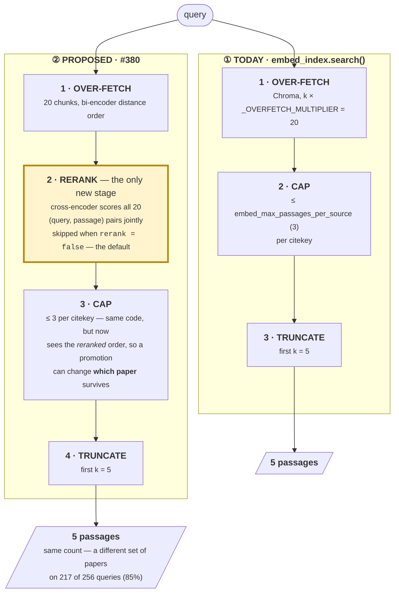

# 🧠 B4: cross-encoder reranking, and where it sits

Status: **shipped**, by
[PR #418](https://github.com/prasadtalasila/chitragupta/pull/418),
merged 2026-08-26. Built as designed below -- rerank before the cap,
off by default, `ms-marco-MiniLM-L6-v2` -- with no deviations.

Written 2026-08-26, for issue 380.

Issue #380 asks for a cross-encoder between `embed_index.search()`'s
over-fetch and its per-citekey cap, and says the position is the one
part that is not "wire a library call". It is right that the position
is the interesting part, and this plan starts by measuring it rather
than arguing it: `bench/bench_rerank_position.py` was written before any
of the design below, and its numbers are what the rest of this document
is built on. Some of them do not say what the issue expected.

**Written for** whoever implements it --
`chitragupta/enrich/embed_index.py`, `chitragupta/config.py`,
`docs/CONFIG.md`, `docs/RETRIEVAL.md` and `tests/` move together.
**Assumed** you have read
[docs/RETRIEVAL.md](../docs/RETRIEVAL.md)'s "Embeddings -- a replacement
for BM25, not an addition", whose per-citekey cap paragraph is the
contract this changes, and
`bench/RESULTS.md`'s three retrieval sections, which already say BM25
beats every dense row. **Not covered here:**
whether the reranker should be pointed at BM25 instead, which the
measurement raises and this plan deliberately leaves open -- see
[The scope question this plan does not settle](#-the-scope-question-this-plan-does-not-settle).

## 🧭 Table of contents

- [What was measured, before anything was designed](#-what-was-measured-before-anything-was-designed)
- [The change, drawn](#-the-change-drawn)
- [What the numbers decide](#-what-the-numbers-decide)
- [The contract](#-the-contract)
- [Choosing the model](#-choosing-the-model)
- [Configuration](#-configuration)
- [What the tests must pin](#-what-the-tests-must-pin)
- [The scope question this plan does not settle](#-the-scope-question-this-plan-does-not-settle)
- [Build order](#-build-order)

## 📊 What was measured, before anything was designed

`bench/bench_rerank_position.py`, 256 keyword self-retrieval queries
against the real enriched corpus (642 ledger items, 497 parsed, 40,741
chunks, `all-mpnet-base-v2`, `k` = 5, cap = 3, reranker
`cross-encoder/ms-marco-MiniLM-L6-v2`). Full write-up and caveats in
`bench/RESULTS.md`, section *"2026-08-26: where a cross-encoder rerank
sits, relative to the per-citekey cap"*. That file is excluded
from the built docs site (`mkdocs.yml`'s `exclude_docs`), which is why
it is named in backticks here rather than linked.

| row | recall@3 | recall@5 | nDCG@5 | distinct@5 |
| --- | --- | --- | --- | --- |
| 1 dense-shipped (pool -> cap -> k) | 0.5039 | 0.6094 | 0.4949 | 3.590 |
| 2 dense +rerank **before** cap (#380) | 0.5430 | 0.6094 | 0.5281 | 3.574 |
| 3 dense +rerank **after** cap | 0.5273 | 0.6094 | 0.4962 | 3.590 |
| 4 bm25-shipped | 0.7695 | 0.8047 | 0.7321 | 5.000 |
| 5 bm25 over-fetch +rerank | 0.7500 | 0.7930 | 0.6886 | 5.000 |

Four things came out of it, and only the first is what #380 expected.

1. **The cap position is real and large.** Moving the rerank across the
   cap changes *which papers survive* on **217 of 256 queries (84.8%)**.
   #380's warning is not theoretical on this corpus.
2. **#380's stated order is the better one** -- arm 2 over arm 3, nDCG@5
   0.5281 against 0.4962. Build it as the issue says, and now for a
   measured reason.
3. **Reranking is a wash for finding the right paper.** recall@5 is
   bit-identical across arms 1-3 at 156/256, and the correct paper is
   **lost 20 times and gained 20 times** -- the swaps cancel, rather
   than the benchmark being unable to see them (the correct paper sits
   at median pool rank 2, at rank 1 for only 92 of 256). The gain is in
   ordering: recall@3 129/256 -> 139/256, ten queries.
4. **`distinct@5` does not move** -- 3.590 -> 3.574, four slots across
   256 queries.

## 🖼 The change, drawn

Fenced `mermaid`, which is this repository's source of truth for a
diagram (`docs/DIAGRAMS.md`) -- GitHub and the docs site both render it
inline, so a change to the pipeline and a change to its picture land in
the same diff.

**The one stage that moves is `RERANK`, and the whole design is which
side of `CAP` it sits on.**

The panels are numbered because Mermaid's layout places the taller
subgraph on the left regardless of declaration or edge order -- read ①
then ②, whichever side each lands on.

**The third sequence, the one that must not be built**, is
over-fetch -> cap -> truncate -> *rerank*: reranking the five survivors
after the cap has already fixed the composition. It is not drawn as a
panel because it is not a proposal; it is the plausible mistake. It can
only permute papers the bi-encoder already chose, and it measures worse
-- nDCG@5 0.4962 against 0.5281.

Why the picture is worth drawing at all: stages 1, 3 and 4 are
byte-identical between the two panels. Every question #380 raises is
about the **edge** between `RERANK` and `CAP`, and that edge is invisible
in a diff -- it is one function call moved above another.

## ⚖ What the numbers decide

**Build it, in #380's order, and ship it off by default.** Finding 2
settles the design question the issue raised. Finding 3 settles the
default: ten queries of recall@3 on one ground truth does not justify a
model download and a per-query forward pass in everyone's drafting loop
without their asking. "Defaulting to the behaviour that exists today",
which #380 already asks for, is therefore not a transitional courtesy
here -- it is the recommendation.

**Drop the compounding claim from the justification.** #380 leads with
"fewer passages per source is what makes multi-source units (#310)
reachable rather than aspirational", and
[docs/FEATURE-ROADMAP.md](../docs/FEATURE-ROADMAP.md)'s B4 entry says
the same. Finding 4 does not support it, and the reason is structural
rather than a near-miss: with cap = 3 and `k` = 5, `distinct@5` can only
be 2, 3, 4 or 5, and the **cap** puts it there. Reranking reshuffles
*within* the cap regime, so it cannot change source diversity.
`embed_max_passages_per_source` and `k` are the levers for #310; B4 is
not one. The roadmap entry and the issue should both be corrected, or
B4's contribution to #310 will be quoted later as though it had been
shown.

**Do not extend the reranker to BM25.** Arm 5 answers the question the
2026-08-16 section left open. Stated as counts, because the rates are
small: recall@5 206 -> 203 (three queries), recall@3 197 -> 192 (five
queries) -- too small to call a regression. The one clear signal is
nDCG@5, and it moves *against* reranking, 0.7321 -> 0.6886. There is no
case here for touching `chitragupta/retrieval.py`, which is a relief:
it is one-per-citekey by construction (#305) and has no cap-position
question at all.

## 📐 The contract

`search(query, k, snippet_chars)` keeps its signature -- it is the
drop-in shape [docs/RETRIEVAL.md](../docs/RETRIEVAL.md) promises, and a
reranker is not a reason to break it. Inside, one stage is inserted:

> over-fetch (`k * _OVERFETCH_MULTIPLIER`) -> **rerank the over-fetched
> set** -> cap per citekey -> truncate to `k`

State that ordering in the docstring where the next person will read it,
beside the paragraph #305 already put there for the cap. The docstring
is the right place precisely because the two rules are one rule: the cap
exists to promote another paper's chunk into the window, and the rerank
has to run before the promotion is decided, or it is only sorting what
the bi-encoder already chose.

**Loading the model must fail loudly.** If `rerank` is on and the model
cannot be constructed, raise, naming the config key and the model id.
Do not fall back to un-reranked results: `docs/CONFIG.md` already states
the principle -- *"a machine quietly running settings its owner never
chose is a worse failure than one that refuses to start"* -- and a
silent fallback here is invisible in exactly the way that warns about,
since un-reranked results look entirely normal.

Load lazily and once, at first reranked call, not at import. `enrich`
is an optional extra and `embed_index` is imported by code paths that
never search.

## 🧮 Choosing the model

Issue #380 asks for a candidate table "in the same shape" as
[docs/CONFIG.md](../docs/CONFIG.md#-choosing-an-embedding-model)'s
embedding-model table, with the rejected candidates and the reason for
each. Two things that table must say, which the embedding one does not:

**The bge-\* prefix warning does not carry over to the reranker.**
CONFIG.md's "Not without a code change first" warns that BAAI `bge-*`
and `intfloat e5-*` expect literal `"query: "` / `"passage: "` prefixes
and will *silently underperform* without them. That was written about
**bi-encoders**, which encode the two sides independently and need a
role marker. `BAAI/bge-reranker-base` is a different architecture:
`XLMRobertaForSequenceClassification` with `num_labels=1`, scoring a
`(query, passage)` pair jointly in one forward pass, exactly as
`cross-encoder/ms-marco-MiniLM-L6-v2` (`BertForSequenceClassification`,
`num_labels=1`) does. No prefix is expected on either. Say so
explicitly: a reader who knows CONFIG.md's warning will otherwise assume
it applies and reject the strongest candidate for the wrong reason.

**The out-of-domain confound was checked, and the findings survive
it.** `ms-marco-MiniLM-L6-v2` is trained on MS MARCO web search, not
scientific prose, so findings 3 and 4 could have been artefacts of one
badly-matched model. Two more candidates were run over the same 256
queries. Arm 2, against arm 1's un-reranked baseline:

| reranker | recall@3 | recall@5 | nDCG@5 | distinct@5 |
| --- | --- | --- | --- | --- |
| *(none -- baseline)* | 129 | 156 | 0.4949 | 3.590 |
| `ms-marco-MiniLM-L6-v2` | 139 | 156 | **0.5281** | 3.574 |
| `ms-marco-MiniLM-L12-v2` | 138 | 152 | 0.5107 | 3.570 |
| `BAAI/bge-reranker-base` | **144** | **157** | 0.5175 | 3.531 |

No candidate moves recall@5 (156 -> 156, 152, 157) and none moves
`distinct@5`. All three raise recall@3, by 9, 10 and 15 queries. So the
shallow-ordering gain is the real, model-independent effect, and
findings 3 and 4 are properties of reranking here rather than of one
model's training data.

**Cost has since been measured, and it picks the model.**
`bench/bench_rerank_cost.py` (RESULTS.md, *"2026-08-26b: what
cross-encoding the over-fetched passages costs"*) times the rerank stage
against the shipped `search()` call in the same process. At the shipped
pool of 20:

| reranker | cuda | cpu |
| --- | --- | --- |
| `ms-marco-MiniLM-L6-v2` | 18.9 ms (**2.52x** a search call) | 210 ms (**5.75x**) |
| `ms-marco-MiniLM-L12-v2` | 34.3 ms (3.76x) | 402 ms (10.08x) |
| `BAAI/bge-reranker-base` | 67.0 ms (6.39x) | 1001 ms (23.64x) |

`bge-reranker-base` wins on quality by **five correct answers in 256**,
on one document-level ground truth, and costs **3.5x** (cuda) to
**4.8x** (cpu) more than `ms-marco-MiniLM-L6-v2`. That is not a trade
this evidence supports. **Name `ms-marco-MiniLM-L6-v2` as
`rerank_model`'s default value**, and keep `rerank = false`.

The cost table is also the strongest argument for the default being off
at all: at the shipped pool the cheapest candidate makes every search
2.5x dearer on a GPU and 5.75x on a CPU, and the enrich extra does not
require a GPU. A laptop drafting session doing many searches per draft
would pay that on every one, for recall@3 up ten queries in 256.

## ⚙ Configuration

Two keys under `[enrich]`, not one:

| Key | Env | Type | Default |
| --- | --- | --- | --- |
| `rerank` | `RERANK` | boolean | `false` |
| `rerank_model` | `RERANK_MODEL` | sentence-transformers cross-encoder id | the chosen candidate |

**Why two rather than an empty-string sentinel.** A single
`rerank_model = ""` meaning "off" is tempting and wrong here, because of
a documented behaviour of this project's own loader: *"A wrong TOML type
falls back silently"* -- a string setting with the wrong type returns
its default rather than raising. With one key, a typo'd or wrongly typed
value is indistinguishable from a deliberate "off", and the failure is
silent in the direction that matters. A boolean says what was intended;
the string says what to load, and is only read when the boolean is true.

`embed_max_passages_per_source` and `_OVERFETCH_MULTIPLIER` are
unchanged. The pool depth is a real question -- 69 of 256 correct papers
(27%) never enter the 20-chunk pool at all, which caps dense recall@5 at
0.7305 no matter what reranks it -- but it is a different lever and a
different issue.

## 🧪 What the tests must pin

To the 100% bar, with a **stub scorer**, so the suite needs no model
download. `bench_rerank_position.py`'s `self_check()` is a working
template for the important one and can be read directly.

1. **The cap interaction.** A promotion must be able to change **which
   document's** chunk survives the cap, not merely the order of the
   survivors. Construct a pool of three chunks of A then one each of B
   and C; with cap 2, `k` 3 the un-reranked result is `[A, A, B]`. A
   stub that promotes C's chunk and A's *third* chunk gives `[C, A, A]`
   before the cap -- C in, B out. This is the test that fails if a
   future refactor moves the rerank below the cap.
2. **The rejected order is unreachable.** Reranking after the cap can
   only ever permute `{A, A, B}`. Assert the shipped path does not
   produce that set from the pool above.
3. **Off is really off.** With `rerank` false, no cross-encoder is
   constructed -- assert on the loader not being called, not merely on
   the output being unchanged. This is what keeps the suite free of a
   model download, so it should fail loudly if someone makes the load
   eager.
4. **Loading failure raises**, naming the key and the model id.

## 🔭 The scope question this plan does not settle

Issue #380 scopes the reranker to `chitragupta/enrich/embed_index.py`. The
measurement puts an uncomfortable fact next to that scope, and this plan
records it rather than acting on it: **the dense path this improves is
the losing path.** Arm 2, reranked and in the best order, reaches nDCG@5
0.5281; plain BM25 -- the only path three of the five genre skills
have, and the default the other two merely name an alternative to --
reaches 0.7321 on the same queries. Three earlier ground truths
in `bench/RESULTS.md` already found BM25 ahead; this is a fourth.

The obvious response, "point the reranker at BM25 instead", is closed by
arm 5: it does not help there either. So the honest statement is that
B4 improves the ordering of a retrieval path that a user has to opt into
twice -- once by building `content/chroma/`, once by choosing a skill
that uses it -- and that it is worth building for the users who have,
not as a route to beating BM25.

Whether the dense path should remain a documented equal alternative in
`docs/RETRIEVAL.md` given four ground truths is a separate decision,
belonging to whoever owns that document, and is **not** part of #380.

## 🧱 Build order

1. **Done** -- quality (`bench_rerank_position.py`) and cost
   (`bench_rerank_cost.py`) are both measured, and together they name
   `ms-marco-MiniLM-L6-v2` at `rerank = false`. Nothing below is blocked.
2. `chitragupta/config.py`: the two keys, plus `docs/CONFIG.md`'s
   settings table and a `### Choosing a reranker` section beside
   "Choosing an embedding model".
3. `embed_index.py`: lazy loader, the rerank stage, the docstring
   paragraph.
4. `tests/`: the four above, to the 100% bar.
5. `docs/RETRIEVAL.md`: the cap paragraph gains the rerank stage, and
   the "when it earns its cost" paragraph gains what the measurement
   actually supports -- ordering, not recall, and not source diversity.
6. `docs/FEATURE-ROADMAP.md`: correct B4's "compounds with B1" claim.
